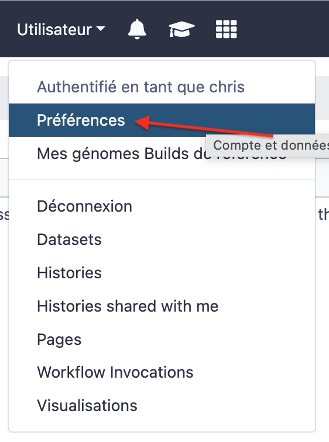

## Go back to your Google ssh terminal

- Detach from the current galaxyscreen session by using the key combination

++ctrl+a++ then ++d++

- Run the following script:
```
sh /root/AnalyseGenome/GalaxyServer/install_galaxy_tools.sh
```
You should now be asked for an API key

## Go back to your Galaxy web window

In the main menu `User` --> `Preferences`

{width="200"}

Select `Manage API Key`, click `Create a new Key`, and copy the current API key

## Paste the copied API key in the Google ssh terminal

and press the ++return++ key

:warning: Do not interrupt the programme until you see on the screen:

```
To follow installation, you may use the 'screen -r ephemeris' command
Alternatively, you can use the 'tail -f /root/tools.log' command and terminate by Ctrl-C
Installation of the 21 galaxy tools may take a long time. Keep cool"
```
Then the installation will continue in the background in the `ephemeris` screen session.

To follow the tool installation by you have 2 options:

- type 
  ```
  tail -f tools.log
  ```
  and to exit from the log scrolling, type ++ctrl+c++
- Or type:
  ```
  screen -r ephemeris
  ```
  and ++ctrl+a++ then ++d++ to detach from the ephemeris screen session

None of these options is affecting the tool installation