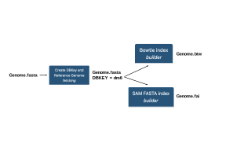
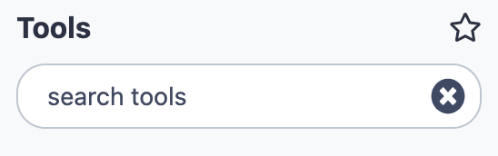
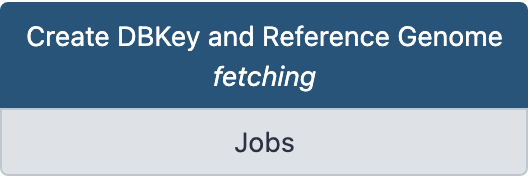

The last thing we can do for the incoming analyses is to prepare several indexes of your
Drosophila genome, which will be available Galaxy-wide.

Alignment programs and a number of tools use their own, specific index, to speed up their
tasks. Thus, since you will align later reads using bowtie, you should prepare a bowtie
genome index. Likewise, you will need to make a conversion of SAM to BAM format using a
samtools tool. You also need to prepare a fasta index (.fai) of your genome for this tool.

In Galaxy, these indexing tasks are preceeded by a "fetch and dbkey" task, whose
purpose is to implement the Galaxy database and inform it of the existence of this genome
and of possible derived indexes.

<center>{ width="600" }</center>

## 1. :wrench: Prepare the _Drosophila_ genome dmel-all-chromosome-r6.18 for indexation.

In the history `REFERENCES` we have uploaded a `dmel-all-chromosome-r6.18` dataset. If you
click on the name of the dataset, you will expand the (green) dataset box and see that it
is a fasta format dataset which contains 1870 sequences.

Indeed, the dataset contains the main _Drosophila_ chromosomes X, Y, 2 (L and R), 3 (L and R)
and 4, but also many unmapped contig sequences and possibly some minor haplotypes.

Thus, before indexing our Drosophila genome, we are going to clean it a little bit by,

- simplifying the fasta headers (keeping only the characteres before the first space)
- and explicitly picking the main chromosomes aforementioned.

### A. :wrench: simplify fasta headers

- Go to the `REFERENCE` history
- Select the tool :wrench: **Regex Find And Replace** (Galaxy Version 1.0.2) in the tool
sub-menu `Analyse des Génomes`. To find easily the tool, you may also type `Regex Find And
Replace` in the search box { width="200" } at the top of the
tool bar.
!!! note "fill the form of :wrench: [Regex Find And Replace]"
    - **Select lines from**: `1. dmel-r6.18`
    - **Check**: Click `Insert Check`
    - **Find Regex**: ` .+` :warning: this is a _space_, followed by a dot, followed by a plus.
    - **Replacement**: _Nothing_ :warning: be sure that the remplacement box is _empty_
    - **Click :heavy_check_mark:`Execute`**
- After run, change the datatype of the dataset `Regex Find And Replace on data 1`from
  `data` to `fasta` using the `pencil` icon.
- Now, you can use the `eye` icon to compare the new dataset with the initial genome dataset.
??? question "What can you say, at least for the chromosome 2L ?"
    The visible header is now `>2L`.
    It was `>2L type=golden_path_region; loc=2L:1..23513712; ID=2L; dbxref=GB:AE014134,GB:AE014134,REFSEQ:NT_033779;
    MD5=b6a98b7c676bdaa11ec9521ed15aff2b; length=23513712; release=r6.18; species=Dmel;`
    before !
- Create a short list of string "on the fly" with :wrench: [Upload Data]
!!! note ""
    - **Click the `Upload Data` menu**
    - **Click the `Paste/Fetch Data` button**
    - **Give a name to the dataset** (`chromosome_list` in replacement of `New File`)
    - **In the main Paste field** copy this list:
    ```
    X
    Y
    2L
    2R
    3L
    3R
    4
    ```
    - **Click the Start dark blue button**
    
- Select the tool :wrench: **Pick Fasta sequences** with header satisfying a string query
  (Galaxy Version 3.0.3) in the tool sub-menu `Analyse des Génomes`. You may also use The
  tool search box.
!!! note "Fill the form of :wrench: Pick Fasta sequences"
    - **Source file**: `11. Regex Find And Replace on data 10`
    - **for a**: Check `list of string`
    - **retrieve sequences whose headers...**: `exactly` **+** `contain one of this list string`
    - **list of strings dataset**: `13. chromosome_list`
    - **Click :heavy_check_mark:`Execute`**
- Rename the created dataset using the pencil icon :pencil2: as `dmel-MAIN-chromosome-r6.18`
??? question "What can you notice if you look at `dmel-MAIN-chromosome-r6.18` ?"
    The number of fasta sequence is `7 sequences`
??? question "How can we check that the right chromosomes have been collected in the dataset ?"
    Use the :wrench: **Select lines** that match an expression (Galaxy Version 1.0.3)
    
    - **Select lines from**: `dmel-MAIN-chromosome-r6.18`
    - **that**: `Matching`
    - **the pattern**: `^>`
    - **Keep header line**: `No`
    - **Click :heavy_check_mark:`Execute`**
    
    From the result, can you deduce the role of the caret sign `^` in the regular expression ?

### B. :wrench: Declare the `dmel-MAIN-chromosome-r6.18` dataset as a reference to Galaxy.
Now that we have a "clean" Drosophila reference genome in fasta format, it is time to notice
it to Galaxy. This is an administrator task which we are going to perform.

- Go to the `Admin` menu (in the top menu bar)
- In the left bar of the `Admin` board, click `Local Data`
- Click on the data manager tool :wrench: **Create DBKey and Reference Genome** _fetching_

{width=200}

- Note that the form of the tool opens in a new browser window

!!! note "Fill the form of :wrench: **Create DBKey and Reference Genome** _fetching_"
    - **Use existing dbkey or create a new one.**: `New`
    - **dbkey**: Choose a simple identifier such as `dmel-r6.18`
    - **Display name for dbkey**: _Leave this field empty_
    - **Name of Sequence**: _Leave this field empty_
    - **ID for sequence**: _Leave this field empty_
    - **Choose the source for the reference genome**: `History`
    - **FASTA file**: `dmel-MAIN-chromosome-r6.18`
    - **Sort by chromosome name**: `As is`
    - **Click :heavy_check_mark:`Execute`**

A new dataset is created, which contain the metadata of the new genome declared to Galaxy,
in a json format. This dataset is just a report and is not specially important, it can even
be deleted.

In contrast, if you go back to other Galaxy web page with the local data management board,
you can now click on the Tool Data Tables `__dbkeys__ ` and `all_fasta` and see that the
Galaxy database now contains informations in these tables about the dmel-r6.18 reference
genome.

## 2. :wrench: Index `dmel-r6.18` for **Bowtie**.

Now that dmel-r6.18 is an "official" Galaxy genome, it is easy to prepare corresponding
indexes for the aligner Bowtie.

- Go back to the local data manager board
- Click on the data manager **Bowtie index** _builder_

!!! note "Fill the form of :wrench: **Bowtie index** _builder_"
    - **Source FASTA Sequence**: `dmel-r6.18` (no other choice !)
    - **Name of Sequence**: _Leave this field empty_
    - **ID for sequence**: _Leave this field empty_
    - **Click :heavy_check_mark:`Execute`**

--> A new dataset `Bowtie index` is created and the orange color and running wheel indicate
that the job is ongoing to create the bowtie index.

It will take several minutes.

**==Your Cloud Galaxy is now ready for analyses with the other trainers==**


## 3. After Work Session

- [x] **Suspend your Google VM**
??? note "Suspend VM instance"
    - Go to your [Google cloud console (web interface)](https://console.cloud.google.com/compute/))
    - Click the 3 vertical dots in the line `bare-galaxy` and select `Suspendre` (or `Suspend` with
      the english interface)
    
    :warning: Keep in mind that a VM instance is charged by Google (on your coupon) when
    it is running. If you **SUSPEND** your instance, there is no more cost of computing (calculated
    in fonction of minutes of activity).
    
- [x] **At the end of the week (only), stop your VM instance**

??? note "Stop your Google VM"
    - Go to your [Google cloud console (web interface)](https://console.cloud.google.com/compute/))
    - Click the 3 vertical dots in the line `bare-galaxy` and select `Arrêter` (or `Stop` with
      the english interface)
    
    :warning: When all your instances are stopped, the cost of your storage devices (200 or 300 Gb)
    is still recorded. Fortunately, this cost is reduced and you can keep your ~200 Gb
    disk for many weeks with your coupon.

- [x] **Protect your instance from self-destruction pulsions**

??? note "Protect your instance from unwanted destruction."
    In some occasion, it is possible to be confused between `arrêter` and `détruire` a
    VM. The consequences of unwanted VM destruction are irreversible as well as annoying.
    To prevent this, you can **protect** your instance from the destruction command.
    
    - Go to the Google Cloud Platform management web page.
    - Click on the **name** of your VM.
    - Click on the top menu :pencil2:`Modifier`
    - Edit the `Protection contre la suppression` option as follows:
    
    {width=600}
    
    (just at the end of the section **Informations générales**) and do not forget to save
    this new setting.
    
    From this point, you will need to uncheck the box to destroy the instance and your are
    protected against unwanted manifestations of bad karma :imp:!

<center>**Your are done for today !**</center>


# <center>:coffee: :beer: :cocktail: :beers: :rainbow:</center>
