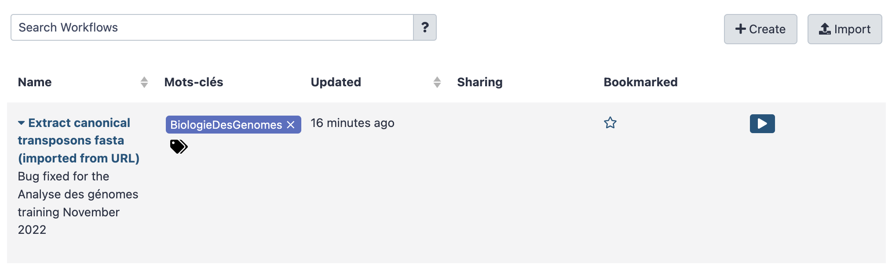
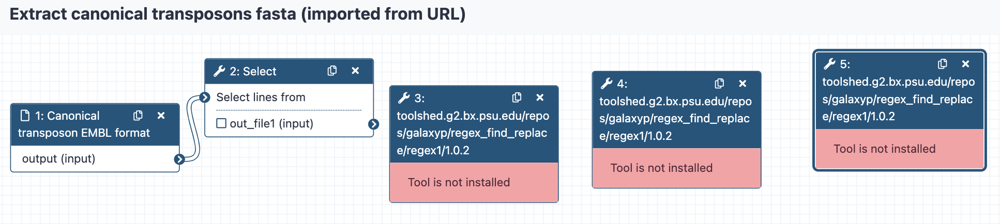
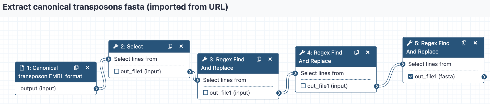

**In this use case, we are going to** 

- Upload a workflow description files in your Galaxy server instance
- Visualise this workflow and see whether tools to execute the workflows are missing
- *since you are administrating the instance*, you can install missing tools
- Eventually run the workflow on input data obtained from a remote public repository.

### 1. Upload workflow description file (.ga)

- Click the `workflow` menu
- Click the "Upload or import workflow" button at the top right
- In the `Galaxy workflow URL:` field, paste the url of the workflow file:
```
https://raw.githubusercontent.com/ARTbio/AnalyseGenome/main/Exercises/Galaxy-Workflow-Extract_canonical_transposons_fasta.ga
```
Note that this file is in the @artbio/AnalyseGenome repository where material for this
training is hosted

- Click on the `Import` button

!!! note
    Alternatively, you could upload the workflow files from you computer instead of uploading them by URL


- the `Workflow` menu should now look like :



- Click the workflow `Extract canonical transposons fasta (imported from URL)` and the `Edit` option
- Observe the warning window that should look like:

??? bug "Issues loading this workflow"
    Please review the following issues, possibly resulting from tool upgrades or changes.
    Step 3: toolshed.g2.bx.psu.edu/repos/galaxyp/regex_find_replace/regex1/1.0.2
    - Tool is not installed
    Step 4: toolshed.g2.bx.psu.edu/repos/galaxyp/regex_find_replace/regex1/1.0.2
    - Tool is not installed
    Step 5: toolshed.g2.bx.psu.edu/repos/galaxyp/regex_find_replace/regex1/1.0.2
    - Tool is not installed  

The workflow was indeed successfully imported. However, some tools are missing, namely:

`toolshed.g2.bx.psu.edu/repos/galaxyp/regex_find_replace/regex1/1.0.2`

The warning lines are redundant, because the workflow is using the same tool at different steps.

Click on the `Continue` button. You should now see missing tools in red and missing links
between various workflow steps. Note that some tools are indeed present because they are
installed by default in the provided Galaxy framework.
??? note "broken workflow"
    


- We are going to fix this. Click on the `Continue` button and then the upper "wheel" icon and select `Close`,
we will come back to the workflow editor when the missing tools are installed in the server.

### 2. Installing (missing) tools

We have to install the following missing tool in our Galaxy instance:

!!! note "Details of missing tools"
    tools:
    ```yaml
    - name: regex_find_replace
      owner: galaxyp
      tool_panel_section_label: Analyse des genomes
      tool_shed_url: https://toolshed.g2.bx.psu.edu
    ```
  

- Click on the `Admin` top menu
- In the left bar click on `Install and Uninstall`
- Now, click the `Install new tools` menu (again in the left bar)
- In the search field, copy and paste
```
regex_find_replace
```
and press the ++enter++ key.
- Two tools will show up, one owned by `jjohnson` and the other owned by `galaxyp`.
    We want to install the latter one, click on it and select `install` button of the lattest
    revision (4, version 1.0.2)
- In the `Target Section:` menu, select `Analyse des Génomes`.
    Thus, the tool will appears in the section `Analyse des Génomes` of your Galaxy tools.
- Click `OK`
- After a few seconds, you will notice the `Cloning...` then soon `Installing dependencies`
  displayed by the install button.
- And rapidly enough, the `Install` button should turn to a red `Uninstall` button.
- You can now check the `Installed Only` radio button at the top, and look at the newly
  installed tool `regex_find_replace` in the list.
---
    
### 3. Check that the imported workflows now display correctly

If you click the `workflow` top menu, you should now be able to edit the imported workflows,
and see that everything is displaying correctly. For the workflow
`Extract canonical transposons fasta (imported from URL)` :



We can go through the various steps of the workflows and figure out what they are doing.

This first workflow  performs a suite of find-and-replace text manipulations, starting
from input data that has been tagged `transposon_set_embl.txt` and producing a new text
dataset that is renamed `Canonical_transposons.fa`.


### 4. Retrieve the `transposon_set_embl.txt` dataset

- Create a new history and name it `workflow test`
- import the dataset using the `Paste/Fetch data` mode of the upload manager (the small
bottom-top arrow icon at the top left of the Galaxy interface). Copy the URL
```
https://raw.githubusercontent.com/bergmanlab/drosophila-transposons/master/releases/transposon_sequence_set_v9.5.embl.txt
```
in the open field and click the `Start` button.

- have a close look at the file

### 5. Run the workflow

- Click on the workflow menu
- Click the Run option of the workflow (the :arrow_forward: to the right hand side)
- Select the appropriate dataset (should be only one already selected)
- And Click the `Run workflow`
- Look at datasets in the history turning from grey to yellow to green and eventually getting hidden.

### 6. Check result
You may check that the generated dataset is identical to the one generated with the tool
`embl2fa` using the tool `differences between two files`
