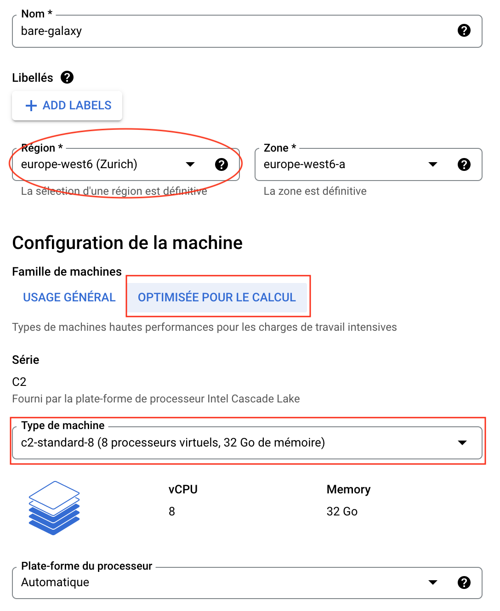
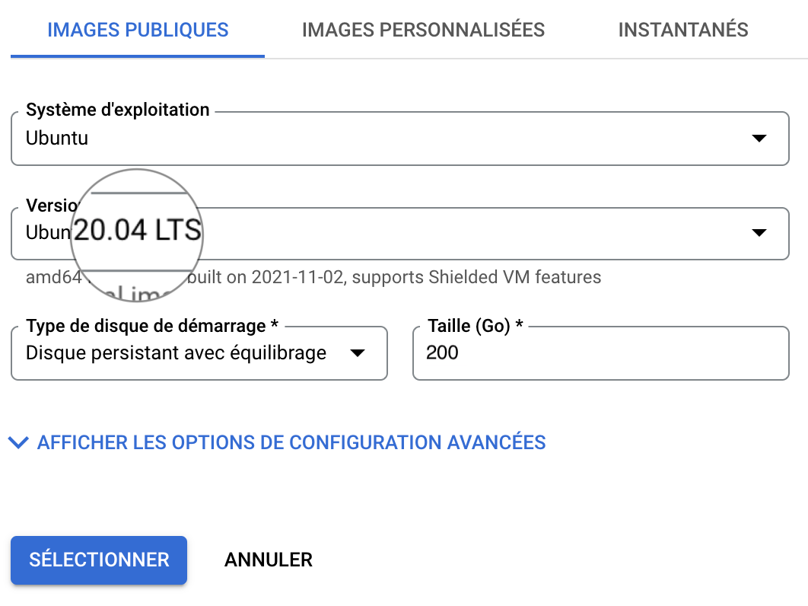
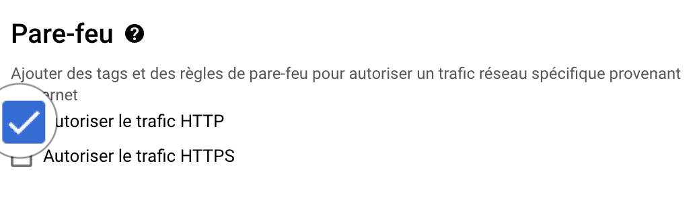
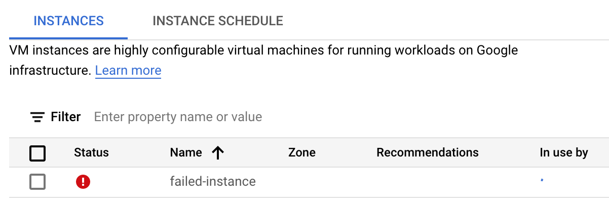

### 1. Spin off a virtual Machine `bare-galaxy` with {: style="width:30px"} Google Cloud Engine

- Connect to your Google Compute Instances
  [dashboard](https://console.cloud.google.com/compute/instances)

- Create a Virtual Machine Instance
 

!!! info "with the following settings"
    - Name: `bare-galaxy`
    - Region `europe-west6 (Zurich)` (or any region available with you Google coupon). ==As
    it is very unlikely that a single Google zone will be able to provide enough resources
    to support 18 virtual machines at the same time, we will have to coordinate to
    distribute our instances to different zones in Europe and USA==.
    - Zone: `europe-west6-a` (or `-b` or `-c`)
    - **Configuration de la machine**
        - `OPTIMISEE POUR LE CALCUL` (or `COMPUTE-OPTIMISED`) ==:link:[in case of trouble](#trouble-shouting)==
        - Série: `C2`
        - Type de machine: `c2-standard-8 (8 processeurs virtuels, 32 Go de mémoire)`
    - **Disque de démarrage (Modifier)**
        - `IMAGES PUBLIQUES`
        - Système d'exploitation: `Ubuntu`
        - Version*: `Ubuntu 20.04 LTS`
        - Type de disque de démarrage: `Disque persistant avec équilibrage`
        - Taille (Go): ==`200`==
        - ==SELECTIONNER==
    - **Pare-feu**
        - Check `Autoriser le trafic HTTP`

This settings should look like:
    
{: style="width:450px"}
{: style="width:450px"}
{: style="width:450px"}

??? bug "Trouble shouting"
    **In some occasions, launching of your VM may fail** as illustrated bellow:
    {: style="width:600px"}
    
    1. Maybe you are not, indeed, using the billing account associated to your
    Google coupon, but instead using a billing account associated to a "Free Trial".
        
        If this is the case, try either of the following solutions:
        
        - If it is not already done, activate your coupon by following the received
        instructions, and be sure that you activate a project associated with the billing
        account of the coupon.
        - Instead a selecting `OPTIMISEE POUR LE CALCUL` (or `COMPUTE-OPTIMISED`), select
        `USAGE GENERAL` (or `GENERAL-PURPOSE`) and scroll-down the **Machine-type** menu
        to select `e2-standard-8 (8 vCPU, 32 GB memory)`
    2. The Region and Zone which you have chosen (in the example, `europe-west6-a`) is
    overloaded.
        
        In this case, try another `Zone` (-b or -c), and/or another `Region`, in Europe or
        America.

### 2. Connect to the VM using the ssh web console

!!! info "ssh connection"
    Roll down the `ssh` menu in the control pannel and select the first option
    `Ouvrir dans une fenêtre du navigateur`

    
    
    **This opens a web ssh shell session to control your VM:**
    
    


### 3. Installation of the Galaxy server

So let's do this, step by step, using the ssh Terminal:

    
  ```{.bash title="1. Terminal"}
  sudo -i
  ```
  This command open a new "shell" where you are root. You can check this by typing `pwd` that
  should return `/root/`, meaning that you are now working in the directory of the `root` user.
  
  This is required because installation of new programs as well as manipulations of network
  interfaces is permitted only to users with administration rights.
  ```{.bash title="2. Terminal"}
  git clone https://github.com/ARTbio/AnalyseGenome.git
  ```
  This command says to use `git` to `clone` the code repository @artbio/AnalyseGenome located at
  `https://github.com/ARTbio/AnalyseGenome.git`. This repository contains a few files of 
  code that will help us in the Galaxy server deployment
  
  ```{.bash title="3. Terminal"}
  git clone https://github.com/galaxyproject/galaxy.git -b release_22.05
  ```
  This command says to use `git` to `clone` the code repository @galaxyproject/galaxy located at
  `https://github.com/galaxyproject/galaxy.git`.
  
  In addition the `-b release_22.05` option specifies that only the version `release_22.05`
  will be cloned locally in your virtual machine. You may try to visualize the URL
  [https://github.com/galaxyproject/galaxy.git](https://github.com/galaxyproject/galaxy.git)
  in your web browser. You will, literally, see the code of the Galaxy program.
  
  As you can notice, it is Open Source as well as FAIR
  
  ```{.bash title="4. Terminal"}
  cd galaxy
  ```
  This command moves you in the `galaxy` directory that was created by git and the
  `git clone` command in 3.
  
  ```{.bash title="5. Terminal"}
  cp config/galaxy.yml.sample config/galaxy.yml
  ```
  This command makes a copie of the `galaxy.yml.sample` file to `galaxy.yml` - in the
  directory `config` that is in the `galaxy` directory.
  
  ```{.bash title="6. Terminal"}
  nano config/galaxy.yml
  ```
  Using this command, we are going to edit some important settings that are required to
  run our Galaxy fresh instance.
!!! note ":computer:"
    - Find the line 53
    ```{.bash title="nano editor"}
        # bind: localhost:8080
    ```
    (you can use the editor command ++ctrl+w++, paste the previous line and press enter)
    
    - and edit it to
    ```{.bash title="nano editor"}
        bind: 0.0.0.0:80
    ```
    By doing this, we ensure that we will be able to reach the galaxy web server on our
    virtual machine using the usual web port `80`.

    - Find the line 1729
    ```{.bash title="nano editor"}
      #admin_users: null
    ```
    delete the `null` string and replace it with your email address.
    Any email address is ok (admin@galaxy.org for instance). It is just used here as
    an account identifier with admin rights on the galaxy instance.
    
    - save your changes by pressing the key combination ++ctrl+o++
    - quit nano by pressing the key combination ++ctrl+x++

!!! note "This part is optional but will save us 20 min of deployment !"
    Before starting the deployment of Galaxy, we are going to use a trick to
    bypass the step of compilation of html and javascript codes which are used to
    render the Galaxy graphic interface.
    
    This is because modern web applications use a lot of cached code, speeding up the user
    experience. However, this implies that this code cache is built during the deployment
    of the application.
    
    For Galaxy, building/caching the client codes for the web server takes about 20 min
    and this is increasing with newer galaxy versions.
    
    To save us these 20 min, we are going to remove the web client folders and replace them
    by already built client folders, prepared by your trainer...
    
    1. Remove the web client folders
    ```
    rm -rf ~/galaxy/client ~/galaxy/static
    ```
    2. Download the cached web client folders
    ```
    cd ~/galaxy && wget https://psilo.sorbonne-universite.fr/index.php/s/Kw9y8LgYyXBq3pr/download/client.tar.gz https://psilo.sorbonne-universite.fr/index.php/s/crArbXEFZq9HB87/download/static.tar.gz
    ```
    3. Uncompress the cached client folders
    ```
    cd ~/galaxy && tar -xvf static.tar.gz && tar -xvf client.tar.gz
    ```
    
    :warning: this tip is **optional**. If you run the next command without doing it,
    everything will go OK, but the `run.sh` script will detect that the galaxy web page
    are not built and it will do it. This takes about 10-15 minutes.

  7.
  Ready for deploying Galaxy ?
    
  Then type
   ```
   sh run.sh
   ```
   and press the ++return++ key !
  
  You should see an abundant log scrolling down. Don't worry !

  - All Galaxy dependencies required for the Galaxy server instance are being downloaded and installed
  - The Galaxy computing environment is automatically set up
  - the Galaxy web server is installed and static pages are built (this step specifically takes more and more time)
  - The Galaxy database (sqlight) is automatically upgraded to its latest structure/model
  - The package manager Conda, which is heavily used by Galaxy to install its tools is installed.
  
  After 5-10 minutes, you should see in the log:

```{.bash title="Terminal"}
[2022-11-08 09:25:25 +0000] [1504] [INFO] Listening at: http://0.0.0.0:80 (1504)
```
### 4. Connect to your living Galaxy instance

You should now be able to access to you Galaxy instance in a your web browser window.

  - Go back to your Google Cloud Engine control panel.
  - Find the `External IP address` / `Adresse IP externe` in the 7th column of the dashboard
  (to the left of the ssh menu that you used before).
  - Click on the hyperlink.
  - In the new browser window, follow the menu `Authentification et enregistrement`
    --> `Enregistrement` and  **register** to your instance using the email address you
    put in the galaxy.yml at [step 3.6](#admin-email)
  - After login, you should see the admin tab in the top menu of the Galaxy interface.
    
    { width="600" }
    
    ==You are connected to Galaxy as an admin !==
