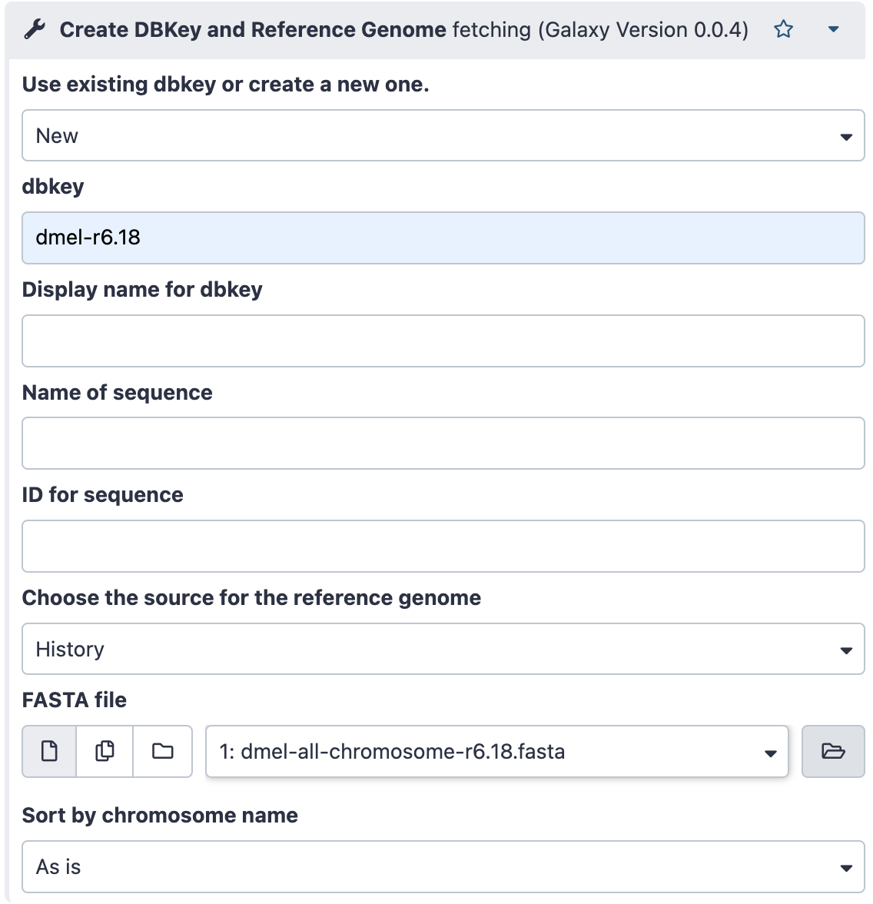

---
hide:
  - toc
---
## Import data

- Rename the `Unnamed history` to `Bowtie` using the pencil icon
- Go to `Upload Data` (to the left bar) and select `Paste/Fetch Data`
- Paste the following content
```
https://psilo.sorbonne-universite.fr/index.php/s/7YqGeFTxTgxtafy/download/dmel-all-chromosome-r6.18.fasta
https://psilo.sorbonne-universite.fr/index.php/s/HYLtfo9d2eD3Q2A/download/GRH-103_R1.fastq.gz
```
- And click the `start` button

- Check the imported datasets in the history bar
- Check the content of the imported datasets by clicking the eye icon in each dataset

## Install required packages
==Required packages (`bowtie` and `samtools`) are already installed in your Galaxy server==

## Clip fastq reads from their sequence adapter and output clipped sequences in a fasta format
- type "clip" in the search toolbar box
- select the `Clip adapter` Galaxy toolbar
- Fill the tool form as following, indicating which file to clip, the min and max sizes of the
  reads you wish to keep in the processed dataset, that you want a fasta output, do no want
  N in the retrieved clipped reads, and that the adapter in the dataset is the Illumina
  TruSeq adapter.

{width="500"}

- Click the `Execute` icon

Check the result in the history:

- how many clipped sequences ? --> click on the dataset to deploy it
- which format ?
- How do the sequences look like ? --> click on the eye icon

## Prepare dmel_r6.18 bowtie index
- click on `Admin` in the main menu
- in the left menu, click on `Local Data` (upper submenu `Server`)
- Click on the data manager `Create DBKey and Reference Genome`
  
  {width="250"}

- Fill the manager tool as following, indicating that you create a `New` DBKey, that this
  DBkey will be `dmel-r6.18`, the source of the reference genome is your history, namely
  the dataset n°1 `dmel-all-chromosome-r6.18.fasta`. Leave the other settings are they are.
  
  {width="500"}
  
  And press the `Execute` button.

- Go back to the `admin` --> `local data` menu
- Click the data manager `Bowtie index builder` (:warning: not the `Bowtie color index builder` !)
- Leave `dmel-r6.18` for `Source FASTA Sequence`, and the other settings as blank
- Click `Execute`

!!! note ""
    The bowtie index creation will take about the same time as when you did it using
    command lines


## Align the clipped fasta reads to dmel.r6.18 using `bowtie`

- In the search toolbar box, type `bowtie`
- Select the tool `sR_bowtie for small RNA short reads`
- in the form tool select:
  - `Clipped GRH-103_R1.fastq.gz-then-fasta` for **Input fasta or fastq file: reads clipped from their adapter**
  - `Match on DNA as fast as possible, ...` for **What kind of matching do you want to do?**
  - `0` for **Number of mismatches allowed**
  - `bam` for **Select output format**
  - `both aligned and unaligned` for **additional fasta output**
  - ==Leave the other settings as is==

Examine the output datasets (`Bowtie Output`, `Matched reads` and `Unmatched reads`)


## Convert SAM file to BAM file and sort the alignments by chromosome positions

==This is automatically done by Galaxy==