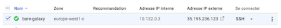

### Spin off a virtual Machine
1. Go to the Google Cloud Dashboard and select "Compute Engine" on the left hand menu bar
2. Select the submenu "Instances de VM"

    

3. Click on the top bar menu the **`CREER UNE INSTANCE`** panel
4. Put a name for your instance
5. Choose a Zone (suggestion: `europe-west6-a`)
6. Configuration de la Machine: `OPTIMISE POUR LE CALCUL`
7. Série: `E2`
6. Type de machine: `c2-standard-4 (4 processeurs virtuels, 16 Go de mémoire)`
7. Disque de Démarrage: Click on `Modifier`
    - `IMAGES PUBLIQUES`
    - Système d'exploitation: `Ubuntu`
    - Version: `Ubuntu 20.04 LTS`
    - Type de disque de démarrage: `Disque persistant avec équilibrage`
    - Taille (Go): `50 Go`
    - Leave the selection `Disque persistant standard` / `Standard persistant drive`
    - Click `Select` / `Sélectionner`
8. Pare-feu: `Authorize HTTP traffic` / `Autoriser le traffic HTTP`
9. Click `Créer` / `Create`

    ### Connect to the started virtual Machine
    After a few seconds, the VM turns on "green" and an `ssh` menu becomes selectable

    

10. Roll down this `ssh` menu and select the first option `Ouvrir dans la fenêtre du navigateur`

    

11. A shell console pop out and you should now be ready to control your VM with linux command lines

    

    

12. Enter the `sudo -i` command at the prompt `yourlogin@instance_name:~$` and hit the return key.
13. The unix prompt become `root@instance_name:~# `: you are now controling your VM as a root administrator.
14. [Optional] Here, if you do not have to work with the VM, you can turn off the VM and even trash it:
    - in one shot, go back to your VM control panel in the web browser, ensure that the running VM is checked, and press the Trash button in the top menu.
    - Confirm that you want to trash the VM and loose everything.
    - after a few seconds the VM disappears from the Dashboard.
