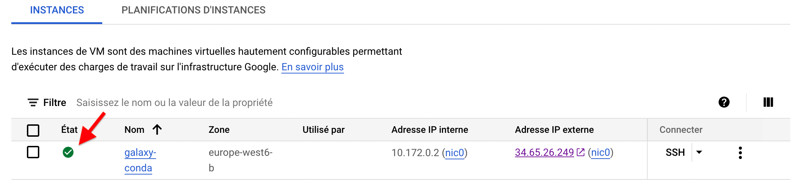

# Get your {width="200"} coupon and activate it.

- We will send you in the Slack board a URL which you will need to access in order to request
a Google Cloud coupon.
- Through this URL, you will be asked to provide your University email address (which must
belong to either `sorbonne-university.fr` or `u-paris.fr domains`) and your name. An email
will be sent to you to confirm these details before a coupon is sent to you.
- Your coupon is valid through: 11/21/2023
- You can **only request ONE coupon per unique** email address.

# Access to your Google Cloud dashboard

The coupon will drive you to a Google Cloud account (note that the Google Cloud account
is different from your Gmail account if you have one).

:warning: The coupon does not know by default whether you have already a Google Cloud
account or not. We assume that most of you never used the Google Cloud resources and therefore
do not have a Google Cloud account. If you actually have one, do not expect that the coupon
will feed your account credits. It will activate, another separate account.

It is possible that the first thing you will be asked to do is to create a new "project",
unless the coupon is automatically opening this project.

Try immediately to access to your [Google Cloud dashboard](https://console.cloud.google.com/home/dashboard)
Then to [Compute engine](https://console.cloud.google.com/compute/instances) and
_CREATE AN INSTANCE_

Use the [documentation here](../bare-galaxy-google/#1-spin-off-a-virtual-machine-bare-galaxy-with-google-cloud-engine)
or [here](../spin_off_VM) to fill the instance form before start.

As soon as you can see

==Please report in the Slack of Analyse des Génomes 2022.==

:warning: **If you have troubles to get a running instance with a green spot, please,
do not wait for the 29/11/2022 at 13:30 to say it because it may be to late**

