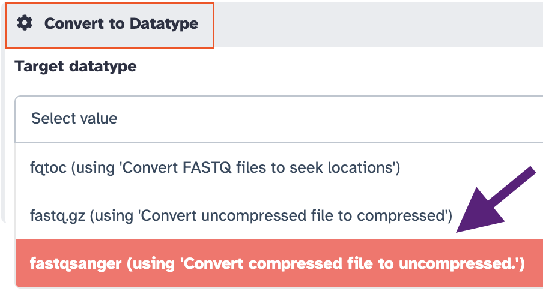
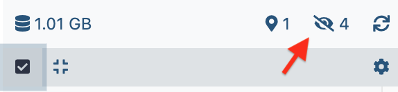

For the course "Analyse des Génomes", we need three types of datasets

- [x] The reference sequences that will be used to align sequencing reads (full genome, miRNA, transposons, etc.)
- [x] libraries of sequencing reads from small RNAs (for analysis of piRNAs)
- [x] Librairies of sequencing reads from mRNA (for Gene differential expression analysis)

All these data have been deposited in the storage server
[Psilo](https://psilo.sorbonne-universite.fr/index.php/s/yHSoKGZKMeJkeXa) at
Sorbonne-Université.

### Get data "by URL"
As these data _**are available through a URL**_ (Universal Resource Location) we will use
as before the menu `Paste/Fetch Data` of the `Upload Data` menu.

??? warning "There are other methods to upload data in Galaxy !"
    * You can transfer data from your local machine (the one where your keyboard is plugged !)
      to Galaxy
    * You can upload data to your Galaxy FTP account and then transfer these data from your
    Galaxy FTP directory to one of your Galaxy histories.

    
#### 1. Upload of reference files as a batch of multiple URLs :heavy_plus_sign: Programmatic file naming

As you have already uploaded single files using their url, we are going to use a more
powerful procedure which is appropriate when uploading numerous files.

Before all, create a new history by clicking the :heavy_plus_sign: icon in the history header

{width="300"}

and immediately renaming the new history as
`References`.

- [x] Click the `Upload Data` button at the top-left corner of the Galaxy interface.
- [x] This time, Click the `Rule-based` tab !
- [x] Leave **Upload data as** `Datasets` and **Load tabular data from** `Pasted Table`
- [x] In the text field `Tabular source data to extract collection files and metadata from`,
paste the following Tabular source data:

!!! info ":candy: URLs of references (genome and RNA classes)"
    ```
    https://psilo.sorbonne-universite.fr/index.php/s/7YqGeFTxTgxtafy/download/dmel-all-chromosome-r6.18.fasta	dmel-r6.18
    https://psilo.sorbonne-universite.fr/index.php/s/w3soG64bRcZd5CJ/download/Dmel_all-transposon_merge.fasta	transposons
    https://psilo.sorbonne-universite.fr/index.php/s/2Y7BfGNZQokMDfT/download/Dmel_piRNA_clusters.fasta	piRNA_clusters
    https://psilo.sorbonne-universite.fr/index.php/s/s9reeBC79Pw6jfN/download/dmel-all-gene-r6.18.fasta	genes
    https://psilo.sorbonne-universite.fr/index.php/s/JndyRYqeWE9d8eb/download/dmel-all-intron-r6.18.fasta	introns
    https://psilo.sorbonne-universite.fr/index.php/s/aZAPqW9PJ2ncnXD/download/dmel-all-miRNA-r6.18.fasta	miRNAs
    https://psilo.sorbonne-universite.fr/index.php/s/dKKHKqHWLj45QWx/download/dmel-all-miscRNA-r6.18.fasta	miscRNAs
    https://psilo.sorbonne-universite.fr/index.php/s/cDy6iqnzkomkPyd/download/dmel-all-ncRNA-r6.18.fasta	ncRNA
    https://psilo.sorbonne-universite.fr/index.php/s/riKojdtpwB9xrKK/download/dmel-all-r6.18.gtf	dmel-all-r6.18.gtf
    https://psilo.sorbonne-universite.fr/index.php/s/F46CrxzzZxcrESa/download/dmel-all-transcript-r6.18.fasta	transcripts
    https://psilo.sorbonne-universite.fr/index.php/s/JM6aQkDMKF6YZRE/download/dmel-all-tRNA-r6.18.fasta	tRNAs
    https://psilo.sorbonne-universite.fr/index.php/s/A8dB5qPW3KgxNey/download/PlacW.fasta	PlacW
    ```

- [x] Click the `Build` button
- [x] In the `Build Rules ...` pannel that opens, click the {width="80" align="absbottom"}
and choose `Add/Modify Column Definitions`
- [x] Click a first time on `Add Definition` and Select `URL`. Leave the URL column to `A`
- [x] Click a second time on `Add Definition`, select `Name` and choose the column `B` for `Name`
- [x] Now, click the `Apply` button
- [x] And to finish the job, click on the dark-blue button `Upload`

<center>:tada:	:confetti_ball:	:balloon:</center>

#### 2. Upload of small RNA sequencing datasets :heavy_plus_sign: Programmatic dataset naming.

- [x] Create a new history using the :heavy_plus_sign: icon of the history menu, and rename it
  `Small RNA sequence datasets`
- [x] Click the `Upload Data` button at the top-left corner of the Galaxy interface.
- [x] Click the `Rule-based`tab as we just did with the reference datasets
- [x] Leave **Upload data as** `Datasets` and **Load tabular data from** `Pasted Table`
- [x] In the text field `Tabular source data to extract collection files and metadata from`,
paste the following Tabular source data:
!!! info ":ice_cream: small RNAseq datasets"
    ```
    https://psilo.sorbonne-universite.fr/index.php/s/HYLtfo9d2eD3Q2A/download/GRH-103_R1.fastq.gz	GRH-103
    https://psilo.sorbonne-universite.fr/index.php/s/C3o48iyyaeYw9gk/download/GRH-105_R1.fastq.gz	GRH-105
    ```
??? note "supplementary smallRNAseq datasets"
    You only need GRH-103 and GRH-105 datasets for the training.
    However, you can also experiment with additional datasets if you wish, to be downloaded
    as before using the following URL/name table:
    ```
    https://psilo.sorbonne-universite.fr/index.php/s/xgFNxA6fb7GgaLL/download/GRH-104_R1.fastq.gz	GRH-104
    https://psilo.sorbonne-universite.fr/index.php/s/Cp5ToXyj3X5jZxT/download/GRH-106_R1.fastq.gz	GRH-106
    ```
- [x] Click the `Build` button
- [x] In the `Build Rules ...` pannel that opened, click the {width="80" align="absbottom"}
and choose `Add/Modify Column Definitions`
- [x] Click a first time on `Add Definition` and Select `URL`. Leave the URL column to `A`
- [x] Click a second time on `Add Definition`, select `Name` and choose the column `B` for `Name`
- [x] Now, click the `Apply` button
- [x] select the Type "fastqsanger.gz" at the bottom of the panel

    {width="200"}

- [x] To finish the job, click on the dark-blue button `Upload`
<center>:tada:	:confetti_ball:	:balloon: :tada:	:confetti_ball:	:balloon:</center>

#### 3. RNAseq datasets (for gene differential expression analysis)

- [x] Create a new history in Galaxy and rename it `RNA sequence datasets`
- [x] Click the `Upload Data` button at the top-left corner of the Galaxy interface.
- [x] Click the `Rule-based`tab as we just did with the reference datasets
- [x] Leave **Upload data as** `Datasets` and **Load tabular data from** `Pasted Table`
- [x] In the text field `Tabular source data to extract collection files and metadata from`,
paste the following Tabular source data:
!!! info ":doughnut: RNAseq datasets"
    ```
    https://psilo.sorbonne-universite.fr/index.php/s/iaQxyLJzAXknCYp/download/SF1_R1.fastq.gz	SF1
    https://psilo.sorbonne-universite.fr/index.php/s/7HTaFnwfdQPCkL3/download/SF2_R1.fastq.gz	SF2
    https://psilo.sorbonne-universite.fr/index.php/s/ig6yZgEg9FPgRiw/download/SF3_R1.fastq.gz	SF3
    https://psilo.sorbonne-universite.fr/index.php/s/gyDgrq8S98C6KyL/download/WT1_R1.fastq.gz	WT1
    https://psilo.sorbonne-universite.fr/index.php/s/J9o73xmQWk43P6A/download/WT2_R1.fastq.gz	WT2
    https://psilo.sorbonne-universite.fr/index.php/s/YFnT3KzPNLdH3N4/download/WT3_R1.fastq.gz	WT3
    ```

- [x] Click the `Build` button
- [x] In the `Build Rules ...` pannel that opened, click the {width="80" align="absbottom"}
and choose `Add/Modify Column Definitions`
- [x] Click a first time on `Add Definition` and Select `URL`. Leave the URL column to `A`
- [x] Click a second time on `Add Definition`, select `Name` and choose the column `B` for `Name`
- [x] Click the `Apply` button
- [x] select the Type "fastqsanger.gz" at the bottom of the panel

    {width="200"}

- [x] And to finish the job, click on the dark-blue button `Upload`

<center>:tada:	:confetti_ball:	:balloon: :tada:	:confetti_ball:	:balloon:
:tada:	:confetti_ball:	:balloon: :tada:	:confetti_ball:	:balloon:</center>


#### 4. Uncompress datasets [_Section 4 should be optionnal_]

At this stage, we have uploaded small RNA and RNA sequencing datasets as `fastqsanger.gz`.
To simplify the subsequent analyzes we are going to uncompress all these datasets, whose
datatype will therefore become `fastqsanger`.

##### Procedure for a single dataset

  1. Go to your `small RNA input datasets` history (or whatever you named it).
  2. Click on the pencil icon {width="70"} of the first dataset.
  3. Click on the tab `datatype`
  { width="100"}.
  4. In the panel ==`Convert to Datatype`==, select `fastqsanger (using 'Convert compressed
     file to uncompressed.'`)
     
     { width="450"}
  
    ??? warning "Why NOT using the panel {width="150px" align="absbottom"}?"
        - Let's imagine a Galaxy dataset whose name is `Hamlet`
        - the _content_ of this dataset is:
        ```
        To be, or not to be, that is the question:
        ```
        - Would you agree that the `datatype` of this dataset is ==`english`==? I think so.
        - Let's put it all together in the form of:
        ```
        @name: Hamlet
        @datatype: english
        @content:
        To be, or not to be, that is the question:
        ```
        
        **Now, what if you change the `Datatype` of this dataset from `english` to `french`
        using the `Assign Datatype` panel? ==This -->==**
        ```
        @name: Hamlet
        @datatype: french
        @content:
        To be, or not to be, that is the question:
        ```
        **This does not seem correct ! Do you aggree ?**
        
        **If you `Convert` instead this dataset from `english` to `french`, you will have
        ==This -->==**
        ```
        @name: Hamlet
        @datatype: french
        @content:
        Être ou ne pas être, telle est la question
        ```
        **It is looking better, isn't it ?**
        
        **In contrast, if your starting dataset was as this:**
        ```
        @name: Hamlet
        @datatype: english
        @content:
        Être ou ne pas être, telle est la question
        ```
        **There, you would "just" `Assign` the Datatype of the dataset from `english` to `french` and
        get**:
        ```
        @name: Hamlet
        @datatype: french
        @content:
        Être ou ne pas être, telle est la question
        ```
  
  5. Click on {width="120" align="absbottom"}
  
  ==**-->**== A new dataset is created. During the decompression job, its name looks like
  `5: Convert compressed file to uncompressed. on data 1`. But when the job finishes, the
  name of the dataset changes to more self-explanatory: `5: GRH-103 uncompressed`.

##### Repeat the same procedure for every small RNAseq dataset.

##### Repeat the same procedure for every RNAseq dataset.
==_Naturally, you can launch as many jobs as you need in the same time_==

##### When all datasets are decompressed

- [x] Delete the compressed datasets (by clicking on the cross icon of datasets).
- [x] Rename the uncompressed datasets by removing the `uncompressed` suffix.
- [x] Purge the deleted datasets. This is done by clicking the wheel icon of the **top**
history menu, and selecting `Purge Deleted Datasets` in the **Datasets Actions** section.
    
    {width="250"}
    
- [x] :warning: If you do not perform this last action, the deleted datasets remain on your
instance disk !

#### 5. Dataset collections :alien:

We are going to organize our various datasets using an additional
structure layer: the **Galaxy Collection**.

A Galaxy Collection is a container object which is convenient to treat together multiple
equivalent datasets, such as a list of sequencing datasets, of text labels, of fasta sequences,
etc.

##### A. Making collections of RNA sequence datasets.

Collections are particularly useful for RNAseq datasets,since these datasets often come
as replicates which can be grouped upon a label. Your training is indeed a good example of
that, since you are provided with 3 `WT` datasets (1, 2 and 3) and 3 `SF` datasets (1, 2 and 3).

- [x] Navigate to you `RNAseq inputs` history (or whatever you named it) and click the upper left small check box
  at the top of the dataset stack {width="150" align="absbottom"}
  
  You see that check boxes appear for each dataset of the history
  
- [x] Check the 3 RNA datasets `WT1`, `WT2` and `WT3`
- [x] In the menu `3 of 6 selected` (also in the top area of the history), select
  `Build Dataset List`
  
  {width="250"}
  
- [x] In the pop-up panel, just type `WT` in the field `Name: Enter a name for your new collection`
- [x] Reorganize the datasets order by clicking the `alphabetic sorting` icon.
- [x] Press the button `Create Collection`

- [x] **Repeat exactly the same operations for the 3 remaining datasets `SF1`, `SF2` and `SF3`**
- [x] When you are done with the creation of collection, you can uncheck the upper left small check box

??? question "What do you see when you click on name of the new dataset collections ?"
    You see the content of the collection, with datasets identified with original names.
    
    Click on  the `<< History` link, to come back to the normal history view.


??? question "what do you see if you click the `crossed eye` icon at the right corner {width="200" align="absbottom"} ? "
    You see the actual datasets contained in the Collection. If you click on `unhide` for
    each of these datasets, you will actually see permanently both the container collection and the contained
    datasets !
