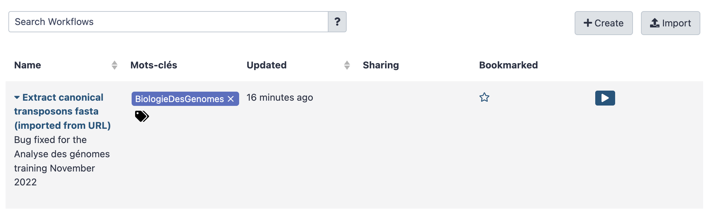
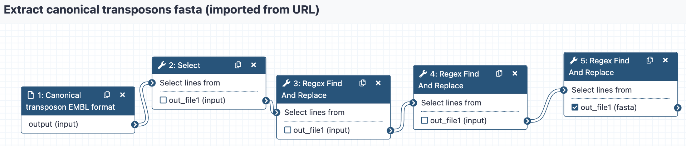

**In this use case, we are going to** 

- Upload a workflow description files in your Galaxy server instance
- Visualise this workflow and its tools
- Eventually run the workflow on input data obtained from a remote public repository.

### 1. Upload workflow description file (.ga)

- Click the `workflow` menu
- Click the "Upload or import workflow" button at the top right
- In the `Galaxy workflow URL:` field, paste the url of the workflow file:
```
https://raw.githubusercontent.com/ARTbio/AnalyseGenome/main/Exercises/Galaxy-Workflow-Extract_canonical_transposons_fasta.ga
```
Note that this file is in the @artbio/AnalyseGenome repository where material for this
training is hosted

- Click on the `Import` button

!!! note
    Alternatively, you could upload the workflow files from you computer instead of uploading them by URL

- the `Workflow` menu should now look like :



- Click the workflow `Extract canonical transposons fasta (imported from URL)` and the `Edit` option



We can go through the various steps of the workflows and figure out what they are doing.

This workflow performs a series of find-and-replace text manipulations, starting
from input data that has been tagged `transposon_set_embl.txt` and producing a new text
dataset that is renamed `Canonical_transposons.fa`.

### 4. Retrieve the `transposon_set_embl.txt` dataset

- Create a new history and name it `workflow test`
- import the dataset using the `Paste/Fetch data` mode of the upload manager (the small
bottom-top arrow icon at the top left of the Galaxy interface). Copy the URL
```
https://raw.githubusercontent.com/bergmanlab/drosophila-transposons/master/releases/transposon_sequence_set_v9.5.embl.txt
```
in the open field and click the `Start` button.

- have a close look at the file

### 5. Run the workflow

- Click on the workflow menu
- Click the Run option of the workflow (the :arrow_forward: to the right hand side)
- Select the appropriate dataset (should be only one already selected)
- And Click the `Run workflow`
- Look at datasets in the history turning from grey to yellow to green and eventually getting hidden.

### 6. Check result
You may check that the generated dataset is identical to the one generated with the tool
`embl2fa` using the tool `differences between two files`
