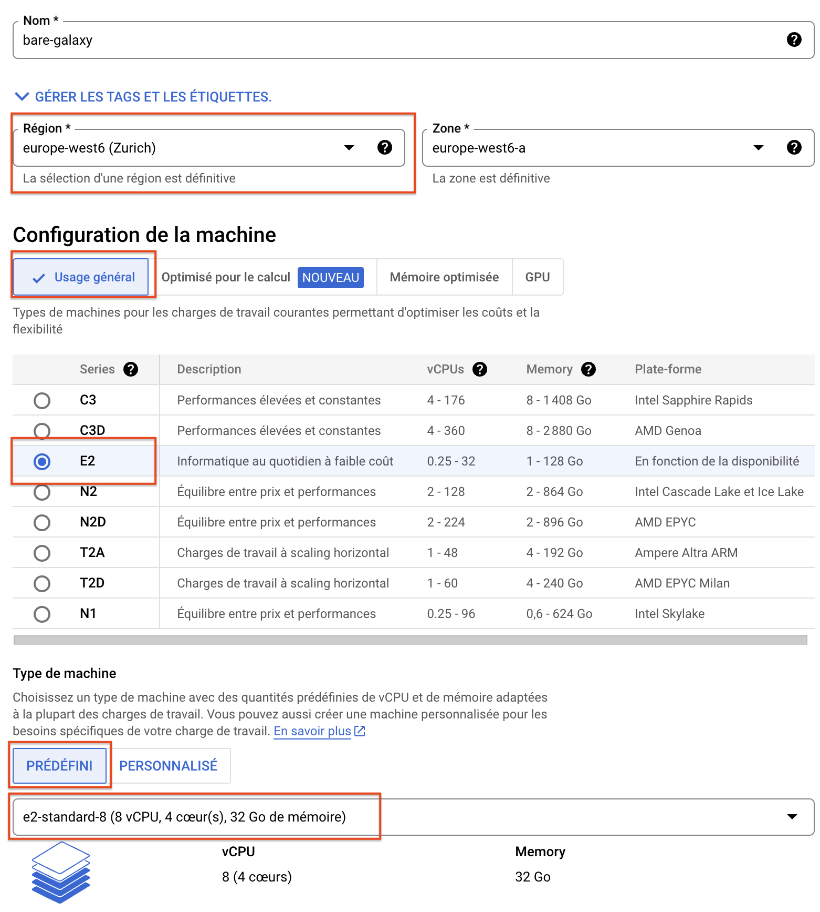
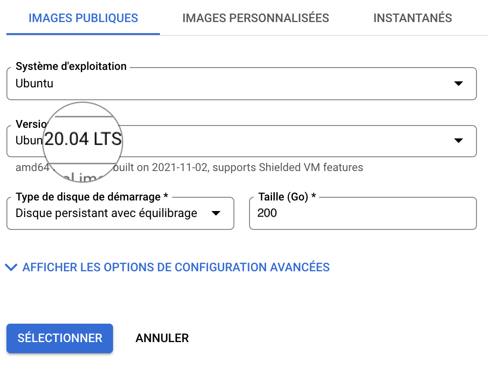

### 0. Prerequisite

- [x] You have obtained and activated your Google Coupon for this training as described in
[Appendix 1](../Google_cloud_Account)
- [x] You have accessed to the Google dashboard and tested Starting and Stopping a virtual
machine (VM) instance as described in [Appendix 1](../Google_cloud_Account)

### 1. Spin off a virtual Machine `bare-galaxy` with {width="30px" align="bottom"} Google Cloud Engine

Before starting, we recommend you to pay extra attention any time you see the :warning:
signal.

- [x] Connect to your Google Compute Instances
  [dashboard](https://console.cloud.google.com/compute/instances)

- [x] Create a Virtual Machine Instance

!!! info "with the following settings"
    - Name: `bare-galaxy`
    - Region `europe-west6 (Zurich)` :point_left: Check your Region in the popup table bellow 
    - Zone: `europe-west6-a` (or `-b` or `-c`) :point_left: Check your Zone in the popup table bellow
    - **Configuration de la machine**
        - `USAGE général`
        - Série: `E2`
        - Type de machine: `PRÉDEFINI` :arrow_forward: `Standard` :arrow_forward: `e2-standard-8`
    - **Disque de démarrage (Modifier)**
        - `IMAGES PUBLIQUES`
        - Système d'exploitation: `Ubuntu`
        - Version*: `Ubuntu 20.04 LTS`
        - Type de disque de démarrage: `Disque persistant avec équilibrage`
        - Taille (Go): ==`200`==
        - ==SELECTIONNER==
    - **Pare-feu**
        - Check `Autoriser le trafic HTTP`

??? warning "Region and Zone assignments to students :warning:"
    ==As it is possible that a single Google zone will be able to provide enough resources
    to support 18 virtual machines at the same time, we will distribute our instances to
    different zones in Europe==.
    
    The following table assigns the instances by name to different Regions and Zones.

    Please respect this attribution for your final instance, the one you will use during
    your practical work.
    
    |    Email prefix    |         Region         |      Zone    |
    |--------------------|------------------------|--------------|
    |alix.martin         |europe-west1 (Belgique) |europe-west1-b|
    |astrid.canal        |europe-west1 (Belgique) |europe-west1-d|
    |camille.jarry       |europe-west1 (Belgique) |europe-west1-c|
    |Christine.lin.1     |europe-west2 (Londres)  |europe-west2-c|
    |claudia.martins     |europe-west2 (Londres)  |europe-west2-b|
    |coraline.bernachot  |europe-west2 (Londres)  |europe-west2-a|
    |julie.birgel        |europe-west3 (Francfort)|europe-west3-c|
    |lasselin            |europe-west3 (Francfort)|europe-west3-a|
    |laurine.bourel77    |europe-west3 (Francfort)|europe-west3-b|
    |leila.qebibo        |europe-west6 (Zurich)   |europe-west6-a|
    |marie.massier       |europe-west6 (Zurich)   |europe-west6-b|
    |sabine.vautier      |europe-west6 (Zurich)   |europe-west6-c|
    |Salim.Aiche         |europe-west9 (Paris)    |europe-west9-a|
    |yelene.etter        |europe-west9 (Paris)    |europe-west9-b|
    |zoe.guilbert        |europe-west9 (Paris)    |europe-west9-c|

These settings should look like:
    
{width="600px"}
{width="450px"}
{width="450px"}

**When**

- [x] you have double-checked all indicated settings
- [x] you are sure that your instance will start in the zone assigned to you

**Then** you can start you instance by clicking the button

{width="350px"}

??? bug "Trouble shouting"
    **In some occasions, launching of your VM may fail** as illustrated bellow:
    {: style="width:600px"}
    
    1. Maybe you are not, indeed, using the billing account associated to your
    Google coupon, but instead using a billing account associated to a "Free Trial".
        
        - [x] If it is not already done, activate your coupon by following the received
        instructions, and be sure that you activate a project associated with the billing
        account of the coupon.
    2. The Region and Zone which you have chosen (in the example, `europe-west6-a`) is
    overloaded.
        
        - [x] In this case, try another `Zone` (-b or -c), and/or another `Region`, in Europe or
        America.

### 2. Connect to the VM using the ssh web console

Roll down the `ssh` menu in the control pannel and select the first option

`Ouvrir dans une fenêtre du navigateur`

    
**This opens a web ssh shell session to control your VM:**

---