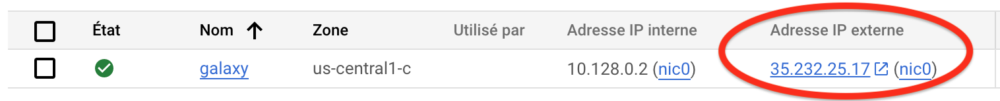

### 1. Installation of the Galaxy server

We have automated the installation of Galaxy on your Google Virtual Machine.
All you need is to (i) taking the control of the machine as root and (ii) downloading a 
bash script and running it.
So let's do this, step by step, using the ssh Terminal:

    
  ```Console
  sudo -i
  ```
??? info "What does `sudo -i` command ?"
    This command open a new `shell` where you are root. You can check this by typing `whoami`
    that should return `root`, meaning that you are now working as `root` user.
    
    This is required because installation of new programs as well as manipulations of network
    interfaces is permitted only to users with administration rights.

____
```
wget https://raw.githubusercontent.com/ARTbio/AnalyseGenome/main/GalaxyServer/deploy_galaxy.sh && \
sh deploy_galaxy.sh
```
??? info "What does `wget` command"
    This command is downloading an installation script located in the GitHub repository
    @artbio/AnalyseGenome
??? info "What does `sh deploy_galaxy.sh` command ?"
    This command runs the sh script
    [deploy_galaxy.sh](https://raw.githubusercontent.com/ARTbio/AnalyseGenome/main/GalaxyServer/deploy_galaxy.sh)

Running `deploy_galaxy.sh` shows abundant log scrolling down. The task being executed are:

  - All python dependencies required for the Galaxy server instance are downloaded and installed
  - The Galaxy computing environment (virtualenv) is automatically set up
  - the Galaxy web server is installed (gunicorn) and static pages are built
  - The Galaxy database (SQLite) is automatically upgraded to its latest structure/model
  - The package manager Conda, which is heavily used by Galaxy to install its tools is installed.


This deployment process takes a while (~20 minutes with the release 23.1 of Galaxy), but
this will happen only once.

Naturally, the nextime you start Galaxy, the process will be quickly skipped.

When deployment is finished, you will see the following log in the console:

```{.bash title="Terminal"}
Adding systemd unit galaxy-gunicorn.service
Adding systemd unit galaxy-celery.service
Adding systemd unit galaxy-celery-beat.service
Adding systemd unit galaxy.target
Created symlink /etc/systemd/system/multi-user.target.wants/galaxy.target → /etc/systemd/system/galaxy.target.
  UNIT                       LOAD   ACTIVE SUB     DESCRIPTION
  galaxy-celery-beat.service loaded active running Galaxy celery-beat
  galaxy-celery.service      loaded active running Galaxy celery
  galaxy-gunicorn.service    loaded active running Galaxy gunicorn
  galaxy.target              loaded active active  Galaxy

LOAD   = Reflects whether the unit definition was properly loaded.
ACTIVE = The high-level unit activation state, i.e. generalization of SUB.
SUB    = The low-level unit activation state, values depend on unit type.

4 loaded units listed.
To show all installed unit files use 'systemctl list-unit-files'.
Galaxy is now running as a daemon in the background
and is controlled by systemctl
```
We will review in a section apart how to display the server activity, stop, start or restart
it.

### 2. Connect to your living Galaxy instance

You should now be able to access to you Galaxy instance in a your web browser window.

- Go back to your Google Cloud Engine control panel.
- Find the `External IP address` / `Adresse IP externe` in the 7th column of the dashboard
  (to the left of the ssh menu that you used before).
  
  
  
- Click on the hyperlink.
- In the new browser window, follow the menu `Authentification et enregistrement`
  --> `Enregistrement` --> `Register here`
  
  { width="300" }

  and  **register** to your instance using the email address
  ```
  admin@galaxy.org
  ```
  and the password of your choice (:warning: don't forget it)
  
- After login, you should see the admin tab in the top menu of the Galaxy interface.
  
  { width="600" }
  
  ==You are connected to Galaxy as an admin !==
