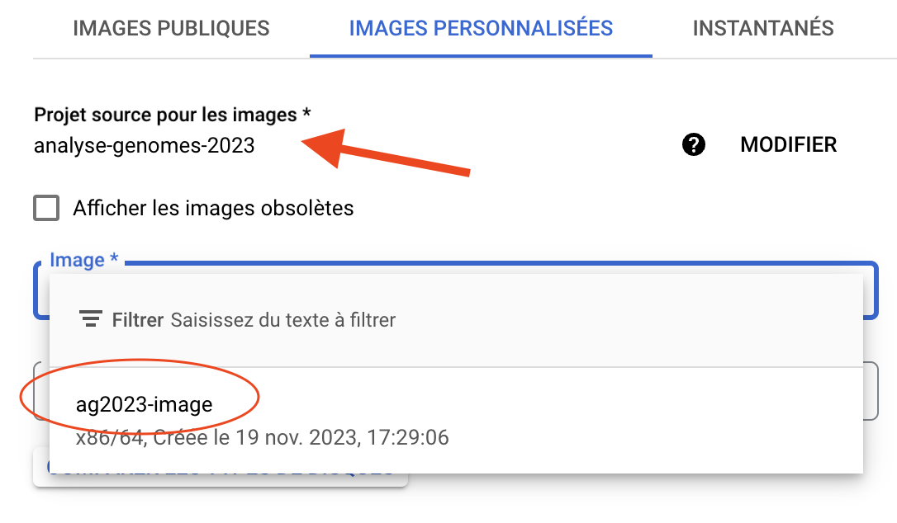

---
hide:
  - toc
---
## In case of big, big troubles with your VM instance

There is an image that you can use to start quickly a new instance.

The VM deployed using this image will have a running Galaxy server with all datasets
preloaded in the histories. This way, you can follow the training tomorrow and the days
after.

Take a breath, and let's do it !

==BEFORE EVERYTHING, say "Help !" in the slack, chanel #galaxy. And most importantly,
indicate your email address and the external IP address of your sick instance.==

I will review remotely the issues and say go/no go for using the emergency image.

If it's `GO` !

1. Go to your compute engine dashbord
2. Stop your sick instance (you can even destroy it if you are sure it is really sick)
3. Click on `CREER UNE INSTANCE`
4. Give a new name to your instance (`save-me` for instance :smile:)
5. Region: somewhere in Europe
6. Zone: where you can
7. Click on `OPTIMISEE POUR LE CALCUL`
8. Serie `C2`
9. Type de Machine: `c2-standard-8`
10. Click at the bottom the check boxe `Autoriser le trafic HTTP`

This is for the easy part.

Now the tricky part, using illustrations.

1. Click `MODIFIER` in the `Disque de démarrage` section
2. Click `IMAGES PERSONNALISEES`
3. Click - really click - on `MODIFIER` of the field `Projet source pour les images *`
4. There, you should see a project named `chris-workshop`. If you do not see it, it must
  be because I did not register your email address (the academic one) for free access to
  the image. Ring me again !
  
      {width="350"}
  
- Now, when you click the `Image *` field, you should see in the rolling menu, The
  emergency image
  ```
  ag-2022
  x86/64, Créée le 23 nov. 2022, 19:53:43
  ```
  Select it
- The remaining fields should automatically fill in (`Disque persistant avec équilibrage` and `200 Go`)
- If you have this:
  
    {width="500"}
  
  You can click on `SELECTIONNER`
  
7. Back to the main panel, click on `DEMARRER`

Almost rescued !

- Open an ssh console in your browser using the menu in the "connecter" column.
- type sudo -i 
- You will see the log indicating that Galaxy is starting (celery, celery-beat and guincorn)
- go back to your Google Cloud engine dashboard.
- Click on the external IP address
- Click on Login/Register.
  This time, you do not have to register, this is already done !
  Just put `admin@galaxy.org` as Email Address and `ag2022` as Password.
- ==You are DONE== :tada: ! Back in a fresh, clean Galaxy server.