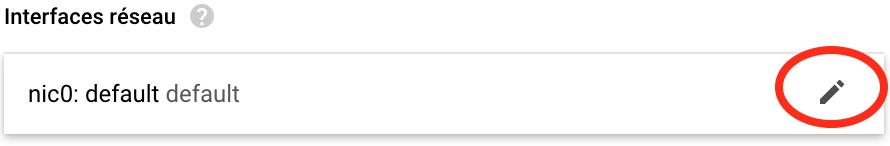

## Management of your Google Virtual Machine

If you read this, you have probably launched at least one time a Google Virtual Machine.

A few rules to get your life easier during the rest of this training:

- ==**Avoid** stopping your VM, instead **suspend** it==
  
  Stopping your VM is like stopping your PC or you laptop.
  
  You will stop everything and will have to literally reboot everything, including
  the Galaxy server. It is not that difficult actually, but it takes a bit more time.
  
  Instead, **Suspending** your VM is like putting your PC in sleeping mode, or closing
  the lid of your laptop.
  
  Thus, remember, at the end of the day or whenever you are not going to use your VM for a long
  time, use:
  
  
  
- **==Protect your instance from unwanted destruction==**
    
    An accident happens so quickly...
  
    - Go to the Google Cloud Platform management web page.
    - Click on the **name** of your VM.
    - Click on the top menu :pencil2:`Modifier`
    - Edit the `Protection contre la suppression` option as follows:
    
    {width=600}
    
    (just at the end of the section **Informations générales**) and do not forget to save
    this new setting.
  
  From this point, you will need to uncheck the box to destroy the instance and your are
  protected against unwanted manifestations of bad karma :imp:!

- **==Reserve a fix IP address==**
    
    Note that you do not need this if you never stop your instance but suspend it instead
    
    - Go back to the Google Cloud Platform management web page.
    - Click on the **name** of your VM.
    - Click on the top menu :pencil2:`Modifier`
    - Deploy the menu **Interfaces réseau**
    
      {width="300"}
      
    - In the menu **`Adresse IP externe`**, select `Créer une adresse IP`
    
      {width="400"}
      
    - In the floating window `Réserver une nouvelle adresse IP statique`, give a name to the
      adresse, and click `Réserver`
      
      {width="400"}
    
    - :warning: Back to the menu **Interfaces réseau**, do not forget to click the `OK` button.
    - :warning::warning: Do not forget to click in addition, at the bottom of the page the
      `Enregistrer` button.
    - Back to the (modified) detail page of your VM, you should now see something like:
      
      {width="800"}
      
    - Go back to the general `Instance de VM` menu by clicking it in the left bar
