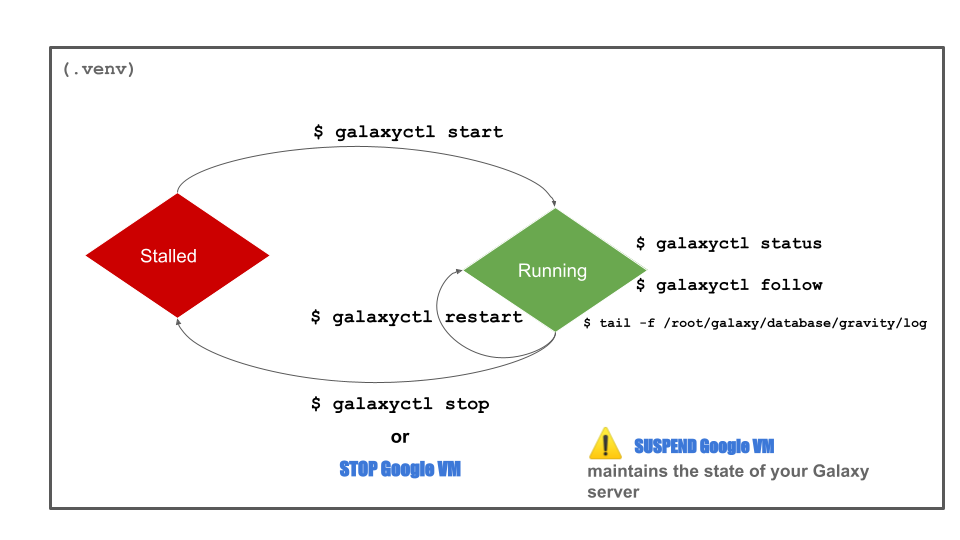

!!! info "Galaxy server commands, quick reminder"
    Check that the server is running and see last logs
    ```
    systemctl status galaxy*.service
    
    # the three services Galaxy celery-beat, celery and gunicorn must be
    # active and running (green)
    ```
    Restart the server
    ```
    systemctl restart galaxy.target
    ```
    Start the Galaxy server, if for any reason it is down
    ```
    systemctl start galaxy.target
    ```
    Follow the activity of the web part only (gunicorn) of the Galaxy server:
    ```
    systemctl status galaxy-gunicorn.service
    ```

## A graphical view of the Galaxy server states and the commands to control them

{width="1200"}

---