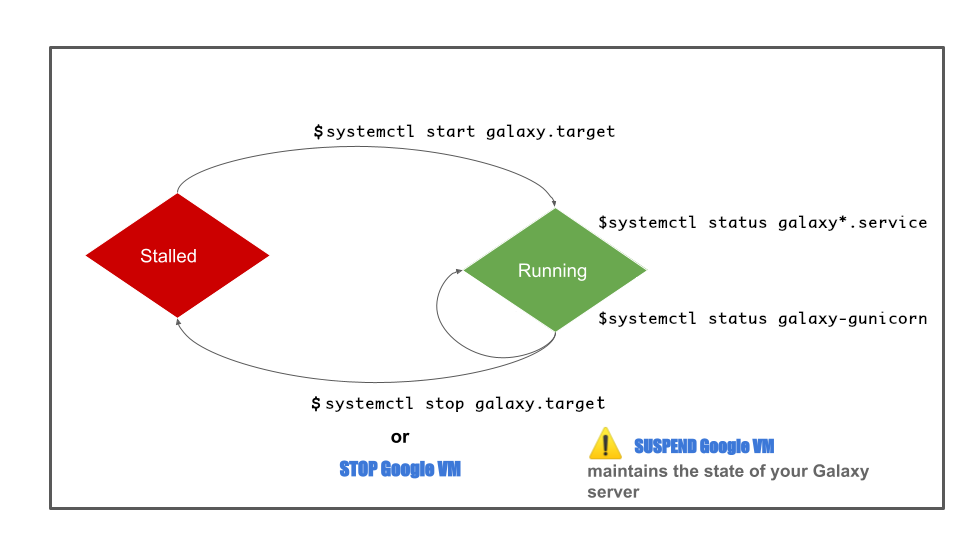

??? info "Galaxy server commands, quick reminder"
    Check that the server is running
    ```
    galaxyctl status
    ```
    Restart the server
    ```
    galaxyctl restart
    ```
    Start the Galaxy server, if for any reason it is down
    ```
    galaxyctl start
    ```
    Follow the activity of Galaxy
    ```
    galaxyctl follow
    ```
    Follow the activity of the web part only of the Galaxy server:
    ```
    tail -f /root/galaxy/database/gravity/log/gunicorn.log
    ```

## A graphical view of the Galaxy server states and the commands to control them

{width="1200"}

## Commands to control the Galaxy server

### The Galaxy server virtual environment

First of all, you must keep in mind that the next commands are only accessible through
the virtual environment that has been installed during the Galaxy deployment.

It is easy to remember that you are actually working through this virtual environment,
because it is indicated in you shell prompt as `(.venv)` when you connect as the admin
user:

Thus, when you execute `sudo -i`, you immediately see:
```
(.venv) root@bare-galaxy:~#
```

You don't have to worry about activating the .venv environment because during the
deployment we automated this activation as soon as you log in to the admin account.

However, if for any reason you were disconnected from the virtual environment (loosing
the `.venv` in the prompt), you can always reactivate it by typing:

```
source ~/galaxy/.venv/bin/activate
```

You can experiment this by

1. Deactivating the virtual environment
  ```
  deactivate
  ```
2. Reactivating it:
  ```
  source ~/galaxy/.venv/bin/activate
  ```

### The useful commands to control the Galaxy server

1. Check that the server is running
  ```
  galaxyctl status
  ```
2. Restart the server
  ```
  galaxyctl restart
  ```
3. Start the Galaxy server, if for any reason it is down
  ```
  galaxyctl start
  ```
4. Follow the activity of Galaxy
  ```
  galaxyctl follow
  ```
5. Follow the activity of the web part only of the Galaxy server:
  ```
  tail -f /root/galaxy/database/gravity/log/gunicorn.log
  ```
  