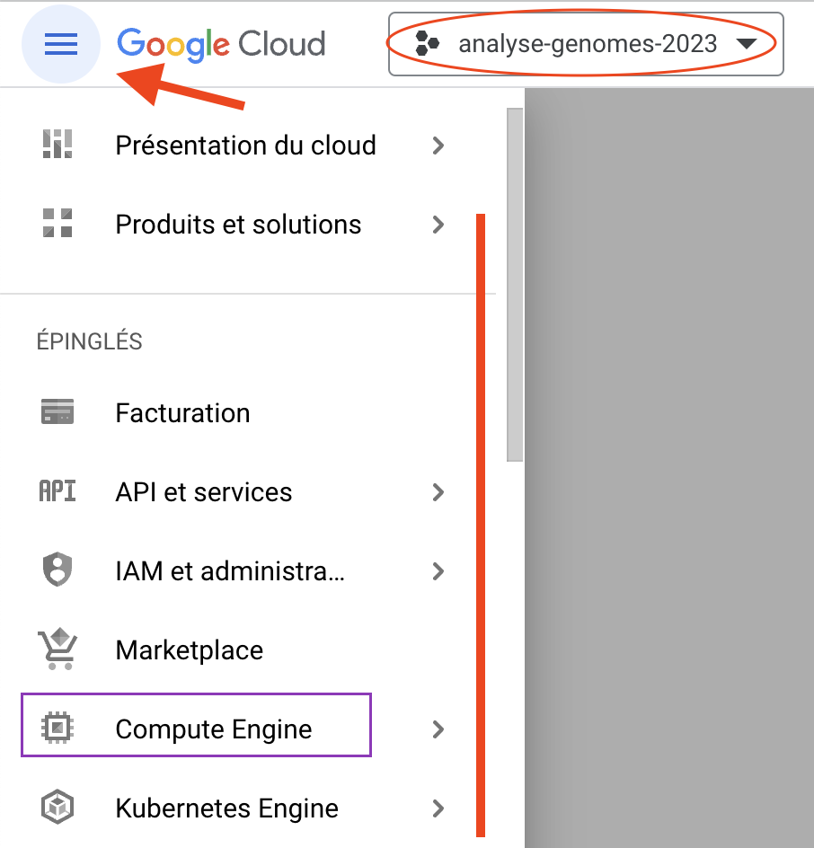
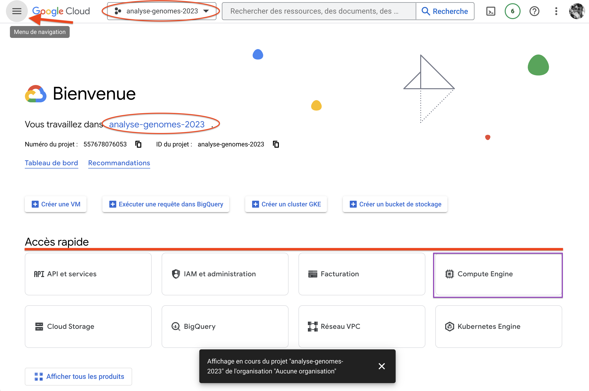
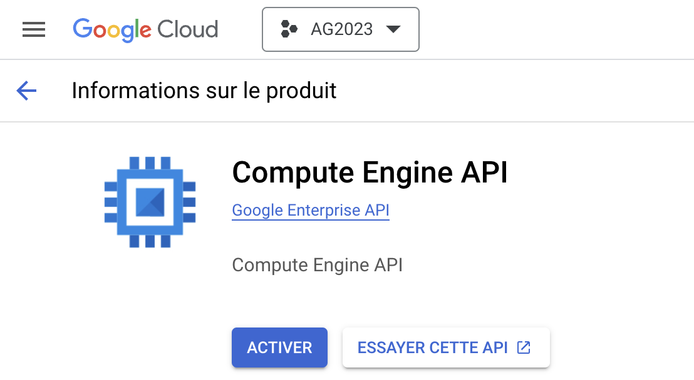
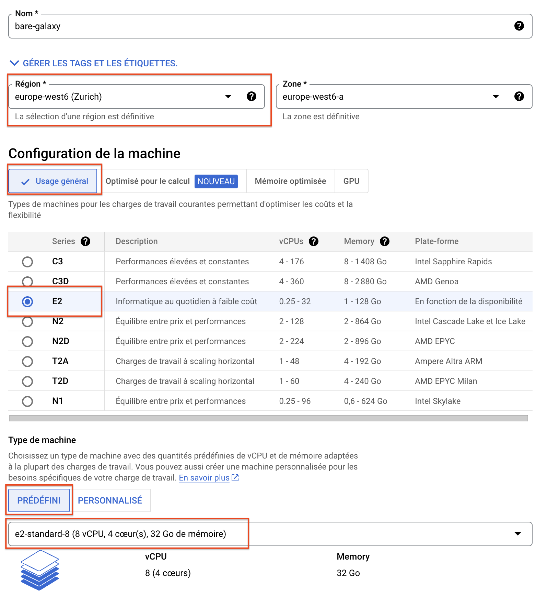
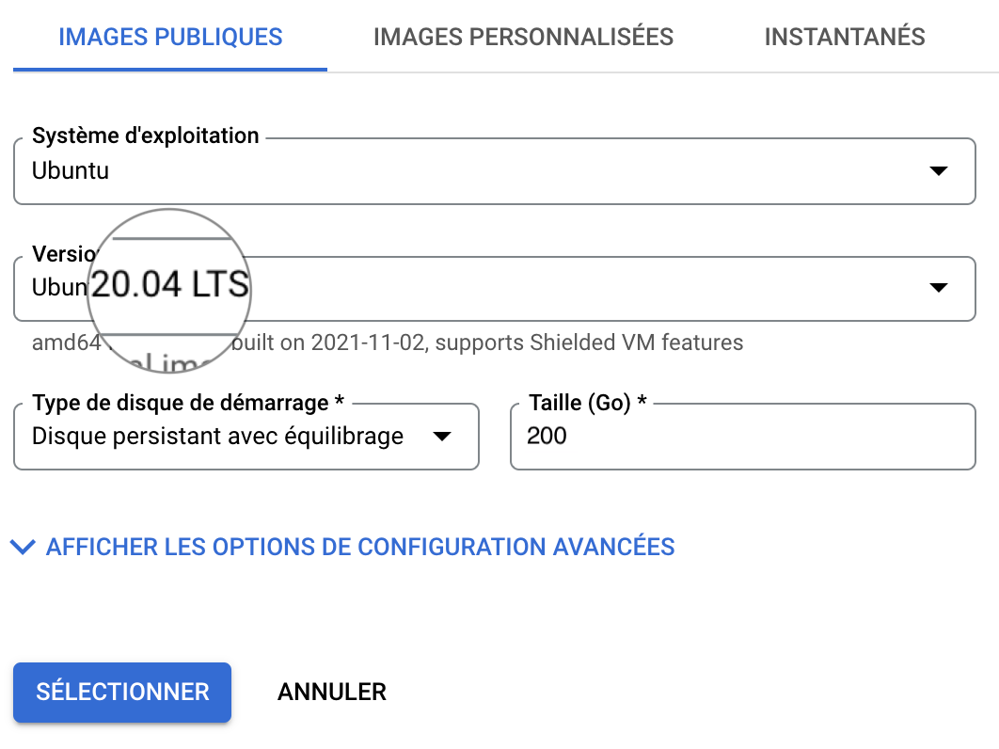
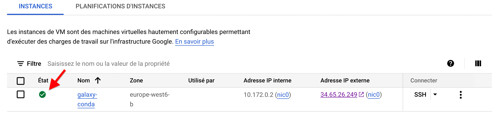
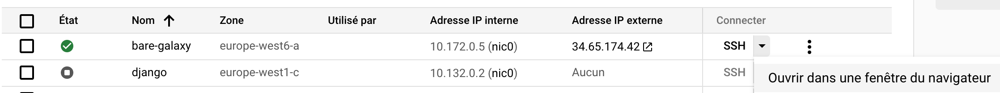
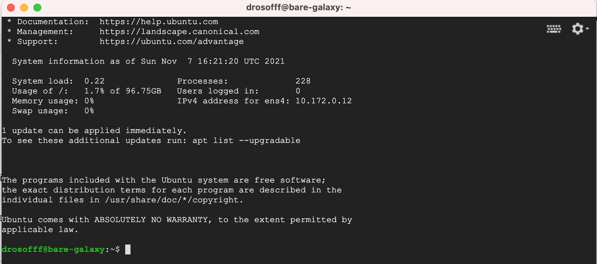
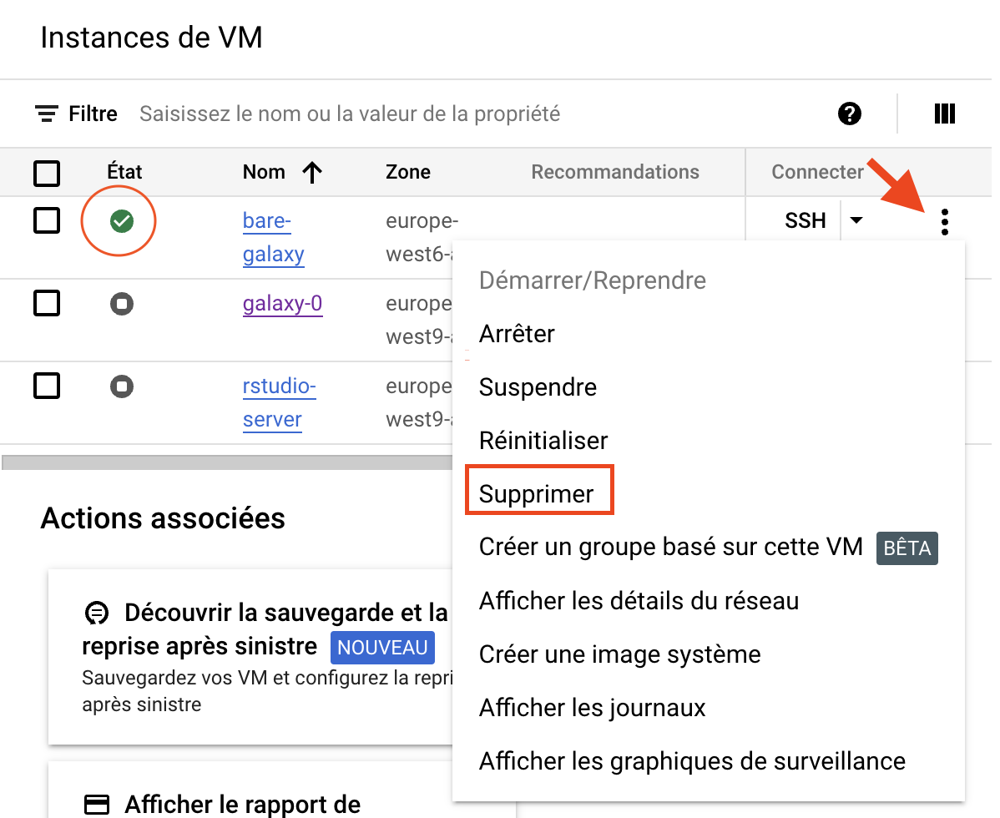

# Get your {width="200"} coupon and activate it.
We will send you in the Slack board a URL which you will need to access in order to request
a Google Cloud coupon.

Through this URL, you will be asked to provide your University email address and your name.
This year, valid email addresses have the following domain names

- sorbonne-university.fr
- etu.sorbonne-universite.fr
- u-paris.fr
- univ-rouen.fr
- etu.unicaen.fr
- edu.bio.ens.psl.eu
- u-psud.fr

An email
will be sent to you to confirm these details before a coupon is sent to you.

- Your coupon is valid through: 11/20/2024
- You can **only request ONE coupon per unique** email address.

# Access to your Google Cloud Account

- [x] The coupon will drive you to your newly created Google Cloud account.
    
    *Note that the Google Cloud account is different from your Gmail account if you have one.*

The logic of Google Cloud Engine accounts... is not that simple ! You should not have to
dive in. However, we provide you below with a few explanations in case you feel lost.

??? info "Your Google Cloud Account"
    First, a GCE provides *services* (red line) to your GCE account. These services are
    listed in the  **main menu** (red arrow).
    
    Secondly, your GCE account is composed of 1 (your case by default) or multiple **projects**
    (red ellipse).
    
    Thirdly, within your GCE account, you have 1 (your case by default) or multiple **comptes de
    facturation (billing accounts)**. Your active "compte de facturation" is probably named
    "Compte de facturation des établissements d'enseignement" or something close.
    It is noteworthy that 1 project is attached to 1 "compte de facturation", whereas 1 "compte
    de facturation" may be attached to multiple projects.
    
    Finally, when you use a service (purple rectangle) - in your case **Compute Engine** - you will
    prompted the first time to activate the API (Application Programming Interface). This is
    normal behavior.
    
    {width="400"}

??? info "Your Google Cloud Dashboard"
    Depending on your navigation, or if you click the upper left logo
    {width="150"}, you will access the GCE account **dashboard**.
    
    Basically, the same items as those discussed previously are available in this view. You
    will find again
    
    - The main service menu (red arrow)
    - The project selector (red ellipse)
    - A quick access to some selected services (red line)
    - A direct access to the main service you are interested in: **Compute Engine** (purple
      rectangle)
    
    {width="800"}

- [x] Click the "Compute Engine" service.
- [x] Since this is probably the first time you access this service, you have to activate its
    Application Programming Interface (API)
    
    {width="300"}

- [x] Then click **CREATE AN INSTANCE** (**CRÉER UNE INSTANCE**)
    and use the following settings:

??? info "VM settings"
    - Name: `bare-galaxy`
    - Region `europe-west6 (Zurich)` (or any region available with you Google coupon). ==As
    it is unlikely that a single Google zone will be able to provide enough resources
    to support 18 virtual machines at the same time, we will have to
    distribute our instances to different zones in Europe and USA==.
    - Zone: `europe-west6-a` (or `-b` or `-c`)
    - **Configuration de la machine**
        - `USAGE général`
        - Série: `E2`
        - Type de machine: `PRÉDEFINI` :arrow_forward: `Standard` :arrow_forward: `e2-standard-8`
    - **Disque de démarrage (Modifier)**
        - `IMAGES PUBLIQUES`
        - Système d'exploitation: `Ubuntu`
        - Version*: `Ubuntu 20.04 LTS`
        - Type de disque de démarrage: `Disque persistant avec équilibrage`
        - Taille (Go): ==`200`==
        - ==SELECTIONNER==
    - **Pare-feu**
        - Check `Autoriser le trafic HTTP`
    
    These settings should look like:
    
    {: style="width:600px"}
    {: style="width:450px"}
    {: style="width:450px"}

As soon as you can see the instance spot turning green,



you can connect it using the ssh web console

- [x] Connect to the VM using the ssh web console

Roll down the `ssh` menu in the control pannel and select the first option
`Ouvrir dans une fenêtre du navigateur`


    
**This opens a web ssh shell session to control your VM:**



- [x] In this console, type:
    ```
    lsb_release -a && lscpu | grep 'CPU(s):' && free -h | grep 'Mem:' && df -h | grep '/$'
    ```

- [x] Copy the result of this command and paste it in the chanel `galaxy` of your Slack
    `Analyse des Génomes 2023`
    This should look like:
??? info "Exemple of returned result"
    ```
    drosofff@bare-galaxy:~$ lsb_release -a && lscpu | grep 'CPU(s):' && free -h | grep 'Mem:' && df -h | grep '/$'
    No LSB modules are available.
    Distributor ID: Ubuntu
    Description:    Ubuntu 20.04.6 LTS
    Release:        20.04
    Codename:       focal
    CPU(s):                             8
    NUMA node0 CPU(s):                  0-7
    Mem:           31Gi       284Mi        30Gi       0.0Ki       509Mi        30Gi
    /dev/root       194G  1.9G  192G   1% /
    ```

- [x] You can now close the console window
- [x] :warning: Do not forget to stop (or even trash) your instance:
    {width="500px"}

---
