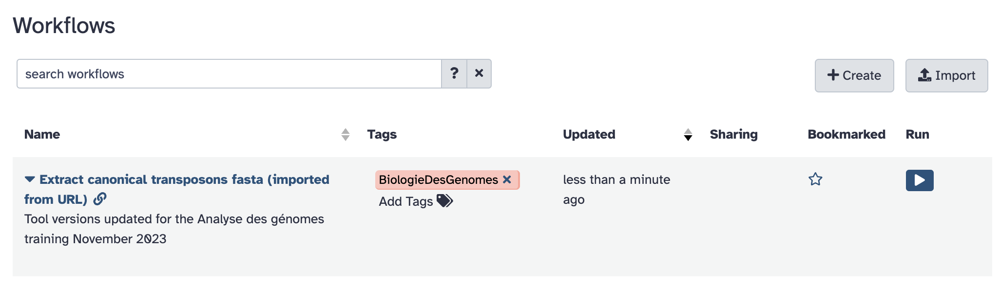
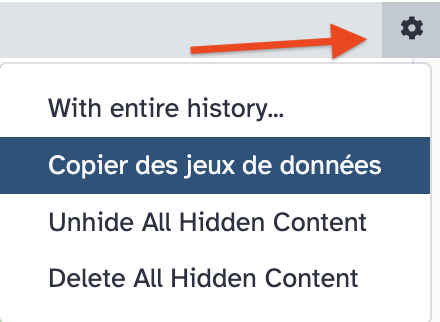

**In this use case, we are going to** 

- [x] Upload a workflow description files in your Galaxy server instance
- [x] Visualise this workflow and its tools
- [x] Eventually run the workflow on input data obtained from a remote public repository.

### 1. Upload workflow description file (.ga)

- [x] Click the `workflow` menu
- [x] Click the "Upload or import workflow" button at the top right
- [x] In the `Galaxy workflow URL:` field, paste the url of the workflow file:
```
https://raw.githubusercontent.com/ARTbio/AnalyseGenome/main/Exercises/Galaxy-Workflow-Extract_canonical_transposons_fasta.ga
```
Note that this file is in the @artbio/AnalyseGenome repository where material for this
training is hosted

- [x] Click on the `Import` button

!!! note
    Alternatively, you could upload the workflow files from you computer instead of uploading them by URL

- [x] the `Workflow` menu should now look like :



- [x] Click the workflow `Extract canonical transposons fasta (imported from URL)` and the `Edit` option


We can go through the various steps of the workflows and figure out what they are doing.

This workflow performs a series of find-and-replace text manipulations, starting
from input data that has been tagged `transposon_set_embl.txt` and producing a new text
dataset that is renamed `Canonical_transposons.fa`.

### 4. Retrieve the `transposon_set_embl.txt` dataset

- [x] Create a new history and name it ==`workflow test`==
- [x] import the dataset 
    - ==Either== using the `Paste/Fetch data` mode of the upload manager (the small
      bottom-top arrow icon at the top left of the Galaxy interface). Copy the URL
      ```
      https://raw.githubusercontent.com/bergmanlab/drosophila-transposons/master/releases/transposon_sequence_set_v9.5.embl.txt
      ```
      in the open field and click the `Start` button.
    - ==OR==, remembering that you just did that few minutes ago !
        
        Thus, you can use the copy datasets function which allow to copy datasets from history
        to history !
        ??? info "How to copy a dataset from an existing Galaxy history"
            - Click the wheel icon at the top of your history right bar
              
              {width="200"}
            - Select `EMBL to Fasta conversion` in the `Source History` left panel
            - Check the item `1`in the list (should be `transposon_sequence_set_v9.5.embl.txt`)
            - Verify that the history in the `Destination History` right panel is `workflow
              test` (should be by default, otherwise change it)
            - Click the `Copy History Items` button
            - Observe the dataset showing up in your `test workflow` history !

- [x] have a close look at the dataset

### 5. Run the workflow

- [x] Click on the workflow menu
- [x] Click the Run option of the workflow (the :arrow_forward: to the right hand side)
- [x] Select the appropriate dataset (should be only one already selected)
- [x] And Click the `Run workflow`
- [x] Look at datasets in the history turning from grey to yellow to green and eventually getting hidden.

### 6. Check result
You may check that the generated dataset is identical to the one generated with the tool
`embl2fa` using the tool `differences between two files`

### 7. Goody for you: an exemple of workflow to treat complex data table

As this is a goody, we put here the key steps to run the workflow

- [ ] Workflow URL
```
https://raw.githubusercontent.com/ARTbio/AnalyseGenome/main/Exercises/Galaxy-Workflow-process_diffmod_table.ga
```
- [ ] 2 tools must be installed in your Galaxy instance to get the workflow running:
  - `add_column_headers`
  - `column_maker`
- [ ] Input table to be parsed/transformed
```
https://github.com/ARTbio/AnalyseGenome/raw/main/Exercises/diffmod_table.tsv.zip
```

