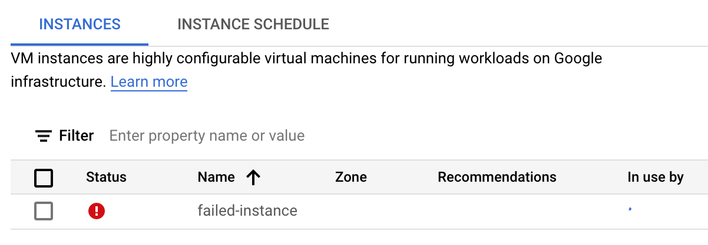
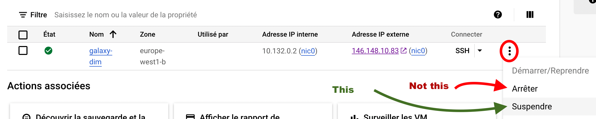

### 1. Prerequisite

**Before following this section, you have to complete successfully all the
instructions given in
["Spin off a VM with your Google Cloud Account"](../Google_cloud_Account)**

### 2. Spin off a virtual Machine `ansible-galaxy` with {width="30px" align="bottom"} Google Cloud Engine

Before starting, we recommend you to pay extra attention any time you see the :warning:
signal.

- [x] Connect to your Google Compute Instances
  [dashboard](https://console.cloud.google.com/compute/instances)

- [x] Create a Virtual Machine Instance

!!! info "with the following settings"
    - Name: `ansible-galaxy`
    - Region `europe-west6 (Zurich)` :point_left: Check your Region in the popup table bellow 
    - Zone: `europe-west6-a` (or `-b` or `-c`) :point_left: Check your Zone in the popup table bellow
    - **Configuration de la machine**
        - `USAGE général`
        - Série: `E2`
        - Type de machine: `PRÉDEFINI` :arrow_forward: `Standard` :arrow_forward: `e2-standard-8`
    - **Disque de démarrage (Modifier)**
        - `IMAGES PUBLIQUES`
        - Système d'exploitation: `Ubuntu`
        - Version: `Ubuntu 20.04 LTS` :point_left: :warning: Watch to the version number (20.04).
          When several processor types are available (eg x86, amd, ...) you can choose anyone.
        - Type de disque de démarrage: `Disque persistant avec équilibrage`
        - Taille (Go): ==`200`==
        - ==SELECTIONNER==
    - **Pare-feu**
        - Check `Autoriser le trafic HTTP`

??? warning "Region assignments to students :warning:"
    ==As it is possible that a single Google region is not able to provide enough resources
    to support 18 virtual machines at the same time, we will distribute our instances to
    different regions in Europe==.
    
    The following table assigns the instances by name to different Regions.

    Please respect this attribution for your final instance, the one you will
    use during your practical work.
    
    |    Email prefix    |         Region           |      Zone         |
    |--------------------|--------------------------|-------------------|
    |alleon.gaelle       |europe-west1 (Belgique)   |let Google decide  |
    |enzo.becherel       |europe-west1 (Belgique)   |let Google decide  |
    |emma.benbakir       |europe-west1 (Belgique)   |let Google decide  |
    |samuel.bensoussan   |europe-west2 (Londres)    |let Google decide  |
    |tberthom            |europe-west2 (Londres)    |let Google decide  |
    |gregblavier76       |europe-west2 (Londres)    |let Google decide  |
    |faroukbouraima      |europe-west3 (Francfort)  |let Google decide  |
    |lunadebarbarin      |europe-west3 (Francfort)  |let Google decide  |
    |baptiste.demaret    |europe-west3 (Francfort)  |let Google decide  |
    |nicolas.doucet      |europe-west6 (Zurich)     |let Google decide  |
    |maeva.drai          |europe-west6 (Zurich)     |let Google decide  |
    |yoann.gonneau       |europe-west6 (Zurich)     |let Google decide  |
    |sarah.graine        |europe-west9 (Paris)      |let Google decide  |
    |margot.hully        |europe-west9 (Paris)      |let Google decide  |
    |nathan.lacombe      |europe-west9 (Paris)      |let Google decide  |
    |jules.richez.22     |europe-west10 (Berlin)    |let Google decide  |
    |loann.paterour      |europe-west10 (Berlin)    |let Google decide  |
    |mathilde.quibeuf    |europe-west10 (Berlin)    |let Google decide  |
    |michiel.tawdarous   |europe-southwest1 (Madrid)|let Google decide  |
    |oceane.wauthier     |europe-southwest1 (Madrid)|let Google decide  |

These settings should be similar to this:
    
{width="600px"}
{width="450px"}
{width="450px"}

**When**

- [x] you have double-checked all indicated settings
- [x] you are sure that your instance will start in the zone assigned to you

**Then** you can start you instance by clicking the button

{width="350px"}


??? bug "Trouble shouting"
    **In some occasions, launching of your VM may fail** as illustrated bellow:
    {: style="width:600px"}
    
    1. Maybe you are not, indeed, using the billing account associated to your
    Google coupon, but instead using a billing account associated to a "Free Trial".
        
        - [x] If it is not already done, activate your coupon by following the received
        instructions, and be sure that you activate a project associated with the billing
        account of the coupon.
    2. The Region and Zone which you have chosen (in the example, `europe-west6-a`) is
    overloaded.
        
        - [x] In this case, try another `Zone` (-b or -c), and/or another `Region`, in Europe or
        America.

### 3. Connect to the VM using the ssh web console and check that everything is fine

- [x] Roll down the `ssh` menu in the control pannel and select the first option

`Ouvrir dans une fenêtre du navigateur`


    
**This opens a web ssh shell session to control your VM:**


- [x] Assuming that you have reached this point you can now type in the web console
the following command (you can copy it from the box bellow)

```
lsb_release -a && lscpu | grep 'CPU(s):' && free -h | grep 'Mem:' && df -h | grep '/$'
```

 - [x] Then, copy the text returned by the command (no screenshot, please) in a separate
post (one by student) in this GitHub
[discussion](https://github.com/ARTbio/AnalyseGenome/discussions/41){:target="_blank"}


<center>
**This is the first check of three (2 more to come)**

{width="80"}
</center> 

### 4. Suspend or continue

If you intend to go through the next section, there is no other action to
complete here.

In contrast, if it is late or you are planing to do something else, suspend your
VM, using the small pop up menu (with 3 vertical dots) : 

{width="800px"}

---
