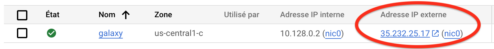
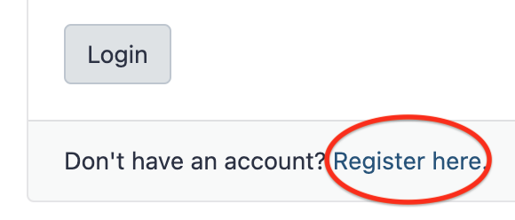

### 1. Installation of the Galaxy server

We have automated the installation of Galaxy on your Google Virtual Machine.
All you need is to (i) taking the control of the machine as root and (ii) cloning
a `galaxyXpand` folder in your VM and running a bash script, using a single
command line (see below).

??? warning "Recommendations before starting"
   
    The creation of your Galaxy server includes the setup of the Galaxy Services and the
    installations of ~28 bioinformatics tools to analyse sequencing datasets.
    
    Although it is completely scripted and requires minimal intervention from your part,
    this process **takes ==1 hour in total==, once,** and the deployed server will serve you
    for ==_the rest of the training week_==.
    
    Therefore, we ask you **extra focus** on this section as well as ==preparing your
    Galaxy server in advance of the Galaxy training week==.
    
    Last practical recommendation about internet connection:
    
    The deployment of the Galaxy server and the installation of Galaxy tools in the server
    involves remote execution of scripts in your Virtual Machine.
    Therefore, it is mandatory that the internet connection between your local terminal
    (where you are physically working !) and the remote VM ==STAYS UP== during these two phases.
    
    Some local machines are configured to sleep after a certain amount of time of inactivity.
    This sleeping process MAY STOP YOUR CONNECTION with the VM and consequently STOP the
    EXECUTION OF YOUR INSTALLATION SCRIPTS. Should this happen, you will have to re-run
    the whole interrupted script, with complications stemming from previous incomplete execution.
    
    --> Please, keep an eye on your deployment during its execution and take any action to
    prevent internet connection breaks.

So let's do this, step by step, typing in the ssh Terminal you have opened in the previous
[section](../bare-galaxy-google/#2-connect-to-the-vm-using-the-ssh-web-console):

    
  ```Console
  sudo -i
  ```
??? info "What does `sudo -i` command ?"
    This command open a new `shell` where you are root. You can check this by typing `whoami`
    that should return `root`, meaning that you are now working as `root` user.
    
    This is required because installation of new programs as well as manipulations of network
    interfaces is permitted only to users with administration rights.

____
```
git clone https://github.com/artbio/galaxyXpand -b ag2024 && \
cd galaxyXpand && \
screen -d -m sh scripts/deploy_ag2024.sh
```
??? info "What is `git` command doing ?"
    This command is cloning the GitHub repository @artbio/galaxyXpand into a
    local folder named `galaxyXpand`.
    
    galaxyXpand is a software developped to quickly and easily install a Galaxy
    server. It is based upon the ansible framework for software deployment.
??? info "What is `sh scripts/deploy_ag2024.sh` doing ?"
    This command runs the script
    [deploy_ag2024.sh](https://github.com/ARTbio/galaxyXpand/blob/ag2024/scripts/deploy_ag2024.sh)

??? info "What is `screen -d -m` doing ? (Linux geek corner)"
    `screen -d -m <command>` is starting the <command> in a separate child shell
    which is in a "detached" mode, ie interruption of your ssh connection will
    not interrupt the detached shell process. You can see this as a small daemon
    programm.

Running `deploy_ag2024.sh` shows abundant log scrolling down. The task being executed are:

  - Python dependencies required for the Galaxy server instance are downloaded and installed
  - The ansible framework v3.0.0 is installed for running the ansible playbooks
  - The Galaxy computing environment (virtualenv) is automatically set up
  - The Galaxy web server is installed (nginx reverse proxying gunicorn) and static pages are built
  - The Galaxy database Postgresql is installed and upgraded to its latest structure/model
  - The package manager Conda, which is heavily used by Galaxy to install its tools, is installed.
  - Plus many other tasks : a high-performance server relies on complex software.
  - [x] The final step in Galaxy deployment is the automated installation of
    around 15 tools that you will need for your analyses.


In total, the automated deployment of your Galaxy server will take about ~45
minutes, including the installation of your tool "portfolio".

Naturally, this deployment will happen once. The next time you connect to your
Galaxy server, you'll be ready to use it !

<center>

{width="200"}
</center>

When deployment is finished, you will see the following log in the console:

```{.bash title="Terminal"}
Adding systemd unit galaxy-gunicorn.service
Adding systemd unit galaxy-celery.service
Adding systemd unit galaxy-celery-beat.service
Adding systemd unit galaxy.target
Created symlink /etc/systemd/system/multi-user.target.wants/galaxy.target → /etc/systemd/system/galaxy.target.
  UNIT                       LOAD   ACTIVE SUB     DESCRIPTION
  galaxy-celery-beat.service loaded active running Galaxy celery-beat
  galaxy-celery.service      loaded active running Galaxy celery
  galaxy-gunicorn.service    loaded active running Galaxy gunicorn
  galaxy.target              loaded active active  Galaxy

LOAD   = Reflects whether the unit definition was properly loaded.
ACTIVE = The high-level unit activation state, i.e. generalization of SUB.
SUB    = The low-level unit activation state, values depend on unit type.

4 loaded units listed.
To show all installed unit files use 'systemctl list-unit-files'.
Galaxy is now running as a daemon in the background
and is controlled by systemctl
```

As a final check that your Galaxy deployment is successful, please, enter the following
command line in your web console, copy the returned output (:warning: *copy* is not
*screenshot*), and paste it in this
[GitHub Discussion](https://github.com/ARTbio/AnalyseGenome/discussions/29) 

```
systemctl status galaxy*.service
```

We are reviewing in a section apart how to display the server activity, stop, start or
restart it.

### 2. Connect to your living Galaxy instance

You should now be able to access to you Galaxy instance in a your web browser window.

- Go back to your Google Cloud Engine control panel.
- Find the `External IP address` / `Adresse IP externe` in the 7th column of the dashboard
  (to the left of the ssh menu that you used before).
  
  
  
- Click on the hyperlink.
- In the new browser window, follow the menu `Authentification et enregistrement`
  --> `Enregistrement` --> `Register here`
  
  { width="300" }

  and  **register** to your instance using the email address
  ```
  admin@galaxy.org
  ```
  and the password of your choice (:warning: don't forget it)
  
- After login, you should see the admin tab in the top menu of the Galaxy interface.
  
  { width="600" }
  
  ==You are connected to Galaxy as an admin !==
