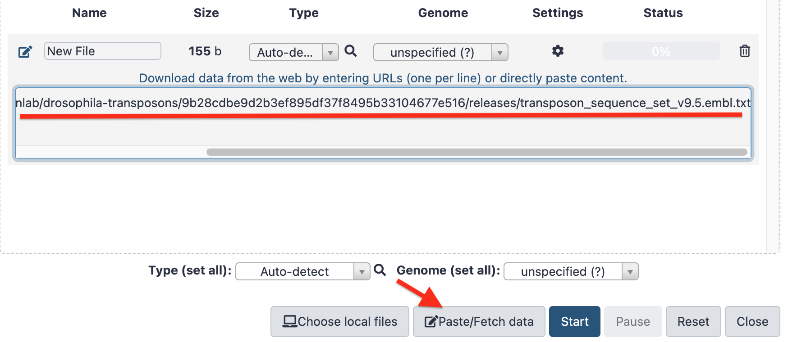

---
hide:
  - toc
---
??? info "Initial Format (EMBL flat file)"
    ```
    ID   INE1    standard; DNA; INV; 611 BP.
    XX
    AC   U66884;
    XX
    DR   FLYBASE; FBte0000312; Dmel\INE-1.
    XX
    SY   synonym: mini-me
    SY   synonym: DINE
    SY   synonym: narep1
    SY   synonym: Dr. D
    XX
    FT   source          U66884:4880..15490
    XX
    CC   This is presumably a dead element.
    CC   Derived from U66884 (e1371475) (Rel. 52, Last updated, Version 6).
    CC   Michael Ashburner, 28-Sep-2001.
    CC   Any changes to original sequence record are annotated in an FT line.
    XX
    SQ   Sequence 611 BP; 193 A; 123 C; 93 G; 202 T; 0 other;
         TATACCCGTT ACTAGATTCG TTGAAATGAA TGTAACAGGC AGAAGGAAGC GTCTTAGACC        60
         ATATATAGTA TATACATACA TGTATATTCT TGATCAGGAT CAATAGCCGA GTCGATCTTG       120
         CCATATCCGT CTGTCCGTAT GAACGTCGAG ATCTCAGGAA CTATAAAAGC TAGAAGGTTT       180
         AGATTCAGCA TACAGAGACA AAGACGCAAG TAGCCATGCC CACTCTAACG TCCACAAACA       240
         GCGCAAAACT ATCACGCCCA CACTTTTGAA AAATGTGTTG TTCTTTTCAC ATTCTGATTA       300
         GTCTTTTACA TTTCTATCGA TTTCCAAAAA AAAACTTTTT GCCAACGCCC TAAAACCGCC       360
         CAAAACTCCG ACACCCACAT TTGTAAAAAA TTGTTGGGAA TTTTTTTCAT AAATTTATTA       420
         GTTTATTATT TATTATAAAT TTAAGTTTAT ATCGATTTGC CGACAACATA TTTTAATTTT       480
         TTTTCTCATT TTATCTTTTA TCTATCGATA TCCCAGAAAA ATTGTGCAAT TTCGCATTCA       540
         CACTAGCTGA GTAACGGGTA TCTGATAGTC GGGAAACTCG ACTATAGCAT TCTCTCTTTT       600
         TGAAATTGCG G                                                            611
    //
    ```
??? info "Target Format (fasta)"
    ```
    >INE1
    TATACCCGTTACTAGATTCGTTGAAATGAATGTAACAGGCAGAAGGAAGCGTCTTAGACC
    ATATATAGTATATACATACATGTATATTCTTGATCAGGATCAATAGCCGAGTCGATCTTG
    CCATATCCGTCTGTCCGTATGAACGTCGAGATCTCAGGAACTATAAAAGCTAGAAGGTTT
    AGATTCAGCATACAGAGACAAAGACGCAAGTAGCCATGCCCACTCTAACGTCCACAAACA
    GCGCAAAACTATCACGCCCACACTTTTGAAAAATGTGTTGTTCTTTTCACATTCTGATTA
    GTCTTTTACATTTCTATCGATTTCCAAAAAAAAACTTTTTGCCAACGCCCTAAAACCGCC
    CAAAACTCCGACACCCACATTTGTAAAAAATTGTTGGGAATTTTTTTCATAAATTTATTA
    GTTTATTATTTATTATAAATTTAAGTTTATATCGATTTGCCGACAACATATTTTAATTTT
    TTTTCTCATTTTATCTTTTATCTATCGATATCCCAGAAAAATTGTGCAATTTCGCATTCA
    CACTAGCTGAGTAACGGGTATCTGATAGTCGGGAAACTCGACTATAGCATTCTCTCTTTT
    TGAAATTGCGG
    ```
## Import the dataset

- [x] In galaxy, create a new history and name it =="EMBL to Fasta conversion"==
- [x] Copy the url of the flat EMBL file:
  ```
  https://raw.githubusercontent.com/bergmanlab/drosophila-transposons/9b28cdbe9d2b3ef895df37f8495b33104677e516/releases/transposon_sequence_set_v9.5.embl.txt
  ```
- [x] In Galaxy, click the `Upload Data` button
  
  {width=200}
  
- [x] Then click the `Paste/Fetch data` button, Paste the copied file url in the central field and click `Start`
  
  {width=700}
  

## Reformat the file using the tool `embl2fa`:

- [x] Go to the `Admin` --> `Install and Uninstall` panel.
- [x] In the search repository box, type `embl2fa`
- [x] The search should likely return the tool at the **bottom** of the page
  ```
  embl2fa										artbio	1	today
  Converts EMBL flat format to fasta format
  ```
- [x] Click on the embl2fa, then on the `install` button.
- [x] Choose `AG 2023` for the **Target Section:**, then click the `OK` button
- [x] The tool installation should only take a few seconds (the button `Install` turns to a red `Uninstall`)
- [x] You can now go back to the analysis interface by clicking the `home` icon.
- [x] in the Galaxy search toolbar box, search for `embl` and select the tool
  `Convert embl flat file to fasta`.
- [x] Select the imported dataset `transposon_sequence_set_v9.5.embl.txt` (should likely be the
  dataset #1) and click :arrow_forward:`Run Tool`


## Inspect the new dataset.

Inspect the new `fasta file` dataset by clicking the small rounded `i` icon that shows up
when you deploy the dataset.

In particular, you can deploy the `Command line` box in the datasheet and verify the code
executed by the tool.
  
## Check the conversion

- [x] Download the file reference for the conversion (ie, a file that we know is correctly converted...)
```
https://raw.githubusercontent.com/ARTbio/AnalyseGenome/main/Exercises/transposon_sequence_set_v9.5.fa
```
- [x] Use the tool `Differences between two files` to compare the dataset `fasta file` and the dataset
  `transposon_sequence_set_v9.5.fa`
  
  The resulting dataset should be empty, meaning that the dataset `fasta file` and the dataset
  `transposon_sequence_set_v9.5.fa` are identical.

-----