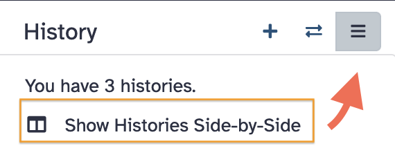
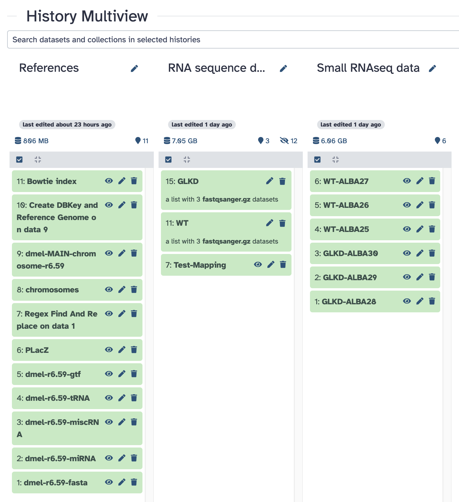

{width="80"}

 
We need to see that all the input datasets you need for next analyses in Galaxy
are available in your account.

Thus, you should have now downloaded 3 data sets in three distinct histories.

- [x] Genomic references in an history `References`
- [x] RNAseq datasets in an history `RNA sequence datasets` (or similar history name)
- [x] small RNAseq datasets ub an history `Small RNAseq data` (or similar history name)

Indeed, you can visualize these 3 histories side-by-side:

Click on the upper-right icon in the history side bar (right handside of the
Galaxy interface).

Select the item `Show Histories Side-by-Side`

{width="300px"}

This menu takes you to the "History multiview" feature. This view mode is
convenient for various datasets managements, for instance for copying datasets
between histories (just drag and drop the datasets over the histories)

It is also handy to have a global view of your analyses in Galaxy (especially
if you gave appropriate and meaningful names to theses histories).

Thus, in the current mutiview, you should see your three dataset histories
side-by-side.

Please, be sure it is the case (if not explore the interface in order to display
these three histories).

Then, take a screenshot of these histories, similar to the following image.

{width="600px"}

And please, paste your screenshot in the third GitHub
[discussion](https://github.com/ARTbio/AnalyseGenome/discussions/42){:target="_blank"}
in a separate comment (one by student).

{width="300px"}

---
