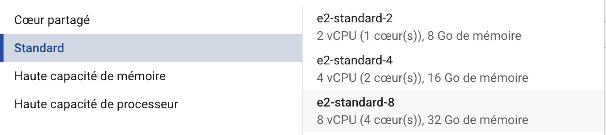
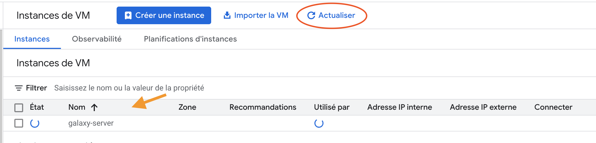

## **1. Activate Compute Engine API**
Since you have now a running project, you can move forward and activate your Compute Engine interface.

1. Click on the top-left **☰** Menu and navigate to the `Compute Engine` button.
2. Since this is the first time, you will not see a list of Virtual Machines (VMs). You will land on a "Compute Engine" presentation page where the main message will be: "The Compute Engine API is not enabled" (or a similar message).
3. Click the clearly visible blue button: "ENABLE".

:warning: The API activation is not instantaneous; it may take a minute or two (a loading indicator will be displayed).

Once the API is activated, the page will automatically reload, and you will finally access the actual Compute Engine dashboard (the "VM instances" page), which will be empty.

## 2. **Spin off your Galaxy server from a Virtual Machine Image**

Using your fresh Compute Engine dashboard, you are going to start a Virtual Machine with 8 cpus, 32 MB of RAM and a 300 GB disk, pre-configured with a fully functional Galaxy server. To do so, you will use an Image, which is prepared for you, as a template (or "model") for your VM.

??? warning "**:trumpet: VM Image Access Authorization**"
    To access and use the VM Image, you must first have the necessary permissions.

    These permissions are granted automatically upon coupon activation via a script that runs every 15 minutes.

    While unlikely, if you attempt to deploy your first VM immediately after activating your coupon, the image may not yet be visible to you.

    **If this occurs, please wait a few minutes (up to a maximum of 15).** If you still cannot access the image after this time, please request assistance on the Slack board or by creating an issue on [GitHub](https://github.com/ARTbio/AnalyseGenome/issues).

    This can also be caused by an authentication issue if you are using an email address that is different from the one we expect.

Your VM deployment can be performed in two ways:

- [x] Using a single command line which is hidden below in the "Geek Corner"
 
??? info "The Geek Corner"
    If you do not like clicking everywhere on a complex graphical interface, you can bypass **all** the steps bellow
    using one of the following command lines.

    These command are identical, except for the --zone parameter, which is different for each line. :warning: In order to balance the resources demanded to Google in different compute centes, we ask you to chose randomly one of them. There are 6 lines, for 6 zones: roll a die !
    
    In addition, before enter ++return++, please edit `<your-name>` with your name (eg `christophe-antoniewski` or `chris-antoniewski`). The command will not work with the `<` and the `>` characters.


    1. **Click on the Cloud Shell icone (a small >_ in a square, at the top right corner of the page, next to your login circular icon).**
    2. When you Cloud Shell is authenticated and started, just copy and paste one of the following commands:
    ```
    gcloud compute instances create <your-name>-galaxy-server --image-family=galaxy-images --image-project=ag2025-25-10-01-1 --zone=europe-west1-b --machine-type=e2-standard-8 --tags=http-server --boot-disk-size=300GB
    ```
    ```
    gcloud compute instances create <your-name>-galaxy-server --image-family=galaxy-images --image-project=ag2025-25-10-01-1 --zone=europe-west2-b --machine-type=e2-standard-8 --tags=http-server --boot-disk-size=300GB
    ```
    ```
    gcloud compute instances create <your-name>-galaxy-server --image-family=galaxy-images --image-project=ag2025-25-10-01-1 --zone=europe-west3-b --machine-type=e2-standard-8 --tags=http-server --boot-disk-size=300GB
    ```
    ```
    gcloud compute instances create <your-name>-galaxy-server --image-family=galaxy-images --image-project=ag2025-25-10-01-1 --zone=europe-west4-b --machine-type=e2-standard-8 --tags=http-server --boot-disk-size=300GB
    ```
    ```
    gcloud compute instances create <your-name>-galaxy-server --image-family=galaxy-images --image-project=ag2025-25-10-01-1 --zone=europe-west6-b --machine-type=e2-standard-8 --tags=http-server --boot-disk-size=300GB
    ```
    ```
    gcloud compute instances create <your-name>-galaxy-server --image-family=galaxy-images --image-project=ag2025-25-10-01-1 --zone=europe-west9-b --machine-type=e2-standard-8 --tags=http-server --boot-disk-size=300GB
    ```
- [x] Using the graphical interface of GCE through the following steps.

### Left Tab "`Configuration de la machine`"

- [x] First of all, click the blue button `Créer une Instance` at the top of your Compute Engine dashboard.
- [x] Give you machine a name. To facilite management of your VM and help in case of trouble, please take a name in the form of
      ```
      <your-name>-galaxy-server
      ```
- [x] Chose a `Region` the `europe-west` region. This can be `europ-west-1`, `-2`, `-3`, `-4`, `-6`, `-8`, `-9`, `-10` or `-12`.
- [x] Leave the `Zone` to `Toutes` (Google Engine will automatically chose the best one for you).

{width="700px"}

Scroll down to the bottom of the page.

- [x] Click on this menu :

{width="700px"}

Then select standard → e2-standard-8 as in the screenshot bellow:

{width="700px"}

### Left Tab "`OS et stockage`"
- [x] Click in the left menu the tab `OS et stockage`
- [x] Click the blue button `Modifier` of the `Système d'exploitation et stockage` section.
- [x] In the pop-up menu `Disque de démarrage`, select `Images personnalisées`
- [x] In the line `Projet source pour les images *`, click on the item `Modifier` (:warning: many people missed it, watch carefully)
- [x] Select the project `AG2025-25-10-01-1` where the image you are looking for is located.
- [x] In the menu, you can now select the image `galaxy-image-x` where x stand for 5, 6, 7, etc.
{width="350px"}
- [x] Last but not least, type `300` in the `Taille (Go)` fiels, and click on the blue button `Sélectionner`. This will be the size
of your disk.

### Left Tab "`Protection des données`"
- [x] Check `Aucune sauvegarde` (This is not necessary and would use your credits for useless storage)

### Left Tab "`Mise en réseau`"
- [x] Check `Autoriser le trafic HTTP`

{width="500px"}

Leave unchanged the remaining left tabs `Observabilité`, `Sécurité` and `Avancé`.

- [x] Click the blue button `Créer` at the bottom of the page.

**:tada: That's it, you should see your VM starting in the dashbord. This may take 1 or 2 minutes before you can access to your Galaxy
server and start using it !**

{width="700px"}

Do not hesitate to click the button `Actualiser`, as the GCE dashboard does not refresh that often.

{width="700px"}

---
