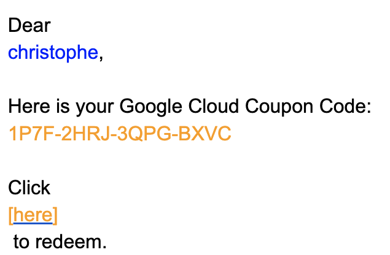

## A. Redeem and activate your Google Cloud coupon

For this training, we have obtained $50 coupons for all students from the Google Cloud Education Program.
These coupons will allow you to use the Google Cloud Engine infrastructure for the entire
duration of the training and likely beyond, at no personal cost.

:warning: Please follow the instructions below carefully, as you can **only request ONE coupon per student**.

We will send a URL to the Slack board for you to redeem your Google Cloud coupon.

- [x] 1. Through this URL, you will be first asked to provide your University email address and your name:

{width="500"}

In 2025, valid student email addresses have the following domain names

- aphp.fr
- edu.bio.ens.psl.eu
- ens.psl.eu
- etu.sorbonne-universite.fr
- etu.u-paris.fr
- sorbonne-universite.fr
- u-paris.fr

- [x] 2. After you complete the form, you will receive an email to confirm your details before the coupon is sent.
    
    :warning: It is important to check your spam folder, as the Google confirmation email often ends up there.

- [x] 3. Following the link in the confirmation email, you will receive another email from Google Cloud Notifications
with a Google Cloud Coupon Code and a redeem link:
{width="300"}

→ please, copy the code and follow the link.

- [x] 4. Paste it in the new form:

{width="300"}

- [x] 5. After clicking "Accept and Continue" and activating your coupon (valid until **15/11/2026**), you will be directed to the Google Cloud Console's "Vue d'ensemble de la facturation" (Billing Overview) page.

{width="600"}

## B. Create a project.

- As you can see, your newly created Google Cloud account has one "compte de facturation" (billing account)
which shoud be "Compte de facturation des établissements d'enseignement" or something close.
This account is provisioned with 50$, which you can check in the left menu "Credits".

- You now need to create a ==**project**==, which will be linked to your billing account.

- [x] Click on the Navigation menu (the "hamburger" icon ☰ at the top left, next to the "Google Cloud" logo).
- [x] A menu will open on the left. Look for the "IAM & Administration" line.
- [x] Hover over on it, and in the submenu that appears, click on "Créer un projet".
- [x] You will land on a page with a form, pre-filled with a default project name.
- [x] Name you project at your convenience (eg Analyse des Génomes, AG2025, etc) and click "Créer".

{width="400"}

---
