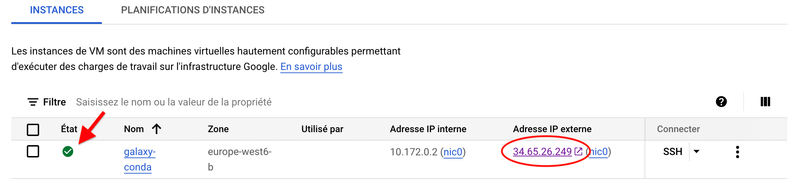
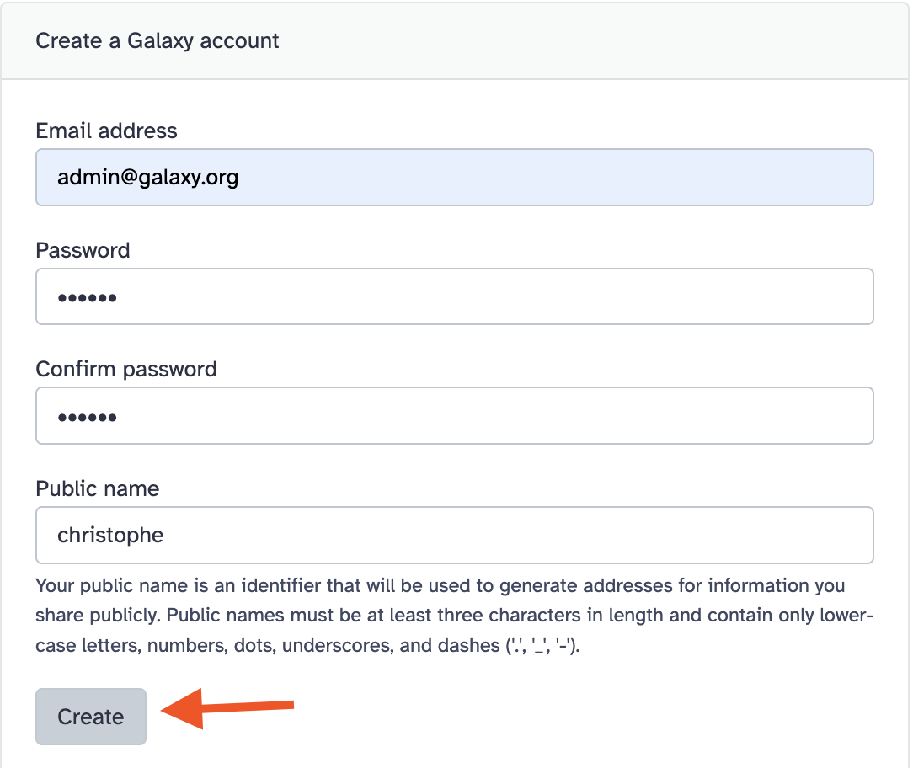

{width="800px"}

Once your VM is up and running, its state indicator turns green.
In addition to the internal IP address (which you will not use), an external IP address
is also attributed to your VM (red ellipsis in the above screenshot).

This is the address that you are going to use to reach the web interface of your
Galaxy server. ==All you have to do is to click on it.==

:warning: When you have started your VM, a lot of events were triggered to activate the
Galaxy server, its job manager and its web frontend. This may take 2-3 minutes. Thus, if this
error web page is returned when you click the external address for the first time, do not panic.
<center>
**502 Bad Gateway**

---

nginx/1.24.0 (Ubuntu)
</center>
Close the page, wait for 30 secondes and try again.

## **First connection to your Galaxy server**

The first time you land to your Galaxy server home page, you see this:

{width="800px"}

You are connected as an anonymous user. As so, you could start import data, that would show up
in the history right bar, use tools (left tools menu) to analyse them, and obtain result datasets
that would appear in the current history.

However, the next time your go back to the Galaxy server, this analysis and its datasets would
be likely lost.

Thus, the first time to do is to register. In your case, you will even register with all the
administration rights to fully manage your Galaxy server. Don't miss your chance!

- [x] Click on the `Authentification et Enregistrement` top menu (as shown above) and, in the new
page that opens, do not fill anything. Instead, click the link `Register here`.

{width="300px"}

- [x] This link opens a page where you can register as an admin.

- :warning: Use `admin@galaxy.org` as email address. There is no other choice to be recognized by
galaxy as a true admin. You can copy the email address bellow :
```
admin@galaxy.org
```
- Put twice the same password of your choice (:warning: don't forget it)
- Put a public name of your choice. Public names must be at least three characters in length
  and contain only **lower-case letters**, numbers, dots, underscores, and dashes ('.', '_', '-').
  
    :warning: The public name `chris` is already taken, sorry about that :smile:.

- Click on the `Create` button.

{width="400px"}

- [x] Back to the Galaxy home page, you will see that an additional menu is now present in the
top menu bar: `Admin`. In addition, if you click on the menu `Utilisateur`, you should see
your public name.

{width="600px"}

## **Congratulations** !

**Your Galaxy admin is set up and ready to use.**


## **Ends of Galaxy work sessions**
:warning: Once more time, each time you have finished to work with Galaxy, save your Google coupon:

- [x] Go to your [Google cloud console (web interface)](https://console.cloud.google.com/compute/))
- [x] Click the 3 vertical dots in the line of your VM and select `Suspendre` (or `Suspend` with
  the english interface)

## **The next time you connect to your Galaxy server**

You can directly enter your account with your login (either `admin@galaxy.org` or your `Public name`) and `password`.

Note that sometimes, you are directly logged in because a cooky remember your recent visit.

---
??? info "The Geek Corner: controlling your Galaxy server through an ssh session"
    You can control you galaxy server by connecting to a ssh shell session in your VM.
    To do so :
        
    1. Click on the `ssh` menu in the line of your VM and select `Ouvrir dans une fenêtre du navigateur`
    2. In the ssh session that opens with your VM, type `sudo -i`
    
    :warning: The following commands won't work if you are not logged as root.
    (`sudo -i` at your initial connection)
    
    - [x] Check the state of the Galaxy server
    ```
    galaxyctl status
    ```
    - [x] Restart "gently" the Galaxy server
    ```
    galaxyctl graceful 
    ```
    - [x] Restart "firmly" the Galaxy server (if for whatever reason it is frozen)
    ```
    galaxyctl restart
    ```
    - [x] Follow the activity log of the Galaxy WEB server:
    ```
    galaxyctl follow
    ```
    Type ++ctrl++++c++ to exit.
    - [x] Follow the slum job manager of Galaxy
    ```
    watch "squeue --format '%.18i %.9P %.40j %.8u %.2t %.10M %.4C %.6D %R' && sinfo"
    ```
    Type ++ctrl++++c++ to exit.
---