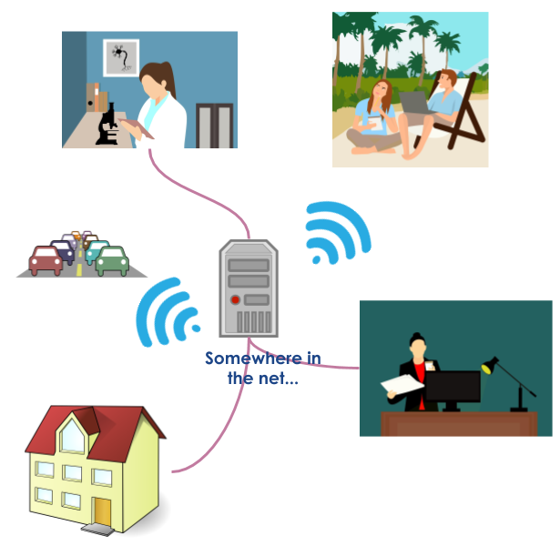

## Un serveur de fichier sur le réseau internet

Il n'est peut être pas inutile de fixer les idées sur quelques termes couramment utilisé.

#### `Le cloud` ou `mon stockage cloud`

Par ses termes, une majorité d'entre-vous font référence, à leur insu ou non, à un serveur
situé quelque part sur le réseau internet, qui contient des fichiers, rendus accessibles
soit à travers l'interface web d'un navigateur, soit en utilisant un petit programme local
"client".

Les "stockages cloud" les plus connus sont `DropBox`, `Google Drive`, `Amazon S3`,
`MyCloud`, etc.

Le `stockage cloud`, dans son assertion commune, existait dans son principe avant le terme `cloud`,
(voir figure), et seules des caractéristiques techniques très "pointues" des stockages distants
justifient vraiment sont emploi (par exemple un système de fichiers distribué).
Pour simplifier les échanges entre utilisateurs et techniciens il peut être préférable de
parler de `NAS` pour `Network Attached Storage`, terme qui a le mérite de désigner de
façon assez pragmatique ce dont on parle: un serveur de ficher accessible à travers le
réseau, internet ou local.

{: style="width:400px"}