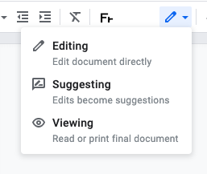

## Les solutions de partage de documents

### [La Suite Google](https://gsuite.google.com/features/)

Pour pouvoir utiliser les outils Google, il faut un créer un compte utilisateur qui vous permettra d'utiliser 
l'ensemble des outils développés par Google.
* [Documents](https://gsuite.google.com/products/docs/)
* [Sheets](https://gsuite.google.com/products/sheets/)
* [Slides](https://gsuite.google.com/products/slides/)
* [Forms](https://gsuite.google.com/products/forms/) 

Le partage des documents est ensuite possible en cliquant sur  en haut à droite de chaque document.

 

Vous pouvez entrer les emails des personnes avec qui vous souhaitez partager le document et préciser si ces utilisateurs peuvent :
* **Voir** (View) 
* **Commenter** (Comment)
* **Editer** (Edit)

Un mode avancé vous permet de gérer chaque partage .

Le document peut aussi être partager par lien, sans préciser d'email.
Dans ce cas, l'ensemble des personnes qui se connecteront à votre document seront anonymes.

Il est donc préférable de faire des partages en utilisant des mails google. Cela permet de suivre les commentaires de chaque personne nommément.

Vous avez 2 modes d'édition : 
* **édition standard** qui change directement le document
* **suggestion** qui permet aux autres d'approuver ou non vos suggestions avant qu'elles ne soient validées dans le document

Vous pouvez aussi faire des commentaires sur certaines parties du texte, en sélectionnant ledit texte et en cliquant sur 

### [La suite Framasofts](https://framasoft.org/fr/)

Framasoft, c’est une association d’éducation populaire, un groupe d’ami·es convaincu·es qu’un monde numérique émancipateur est possible, persuadé·es qu’il adviendra grâce à des actions concrètes sur le terrain et en ligne avec vous et pour vous !

Framasofts propose un ensemble de logiciels et de services libres.

* [Framapad](https://framapad.org/fr/) pour éditer collaborativement.
*Écrivons tous ensemble sur le même document dans une interface de rédaction collective en ligne. Aucune inscription requise, on se donne un pseudo, une couleur et on se lance !*
* [Framacalc](https://accueil.framacalc.org/fr/), un tableur collaboratif.
*Framacalc est au tableur ce que Framapad est au traitement de texte, autrement dit la possibilité d’éditer simplement et collectivement en ligne sur un même document.*
* [Framaslides](https://framaslides.org/login), créer et partager des diaporamas.
*Framaslides vous permet de créer directement en ligne un diaporama ou une présentation, d’y accéder avec une simple connexion internet, et de la partager.*
* [Framaforms](https://framaforms.org/), Création de questionnaires.
*Framaforms vous permet de créer les questionaires dont vous avez besoin, que ce soit dans un cadre scolaire, familial ou associatif. Créez vos questions en fonction de vos besoins, des formulaires à choix multiples aux champs de texte libre.*

