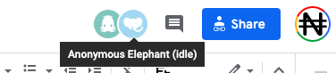

## [Google Docs](https://gsuite.google.com/features/)

Pour utiliser les [Google Apps](https://gsuite.google.com/features/) de façon sécurisée,
et en particulier Google Docs, il vous
faut en premier lieu [obtenir une adresse Gmail](https://accounts.google.com/) qui
fournira accès à un
identifiant et compte Google, et vous permettra de vous **authentifier**.

Il est important de noter qu'un compte google, associé à une adresse Gmail, est automatiquement
associé à un *espace de stockage de fichier  `Cloud` d'environ 15 Go*, le
[Google Drive](https://www.google.com/intl/fr_ALL/drive/).
C'est dans cet espace que vos fichiers Google Docs seront stockés, partagés ou non, et accessibles depuis
n'importe quel ordinateur par l'interface web de [Google Drive](https://drive.google.com/),
ou en synchronisation avec vos ordinateurs avec le *client Desktop* `Sauvegarde et
synchronisation` de Google Drive.

### Les Google Apps

* [Google Docs](https://gsuite.google.com/products/docs/): un équivalent de Microsoft Word
* [Google Sheets](https://gsuite.google.com/products/sheets/): un équivalent de Microsoft Excel
* [Google Slides](https://gsuite.google.com/products/slides/): un équivalent de Microsoft Powerpoint
* [Forms](https://gsuite.google.com/products/forms/): un générateur de sondages en ligne

!!! info "Pourquoi utiliser le traitement de texte partagé Google Docs ?""
    - Il est gratuit, associé à un espace de stockage cloud gratuit, et toujours à jour sans mises à jour.
    - Son interface est simple, très similaire à celle de Word, et propose la plupart des fonctionnalités
    disponibles sur Microsoft Word (Tables des matières, styles, tableaux intégrés, images intégrées,
    graphiques intégrés, etc)
    - Il possède en plus de puissantes fonctionnalité de partage et publication en ligne, et permet
    à plusieurs dizaines d'utilisateurs de  travailler simultanément sans risque de corruption sur le même
    document.
    - Il est entièrement "journalisé": Chaque micro-version du texte créé est mémorisée et peut être
    réactivée, en partie ou entièrement, en cas de problème ou de mauvaise manipulation.
    - Tout comme word il gère le mode "révisions" à plusieurs (évidemment sur un seul et même document),
    ainsi que les notes avec un système d'alerte par mail des collaborateurs.
    - Il possède de nombreux plugins de traductions, formattage, etc.
    - Les fichiers créés bénéficient des fonctionnalités de recherche de Google dans votre Google Drive.
    - Il est très bien intégré avec les autres Google Apps (Sheets, Slides, Forms, Sites, etc)
    - Surtout, il permet d'en finir avec le processus d'échange (généralement par mail) de versions
    asynchrones d'un texte, qui s'avère très chronophage pour l'éditeur principal, inutile et fastidieux.

??? bug "Pourquoi utiliser Google Docs quand les autres solutions sont bien meilleures ?"
    - Microsoft est plus respectueux de ses clients
    - Des logiciels libres ont les mêmes fonctionnalités et la même fiabilité
    - Les autres me voit écrire, c'est gênant.
    - C'est bien de pouvoir compiler des versions avec des dates exotiques et des initiales de collaborateurs,
    Après tout, c'est moi le boss, et je suis imbattable au jeu des 7 erreurs !
    - J'ai peur de faire une bêtise et de détériorer le texte de mes collaborateurs
    - Google m'espionne, me vole mes idées et les revends à mes compétiteurs.
    - Ma contribution à un document partagé est diluée et disparait avec le travail des autres.
    - Les textes que j'écris seul sont bien meilleurs.
    - Je n'aime pas que n'importe qui me lise.
    - Ce n'est pas pareil que d'habitude.
    - Google docs fonctionne très mal quand on veut l'utiliser comme Microsoft Word !
    - C'est beaucoup plus simple que chacun travaille dans son coin à sa main.
    - Je retrouve toujours les textes que j'ai écrits, surtout dans ma clé USB où je les conserve
    en sécurité.
    - Je ne vois pas l'intérêt de se prendre la tête, ce n'est que du texte.
    - Je n'aime pas l'interface de Google Docs, elle est moche et ce n'est pas comme d'habitude.

Mais sans plus tarder, commençons ce bref tutorial pratique.

### Création d'un document Google Docs "ab initio"

### Ouverture et édition d'un document Word

### Partage d'un document

#### Partage avec des utilisateurs identifiés et titulaires d'un compte Gmail

Le partage des documents est ensuite possible en cliquant sur  en haut à droite de chaque document.

 

Vous pouvez entrer les emails des personnes avec qui vous souhaitez partager le document et préciser si ces utilisateurs peuvent :
* **Voir** (View) 
* **Commenter** (Comment)
* **Editer** (Edit)

Un mode avancé vous permet de gérer chaque partage .

#### Partage par lien avec n'importe quel utilisateur
Le document peut aussi être partager par lien, sans préciser d'email.
Dans ce cas, l'ensemble des personnes qui se connecteront à votre document seront anonymes.

Il est donc préférable de faire des partages en utilisant des mails google. Cela permet de suivre les commentaires de chaque personne nommément.

### Bonnes pratiques de collaboration à un document Google Docs

Vous avez 2 modes d'édition : 
* **édition standard** qui change directement le document
* **suggestion** qui permet aux autres d'approuver ou non vos suggestions avant qu'elles ne soient validées dans le document

Vous pouvez aussi faire des commentaires sur certaines parties du texte, en sélectionnant ledit texte et en cliquant sur 

### [La suite Framasofts](https://framasoft.org/fr/)

Framasoft, c’est une association d’éducation populaire, un groupe d’ami·es convaincu·es qu’un monde numérique émancipateur est possible, persuadé·es qu’il adviendra grâce à des actions concrètes sur le terrain et en ligne avec vous et pour vous !

Framasofts propose un ensemble de logiciels et de services libres.

* [Framapad](https://framapad.org/fr/) pour éditer collaborativement.
*Écrivons tous ensemble sur le même document dans une interface de rédaction collective en ligne. Aucune inscription requise, on se donne un pseudo, une couleur et on se lance !*
* [Framacalc](https://accueil.framacalc.org/fr/), un tableur collaboratif.
*Framacalc est au tableur ce que Framapad est au traitement de texte, autrement dit la possibilité d’éditer simplement et collectivement en ligne sur un même document.*
* [Framaslides](https://framaslides.org/login), créer et partager des diaporamas.
*Framaslides vous permet de créer directement en ligne un diaporama ou une présentation, d’y accéder avec une simple connexion internet, et de la partager.*
* [Framaforms](https://framaforms.org/), Création de questionnaires.
*Framaforms vous permet de créer les questionaires dont vous avez besoin, que ce soit dans un cadre scolaire, familial ou associatif. Créez vos questions en fonction de vos besoins, des formulaires à choix multiples aux champs de texte libre.*

