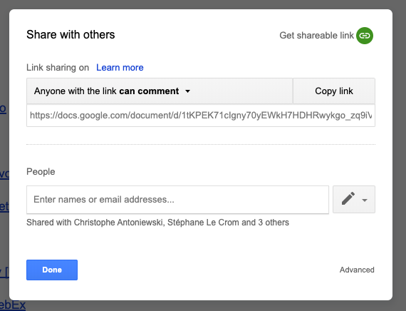
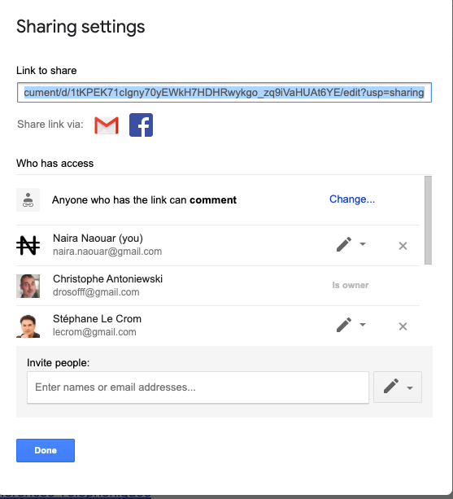
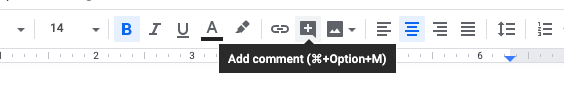

Vous êtes pressés d'expérimenter tout de suite ?
    
  --> Rendez-vous dans notre
[bac à sable](https://docs.google.com/document/d/1LdgkqQUuQSdp2hpCQcFv8vgb6B0B96yHAbHDXoXB9UQ/edit?usp=sharing) Google Docs
  
## [Google Docs](https://gsuite.google.com/products/docs)

Pour utiliser les [Google Apps](https://gsuite.google.com/features/) de façon sécurisée,
et en particulier Google Docs, il vous
faut en premier lieu [obtenir une adresse Gmail](https://accounts.google.com/) qui
fournira accès à un
identifiant et compte Google, et vous permettra de vous **authentifier**.

Il est important de noter qu'un compte google, associé à une adresse Gmail, est automatiquement
associé à un ==espace de stockage de fichier  `Cloud` d'environ 15 Go==, le
[Google Drive](https://www.google.com/intl/fr_ALL/drive/).
C'est dans cet espace que vos fichiers Google Docs seront stockés, partagés ou non, et accessibles depuis
n'importe quel ordinateur par l'interface web de [Google Drive](https://drive.google.com/),
ou en synchronisation avec vos ordinateurs avec le *client Desktop* [`Sauvegarde et
synchronisation`](https://www.google.com/intl/fr_ALL/drive/download/backup-and-sync/)
de Google Drive.

### Les [Google Apps](https://gsuite.google.com/features/)

Ici, nous nous intéressons au logiciel de traitement de textes
[Google Docs](https://gsuite.google.com/products/docs/), équivalent collaboratif de Microsoft Word.

Mais il y a de nombreuses autres Google "Apps", dont les plus connues sont:

- [Google Sheets](https://gsuite.google.com/products/sheets/): un équivalent de Microsoft Excel
- [Google Slides](https://gsuite.google.com/products/slides/): un équivalent de Microsoft Powerpoint
- [Forms](https://gsuite.google.com/products/forms/): un générateur de sondages en ligne

??? info "10 raisons pour utiliser le traitement de textes partagés Google Docs"
    1. Il possède de puissantes fonctionnalités de partage et de publication en ligne, et permet
    à plusieurs dizaines d'utilisateurs de travailler simultanément et sans risque de
    corruption sur le même document.
    - Il permet donc d'en finir avec le processus d'échange e-mail de versions
    asynchrones d'un texte, qui s'avère très chronophage pour les éditeurs, inutile et fastidieux.
    - Il est gratuit, toujours à jour et associé à un espace de stockage cloud accessible partout et tout le temps.
    - Son interface est simple, similaire à celle de Word, et propose la plupart des fonctionnalités
    disponibles sur Microsoft Word (tables des matières, styles, tableaux intégrés, insertion d'images,
    de graphiques, etc)
    - Il est entièrement "journalisé": Chaque micro-version du texte créé est mémorisée et
    réactivable, en partie ou entièrement, en cas de changement d'avis ou de mauvaise manipulation.
    - Tout comme Word il gère le mode "révisions" à plusieurs (évidemment, sur un seul et même document),
    ainsi que les notes avec un système d'alerte par mail des collaborateurs.
    - Il possède de nombreux plugins de traductions, formattage, etc. Il possède en particulier
    d'excellents plugins pour la gestion des références bibliographiques. En particulier
    [Paperpile](https://paperpile.com/welcome)
    - Les fichiers créés bénéficient des fonctionnalités de recherche de Google dans votre Google Drive.
    Google a une certaine compétence dans ce domaine.
    - Il est très bien intégré avec les autres Google Apps (Sheets, Slides, Forms, Sites, etc)
    - Il possède un base d'utilisateurs importante. Nombre de documentations très bien faites
    sont accessibles en lignes et la résolution de problèmes est relativement simple en
    recherchant dans Google 

??? bug "Coin détente: 10 bonnes et moins bonnes raisons de ne *pas* utiliser Google Docs"
    1. C'est Google. Microsoft est plus respectueux de ses clients
    - Des logiciels libres ont les mêmes fonctionnalités et la même [fiabilité](https://framapad.org/fr/)
    - Les autres me voit écrire, c'est gênant.
    - C'est bien de pouvoir compiler des versions avec des dates exotiques et des initiales de collaborateurs.
    Après tout, c'est moi le boss, et je suis imbattable au jeu des 7 erreurs !
    - J'ai peur de faire une bêtise et de détériorer le texte de mes collaborateurs
    - Google m'espionne, me vole mes idées et les revends à mes compétiteurs.
    - Ma contribution à un document partagé est diluée et disparait avec le travail des autres.
    - Les textes que j'écris seul sont bien meilleurs.
    - Je n'aime pas que n'importe qui me lise.
    - Google docs fonctionne très mal quand on veut l'utiliser comme Microsoft Word !
    - C'est beaucoup plus simple que chacun travaille dans son coin à sa main.
    - Je retrouve toujours les textes que j'ai écrits, surtout dans ma clé USB où je les conserve
    en sécurité.
    - Je ne vois pas l'intérêt de se prendre la tête, ce n'est que du texte.
    - Je n'aime pas l'interface de Google Docs, elle est moche et ce n'est pas comme d'habitude.

### Meta-tutorial pratique.

Ci-dessous, quelques vidéo sélectionnée pour leur clarté et leur brièveté .

#### 1. Prise en main très complète de Google Docs ([24 minutes](https://youtu.be/84oqNE_MZN0))
#### 2. Création d'un document Google Docs "ab initio" ou ouverture/édition d'un document Microsoft Word [à 0'15" d'une vidéo de 9'](https://www.youtube.com/watch?v=I0OqnItA-zA)
#### 3.Partage d'un document

Voir ce tutoriel avec ce lien qui vous amène directement à la section "[partage de documents](https://www.youtube.com/watch?v=ln8x_dfdwks&t=1243s)"

et aussi -->

??? note "Partage avec des utilisateurs identifiés et titulaires d'un compte Gmail"
    Le partage des documents est possible en cliquant sur  en haut à droite de chaque document.
    
     
    
    
    Vous pouvez entrer les emails des personnes avec qui vous souhaitez partager le document et préciser si ces utilisateurs peuvent :
    
    - **Voir** (View) 
    - **Commenter** (Comment)
    - **Editer** (Edit)
    
    
    Un mode avancé vous permet de gérer chaque partage .
    
    Notez bien que le partage de document avec des utilisateurs identifiés par leur e-mail n'est
    possible que si ces e-mails (généralement @gmail.com) sont associé à un compte Google Drive.
    
    Si les adresses mails que vous indiquez ne sont pas associées à un identifiant Google, cela
    vous sera indiqué. Vous pourrez alors soit choisir d'inviter l'utilisateur correspondant à *créer*
    un identifiant Google Drive, soit ne partager le document que par *lien* avec ces ou ces utilisateurs.

??? note "Partage par lien (`sans authentification`) avec des utilisateurs ne possédant d'identifiant Google"
    Le document peut aussi être partager par lien, sans préciser d'email.
    Dans ce cas, l'ensemble des personnes qui se connecteront à votre document seront anonymes.
    
    
    
    Il est donc préférable de faire des partages en utilisant des mails google. Cela permet de suivre les commentaires de chaque personne nommément.

#### 4. Modes d'interaction avec un document Google Docs

Il existe 3 modes d'interactions avec un document Google Docs : 

- **Edition** activé par défaut
- **suggestion** qui permet d'introduire des corrections et de garder leur suivi. Equivalent du mode "correction" de Microsoft Word
- **Affichage** qui montre le texte tel qui apparaitra lors d'une impression ou dans un export pdf du document.

Vous pouvez aussi faire des commentaires sur certaines parties du texte, en les sélectionnant et en cliquant sur 

??? note "[La suite Framasofts](https://framasoft.org/fr/)"
    
    Framasofts propose un ensemble de logiciels et de services libres.
    
    - [Framapad](https://framapad.org/fr/) pour éditer collaborativement.
      Aucune inscription requise, on se donne un pseudo, une couleur et on se lance !
    - [Framacalc](https://accueil.framacalc.org/fr/), un tableur collaboratif.
    - [Framaslides](https://framaslides.org/login), créer et partager des diaporamas.
    - [Framaforms](https://framaforms.org/), Création de questionnaires.

