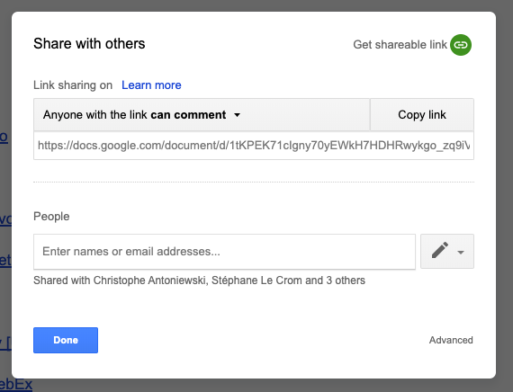
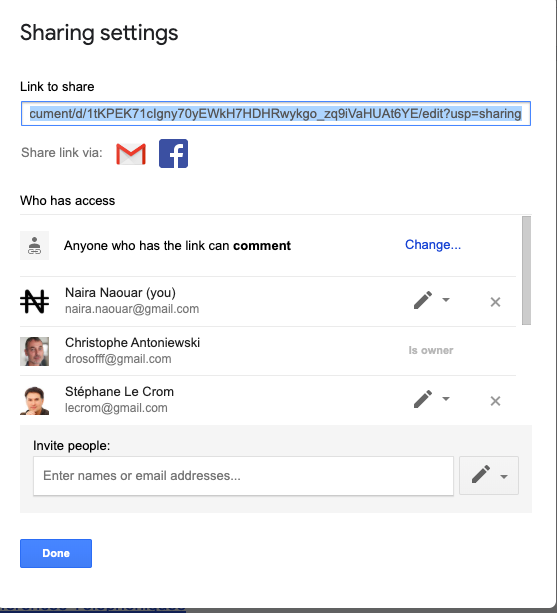
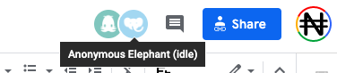

## Les solutions de partage de documents

### [La Suite Google](https://gsuite.google.com/features/)

Pour pouvoir utiliser les outils Google, il faut un créer un compte utilisateur qui vous permettra d'utiliser 
l'ensemble des outils développés par Google.
* [Documents](https://gsuite.google.com/products/docs/)
* [Sheets](https://gsuite.google.com/products/sheets/)
* [Slides](https://gsuite.google.com/products/slides/)
* [Forms](https://gsuite.google.com/products/forms/) 

Le partage des documents est ensuite possible en cliquant sur l'onglet  en haut à droite de chaque document.

 

Vous pouvez entrer les emails des personnes avec qui vous souhaitez partager le document et préciser si ces utilisateurs peuvent :
* Voir (View) 
* Commenter (Comment)
* Editer (Edit)

Un mode avancé vous permet de gérer chaque partage .

Le document peut aussi être partager par lien, sans préciser d'email.
Dans ce cas, l'ensemble des personnes qui se connecteront à votre document seront anonymes.

Il est donc préférable de faire des partages en utilisant des mails google. Cela permet de suivre les commentaires de chaque personne nommément.

### [La suite Framasofts](https://framasoft.org/fr/)

Framasofts est un ensemble de logiciels libres.

