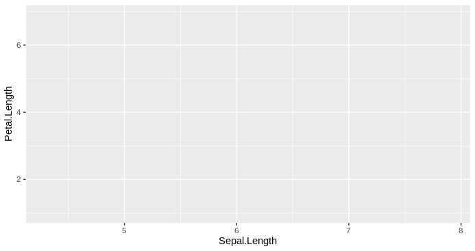
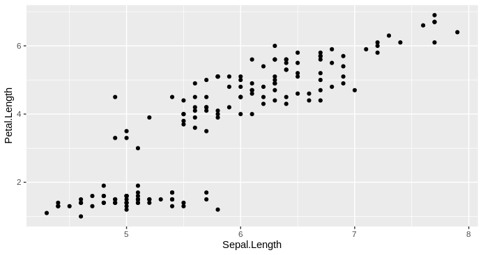
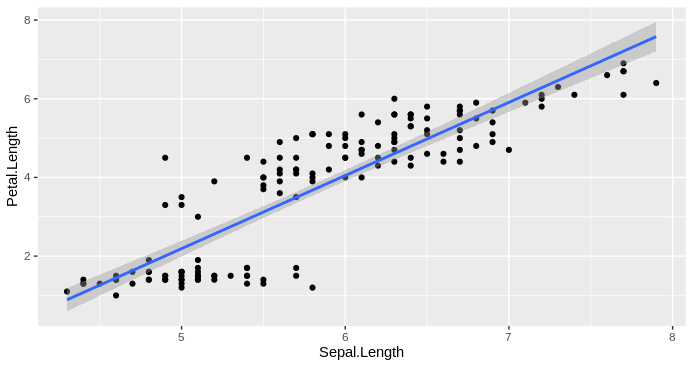
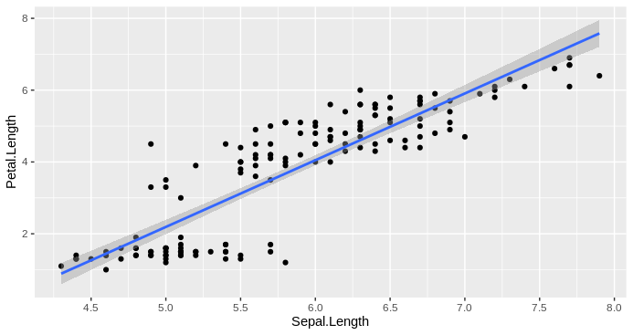
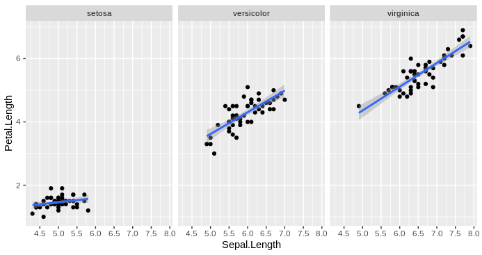
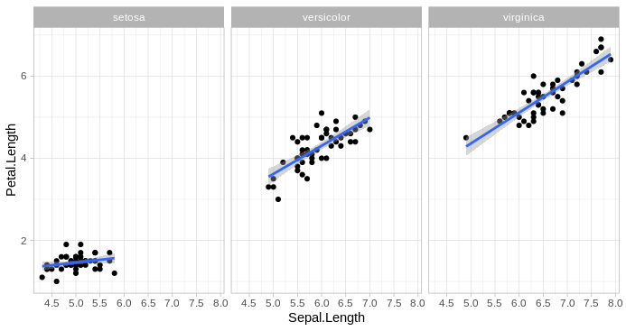
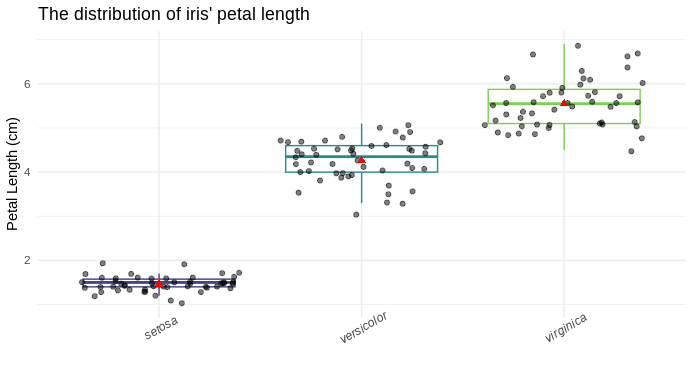
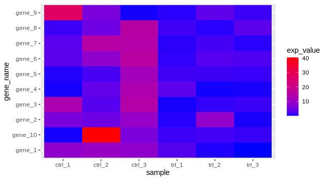

<!-- ## Visualization with ggplot2 -->

Visualization is used throughout data analysis, from controlling distribution to presenting final results.

With R, we can use the default plotting functions from the R package <code>graphics</code>
(`plot()`, `hist()`, `boxplot()`, *etc.*).
Read more about these functions in the [chapters 11 and 12](https://bookdown.org/ndphillips/YaRrr/plotting1.html) of Philips’ book.

In this tutorial, we will introduce the <code>[ggplot2](https://ggplot2.tidyverse.org/index.html)</code> package to make more flexible and beautiful plots.


## The Compositions of A ggplot

* **data**: what to visualize
* **mapping**: the properties of a graph ("aesthetics"), *e.g.*: the abscissa, the ordinate, the legend, the facets, *etc.*
* **coordinates**: interpretation of the "aesthetics" from `x` and `y` to define the position in the graph
* **geometries**: graphical interpretation of the "aesthetics" from `x` and `y`, *e.g.*: points, lines, or polygons
* **statistics**: calculation and transformation of data, *e.g.*: counting observations for a histogram
* **scales**: graphical translation of data, *e.g.*: associate colors to a variable, modify the presenting scales of axes
* **facets**: the grouping to be carried out
* **theme**: the style of a graph

## How to Build A ggplot

> All ggplot2 plots begin with a call to `ggplot()`, supplying default data and aesthethic mappings, specified by `aes()`. You then add layers, scales, coords and facets with `+`.

Example using the built-in dataset `iris`:

```r
str(iris) # data structure of "iris" dataset
## 'data.frame':	150 obs. of  5 variables:
##  $ Sepal.Length: num  5.1 4.9 4.7 4.6 5 5.4 4.6 5 4.4 4.9 ...
##  $ Sepal.Width : num  3.5 3 3.2 3.1 3.6 3.9 3.4 3.4 2.9 3.1 ...
##  $ Petal.Length: num  1.4 1.4 1.3 1.5 1.4 1.7 1.4 1.5 1.4 1.5 ...
##  $ Petal.Width : num  0.2 0.2 0.2 0.2 0.2 0.4 0.3 0.2 0.2 0.1 ...
##  $ Species     : Factor w/ 3 levels "setosa","versicolor",..: 1 1 1 1 1 1 1 1 1 1 ...
```

```r
library("ggplot2")
# initiate a plot for "iris" dataset, 
# display "Sepal.Length" on the abscissa and "Petal.Length" on the ordinate
p0 <- ggplot(
  data = iris,
  mapping = aes(x = Sepal.Length, y = Petal.Length)
)
p0
```


```r
# the data will be shown as dots in the graph
p1 <- p0 + geom_point()
p1
```


```r
# add a linear regression model line calculated based on x and y
p2 <- p1 + stat_smooth(method = "lm")
p2
```


```r
# change the breaks' position
p3 <- p2 + scale_x_continuous(breaks = seq(4, 8, by = 0.5))
p3
```


```r
# show the graph by Species
p4 <- p3 + facet_wrap(facets = vars(Species))
p4
```


```r
# use the "light" theme
p5 <- p4 + theme_light()
p5
```


## A Plot With More Detail?

```r
p_box <- ggplot( # init plot
  data = iris,
  mapping = aes(x = Species, y = Petal.Length)
) +
  geom_boxplot( # add a layer of boxplot
    mapping = aes(color = Species), # colored by species
    outlier.shape = NA # hide outlier points
  ) + 
  scale_color_viridis_d(begin = 0.2, end = 0.8) + # replace boxplot color by viridis palette
  geom_point( # add a layer of dots
    position = position_jitter(seed = 123), # use jitter position to avoid overlapping
    alpha = 0.5 # make the points transparent
  ) +
  stat_summary(# add summary of average value with specified form (a red point of shape 17 and size 2)
    fun = mean, shape = 17, geom = "point", size = 2, color = "red"
  ) +
  labs( # tweak labels
    x = NULL, # remove abscissa title
    y = "Petal Length (cm)", # change ordinate title
    title = "The distribution of iris' petal length" # add a title
  ) +
  theme_minimal() + # use the minimal theme
  theme( # extra tweaks on theme
    legend.position = "none", # hide legend
    axis.text.x = element_text(face = "italic", angle = 30) # show abscissa text at 30° angle with italic font face
  )
p_box
```


Please check the official [reference manual](https://ggplot2.tidyverse.org/reference/index.html) of `ggplot2` for the documentation of all functions. For more examples, please check:

* [chapter 5](https://egallic.fr/Enseignement/R/Book/graphiques.html) of a R course notes from the Aix-Marseille Université
* [chapters 2 and 3](https://bookdown.org/ansellbr/WEHI_tidyR_course_book/making-beautiful-plots.html) of Brendan's book

## Volcano Plot & Heatmap

The volcano plot and the heatmap are two widely used figure types to show biological research results.

Check the chapter [19.11 Volcano plots](https://biocorecrg.github.io/CRG_RIntroduction/volcano-plots.html) of Sarah's book
for a concrete example of how to build a Volcano plot for differential expression analysis results.

Heatmap need a bit more data manipulation before draw it with ggplot2.
For instance, we want to visualize a set of 10 genes of 6 samples (3 control and 3 treated):

```r
## prepare a toy dataset
set.seed(123)
exp_mat_ctrl <- matrix(rexp(30, rate = 0.1), ncol = 3)
exp_mat_trt <- matrix(rexp(30, rate = 0.8), ncol = 3)
exp_mat <- cbind(exp_mat_ctrl, exp_mat_trt)
colnames(exp_mat) <- c(
  paste0("ctrl_", 1:ncol(exp_mat_ctrl)),
  paste0("trt_", 1:ncol(exp_mat_trt))
)
rownames(exp_mat) <- paste0("gene_", 1:nrow(exp_mat))
exp_mat
##             ctrl_1    ctrl_2     ctrl_3     trt_1     trt_2     trt_3
## gene_1   8.4345726 10.048301  8.4314973 2.7097997 0.5254560 0.1132392
## gene_2   5.7661027  4.802147  9.6587121 0.6332697 9.0137595 0.3827548
## gene_3  13.2905487  2.810136 14.8527579 0.3244473 1.0571525 1.3340163
## gene_4   0.3157736  3.771178 13.4804449 3.2461151 0.2819275 0.3918953
## gene_5   0.5621098  1.882840 11.6852898 1.5362822 1.3754235 1.2183002
## gene_6   3.1650122  8.497861 16.0585234 0.9883522 2.8103821 2.3597791
## gene_7   3.1422729 15.632035 14.9674287 0.7866001 1.7046679 0.7057358
## gene_8   1.4526680  4.787604 15.7065255 1.5683013 0.7204896 3.2212017
## gene_9  27.2623646  5.909348  0.3176774 0.7358558 3.4065948 1.3096197
## gene_10  0.2915345 40.410117  5.9784969 1.4116125 1.6402038 1.2805517

## transform the data into "long" format (tidydata)
exp_df <- as.data.frame(exp_mat)
exp_df$gene_name <- rownames(exp_df)
exp_df
##             ctrl_1    ctrl_2     ctrl_3     trt_1     trt_2     trt_3 gene_name
## gene_1   8.4345726 10.048301  8.4314973 2.7097997 0.5254560 0.1132392    gene_1
## gene_2   5.7661027  4.802147  9.6587121 0.6332697 9.0137595 0.3827548    gene_2
## gene_3  13.2905487  2.810136 14.8527579 0.3244473 1.0571525 1.3340163    gene_3
## gene_4   0.3157736  3.771178 13.4804449 3.2461151 0.2819275 0.3918953    gene_4
## gene_5   0.5621098  1.882840 11.6852898 1.5362822 1.3754235 1.2183002    gene_5
## gene_6   3.1650122  8.497861 16.0585234 0.9883522 2.8103821 2.3597791    gene_6
## gene_7   3.1422729 15.632035 14.9674287 0.7866001 1.7046679 0.7057358    gene_7
## gene_8   1.4526680  4.787604 15.7065255 1.5683013 0.7204896 3.2212017    gene_8
## gene_9  27.2623646  5.909348  0.3176774 0.7358558 3.4065948 1.3096197    gene_9
## gene_10  0.2915345 40.410117  5.9784969 1.4116125 1.6402038 1.2805517   gene_10

# install.packages("tidyr") # we need the 'gather' function from this package
exp_df_long <- tidyr::gather(
  exp_df,
  key = "sample", # new column name to store the sample ID
  value = "exp_value", # new column name to store the value of each sample
  -gene_name # the column to skip when gathering
)
head(exp_df_long)
##   gene_name sample  exp_value
## 1    gene_1 ctrl_1  8.4345726
## 2    gene_2 ctrl_1  5.7661027
## 3    gene_3 ctrl_1 13.2905487
## 4    gene_4 ctrl_1  0.3157736
## 5    gene_5 ctrl_1  0.5621098
## 6    gene_6 ctrl_1  3.1650122

## visualize the data
p_heatmap <- ggplot(exp_df_long, aes(x = sample, y = gene_name)) +
  geom_tile(aes(fill = exp_value)) + 
  scale_fill_gradient(high = "red", low = "blue")
p_heatmap
```


There is a built-in function in R `stats::heatmap()` to draw the graph directly.
But you can have more control on the figure (style, color, position, *etc.*) if you use ggplot2.

## Other Chart Types

Please check the [R graph gallery](https://r-graph-gallery.com/index.html) for more (complex, even dynamic) examples of different chart types.


## Export Graphs

`ggplot2` has an implemented function `ggsave()` to export the plots in a various formats (.png, .jpeg, .pdf, .svg, *etc.*),
by default it will save the last plotted graph if you don't specify.

```r
ggsave(
  plot = p5,
  filename = "path/to/my_plot.png",
  height = 6.3, width = 4.7, units = "in", dpi = 200
)
```

## Which Type of Plot?

* One variable: boxplot, histgram, pie chart, density plot
* Two quantitative variables: scatter plot (dots plot)
* Two qualitative variables: (nested) boxplot
* One quantitative and one qualitative: boxplot, violin plot

[The eBook of Claus](https://clauswilke.com/dataviz/) is interesting to have look for the general ideas of plot type to use and how to do a better visualization (not limited to ggplot2 figures).

And you can find the `ggplot2` cheat sheet [here](https://rstudio.github.io/cheatsheets/data-visualization.pdf).

---