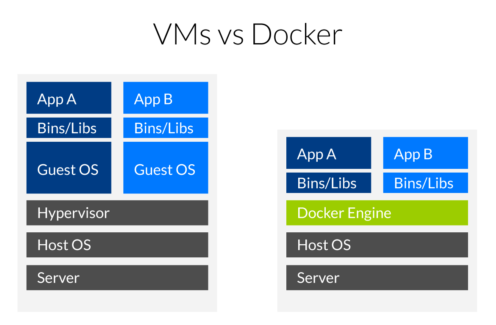

## Installation of a Galaxy server with Docker

### What is Docker ?



### Virtual machines

Virtual machines (VMs) are an abstraction of physical hardware turning one server into
many servers. The hypervisor allows multiple VMs to run on a single machine.
Each VM includes a full copy of an operating system, one or more apps, necessary binaries
and libraries - taking up tens of GBs. VMs can also be slow to boot.

### Containers

Containers are an abstraction at the app layer that packages code and dependencies
together. Multiple containers can run on the same machine and share the OS kernel with
other containers, each running as isolated processes in user space. Containers take up
less space than VMs (container images are typically tens of MBs in size), and start
almost instantly.

###  A GalaxyKickStart Docker **Container** for the *Analyse des génomes*

Instead of using the GalaxyKickStart playbook in a VM, the playbook can be used to build
a Docker container image that will be an almost exact mirror of the GalaxyKickStart VM
you have just built.

You are not going to do that today (although you should be able to do it by reading the instructions).

Instead, you are going to

- Install the `docker` system
- pull the GalaxyKickStart docker container that is deposited in the [`Docker Hub`](https://hub.docker.com/u/artbio/)
- run this docker container and connect to the deployed GalaxyKickStart server instance

----
### Deployment

- There is actually no need for a new VM, the ansible already installed the docker service
in the VM used to deploy GalaxyKickStart.
- If not already, be connected to you VM as root user using the Google ssh console (`sudo -i`)
- download the script `run_docker_analyse_genomes_2019.sh` using the command
```
wget https://raw.githubusercontent.com/ARTbio/Run-Galaxy/master/deployment_scripts/run_docker_analyse_genomes_2019.sh
```
- run the script using the command
```
sh run_docker_analyse_genomes_2019.sh
```
- Connect to your docker-deployed "GalaxyKickStart" instance:
Just click on the url displayed in your Google Cloud Engine Console and connect using the login:password `admin@galaxy.org:admin`

----

### Shutdown on the docker container and clear disk space
- go back to your console
- type:

```
docker ps
```

- copy the docker id or the docker container name
- type the following command while replacing <id or name> with the copied content

```
docker stop <id or name> && docker rm <id or name>
```

- remove the docker image with the command

```
docker rmi artbio/analyse_genome:2019

```
- remove the exported folders by typing

```
rm -rf /galaxy_export /galaxy_tmp
```

!!! info
    Following this procedure you will recover about 50 Go of free disk space
    This is significant !

----
### The docker_galaxy.sh script explained

NB: in the following code, numbers in line heads should be removed to run the script.

```bash
#!/usr/bin/env bash
# run `bash run_docker_analyse_genomes_2019`
set -e
echo "Now pulling the artbio/analyse_genomes:2019 docker image from DockerHub\n"
supervisorctl stop all
docker pull artbio/analyse_genomes:2019
echo "Running artbio/analyse_genomes:2019 docker container\n"
mkdir /galaxy_export /galaxy_tmp && chown 1450:1450 /galaxy_export /galaxy_tmp
export DOCKER_INSTANCE=`docker run -d -p 80:80 -p 21:21 -p 8800:8800 \
          --privileged=true \
          -e GALAXY_CONFIG_ALLOW_USER_DATASET_PURGE=True \
          -e GALAXY_CONFIG_ALLOW_LIBRARY_PATH_PASTE=True \
          -e GALAXY_CONFIG_ENABLE_USER_DELETION=True \
          -e GALAXY_CONFIG_ENABLE_BETA_WORKFLOW_MODULES=True \
          -v /galaxy_tmp:/tmp \
          -v /galaxy_export:/export \
          artbio/analyse_genomes:2019`
echo "The analyse_genomes:2019 docker container is deploying...\n"
echo "Press Ctrl-C to interrupt this log and start using the container...\n"
docker logs -f  $DOCKER_INSTANCE
```

1. The shebang line. Says that it is a script code and that the interpreter to execute the
code is sh and can be found in the /usr/bin/env environment
2. a commented line to explain the script usage
- `set -e` says to the bash interpreter to exit the run at first error (to avoid catastrophes)
- prompts "Now pulling the galaxykickstart docker image from DockerHub"
- stop the galaxy services (galaxy, postgresql, slurm, nginx,...) that were deployed before with ansible (to liberate ports)
- Pulls (Downloads) the Docker Image specified as parameter to the `docker pull` statement (*artbio/analyse_genomes:2019*)
- reports this action to the terminal
- creates the /galaxy_export and /galaxy_tmp directory to export automatically data produced by the docker container
docker image. Note the `\` at ends of lines 7 to 14: this character `\` specify that the
code line is continued without line break for the bash interpreter.

    The line 7 starts with an `export DOCKER_INSTANCE=` instruction. This means that the result
    of the command between \` after the sign `=` will be put in the environmental variable
    `DOCKER_INSTANCE`, available system-wide.

    Now, the docker command (between \`) itself:

    Still in line 7, we have `docker run -d -p 80:80 -p 21:21 -p 8800:8800`.

    This means that a container will be run as a deamon (`-d ` option) and that the internal
    TCP/IP ports 80 (web interface) and 21 (ftp interface) of the docker instance will be mapped
    to the ports 80 and 21 of your machin (The VM in this case). Note that in the syntax `-p 80:80`,
    the host port is specified to the left of the `:` and the docker port is specified to the right
    of the `:`.
    
8. docker command continued: here we specify that the docker container acquires the root privileges
9. docker command continued: `-e GALAXY_CONFIG_ALLOW_USER_DATASET_PURGE=True`.

    The -e option specifies an environmental variable `GALAXY_CONFIG_ALLOW_USER_DATASET_PURGE`
    passed (`e`xported) to the docker container with the value `True`
    `galaxy_manage_trackster: true` with the string `galaxy_manage_trackster: false`
    in the ansible configuration file `groups/all`.

10. The environmental variable `GALAXY_CONFIG_ALLOW_LIBRARY_PATH_PASTE` is exported to
the docker container with the value `True`
11. The environmental variable `GALAXY_CONFIG_ENABLE_USER_DELETION` is exported to
the docker container with the value `True`
12. The environmental variable `GALAXY_CONFIG_ENABLE_BETA_WORKFLOW_MODULES` is exported to
the docker container with the value `True`

    Note that all these exports in the docker command correspond to advanced boiling/tuning of the docker container.
    You are not obliged to understand the details to get the container properly running.
13. Now the -v is important, better to understand it !

    -v stands for "volume". the `-v` option says to export the /tmp directory of the docker container
    to the /galaxy_tmp directory of the host.
14. we also export the /export directory of the container (any docker container has or
should have by default an /export directory) to an /galaxy_export directory of the host (your VM here).

    Note that if the /galaxy_export directory does not exists at docker run runtime, it will be created.

    So it is important to understand the -v magics: every directory specified by the -v option will be shared
    between the docker container filesystem and the host filesystem. It is a mapping operation, so that
    the same directory is accessible either from inside the docker container or from inside the host.

    Now, if you stop and remove the docker container, all exported directory will persist in the host.
    If you don't do that, all operations performed with a container are lost when you stop this container !

15. This is the end of the docker run command. The docker image to be instantiated is specified by $1 variable,
the parameter passed to the script at runtime.
16. reports to the terminal user
17. wait 90 sec during the docker container deployment
18. reports to the terminal user
19. Now that the docker container is launched, you can access its logs with the command
`docker logs ` followed by the identification number of the docker container.
We have put this ID in the variable `DOCKER_INSTANCE`
and we access to the content of this variable by prefixing the variable with a `$ `:
`docker logs $DOCKER_INSTANCE`
