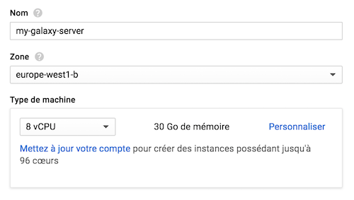
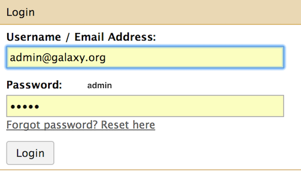

### Spin off a virtual Machine
##### 1. Go to the Google Cloud Dashboard and select "Compute Engine" on the left hand menu bar
##### 2. Select the submenu "Instances de VM"

##### 3. Click on the top bar menu the "CREER UNE INSTANCE" panel

    
##### 4. Put name `my-galaxy-server`, Zone `europe-west1-b (or c)`, Type de machine `8 vCPU` + `30 Go` de mémoire.

##### 5. Disque de Démarrage: Click on `Modifier`

##### 6. Select the top menu `images personnalisées` (`custom images`)

##### 7. Click on the rolling menu `Afficher les images de` and select the `My Project - main-sunset-133416`

    
What is important here is the identifier `main-sunset-133416`

##### 8. Check the button to select `galaxy-image-pasteur`

##### 9. At the bottom of the same form, choose `100 Go` for the Disk Size (Taille). Note that this size should be already selected.

    
Click the `Sélectionner` button to leave the selection `Disque persistant standard` / `Standard persistant drive`
    
##### 10. Back to the main form, Click `Authorize HTTP traffic` / `Autoriser le traffic HTTP`

##### 11. Click `Créer` / `Create`
##### 12. After ~1 minute or so, the VM turns on "green" and an `ssh` menu becomes selectable

    
    
##### 13. Click on the http link provided in the `Adress IP externe` column
You should now be able to access to your own Galaxy server instance, but not that this
phase can take an additional minute or so, this is the time to start all the galaxy services
in the new server instance.
    
##### 14. Immediately Log in to your server as the administrator

   	
And log in with `admin@galaxy.org` : `admin`
   	

   		
## YOU ARE READY TO USE GALAXY !
