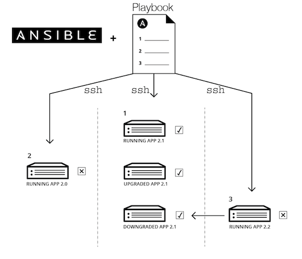

## Installation of a Galaxy server with Ansible and the GalaxyKickStart playbook

### What is Ansible ?



Ansible is an automation engine that automates configuration management and application
deployment.

Ansible reads instructions (Tasks) from a playbook and performs the indicated tasks on
target machines (Hosts), through an ssh connection.

There is no magics: everything an "administrator" can do using command lines of a linux OS,
can be automated with ansible that "wraps" these command lines.
The power of Ansible (and similar orchestration software, ie Puppet, Chief, etc.) comes
from the abstraction of complex suite of commands in the Ansible syntax.
Moreover, automation allows to reproduce exactly the desired configuration.
Finally, Ansible is `idempotent`: whatever the initial configuration, it brings the target
to the exact same final state. This is useful to repair a broken configuration.

### Ansible playbook - GalaxyKickStart

The Ansible "language" (Striclty speaking, Ansible language is *not* a programming language)
is structured. Thus a playbook is not necessarily a single flat file. Multiple tasks can be gathered in a file, a "role" is the execution of a set of tasks, and a playbook can execute multiple roles.
 
GalaxyKickStart is an Ansible playbook that will

- install basic dependencies needed for Galaxy
- Create and manage all the linux users involved in the deployment of Galaxy
- Install and configure the services required for Galaxy:
  - postgresql (database engine)
  - nginx (web server)
  - docker (containers)
  - proftpd (ftp server)
  - slurm (job manager)
  - supervisor (service manager)
- Configure Galaxy for using these services
- Install tools and workflows using the bioblend API.

The code of the GalaxyKickStart playbook is freely available at the ARTbio GitHub
Repository [https://github.com/ARTbio/GalaxyKickStart](https://github.com/ARTbio/GalaxyKickStart).

----
### Deployment

- start a GCE VM

!!! question "Google Instance"
    - **Série N2** --> `n2-standard-16 (16 processeurs virtuels, 64 Go de mémoire)`
    - **Disque de démarrage**  --> `Ubuntu 16.04 LTS`
    - **Taille (Go)** --> `200`
    - **Pare-feu** --> `Autoriser le trafic HTTP`

- connect to you VM using the Google ssh console
- start an interactive session as root using the command
```
sudo -i
```
- download the script `run_ansible_analyse_genomes_2019.sh` using the command
```
wget https://raw.githubusercontent.com/ARTbio/Run-Galaxy/master/deployment_scripts/run_ansible_analyse_genomes_2019.sh
```

- We are now ready to run this script. However this year there is bonus ! All trainees will participate to ==Pasteur 2019
Ansible Racing==.
In order to participate, you'll just have to put the `time` command just before the script invokation, as follows:

```
time sh run_ansible_analyse_genomes_2019.sh analyseGenomes_2019
```

!!! danger "The Ultimate Pasteur 2019 Ansible Racing"
    Please copy the time info returned by your console at the end of the deploymment.
    It shoud look like this:
    ```
    real	10m27.142s
    user	8m22.941s
    sys	1m16.409s
    ```
    Then Paste this time as a comment in this [GitHub issue](https://github.com/ARTbio/Run-Galaxy/issues/25)

- When the deployment is finished, connect to your ansible-deployed "GalaxyKickStart" instance:
    
    Just click on the url displayed in your Google Cloud Engine Console.
    
- Connect to your server as an admin:

    This time, ansible and the GalaxyKickStart playbook already programmatically registered
    an admin user. Just use the `admin@galaxy.org:admin` as credentials (user:password)
    
    When logged in, see that required tools as well as workflows are already installed !

!!! warning
    admin is not really a decent password,
    please c h a n g e   y o u r   p a s s w o r d
    to avoid you Galaxy server getting hacked by the end of the course.

----
### Galaxy administration tasks
#### Transfert input data to you newly deployed Galaxy instance
that is :
    - a data set with reference sequences
    - a data set with small RNAseq files
    - a data set with RNAseq files

- Click the main menu `User` --> `Saved Histories`
- Press the top right button (above history list) `Import from file`
- copy this url :
```
https://galaxy.pasteur.fr/history/export_archive?id=4c5da5ad7355ff42
```
    
- repeat the same operation with: 
```
https://galaxy.pasteur.fr/history/export_archive?id=eb4c1d5564c9f78c
```
and
```
https://galaxy.pasteur.fr/history/export_archive?id=69a1b70d1c4a6bdb
```
??? bug "In case of emergency"
    ```
    https://00e9e64bacc86f2151a14558fe5cde860787db0c2c54b36c1a-apidata.googleusercontent.com/download/storage/v1/b/artbio_genomic_analysis/o/export_archive%3Fid=4c5da5ad7355ff42?qk=AD5uMEtvNjCQjALPCHx2V2xEEgOELrj8N7H0HMXCrsm1eeKXAkG8UIO61njE8WdWHo7XzcDTL3vCm0buCY9AUa4rIF-a4Sc4FlWVafXUjLoHiJj1YGmWoRFPdaf-p3R0pCF_VROCXjKV7ymBlPJsfZFA8LVxriefgb2-2l9221SXmzBD2lUsgOM5hZ2peTXHGg3DPTFYJGg7eEAIaVJJ4EjjIMsbXXAh6g0gSQuw5qqO36HnZUE2hLnrajHhyVrT4JqXOobUYEZ1oeC2DD3Jv_1eaW3C58lTdtQPv9EZn5boJMzjL41Q0pKkOvIYRPWb6ymoKz5INAWExtWcAKD4hmy00MhQMha0paPbmtIxxwh4lJWrkBgbg51r5AZhpJeQBVES8QXxboUlongYUO8VsNr4rsZLtcG6q4jduyRG2VmzoYkXRoPVZYKnZPp9ZUk8xjk8BhnKP0hBsO9MM8LKtqM4ds-4xF58q734nd1zQl4jKeRYk2ERwnC61Z4G5Rc-WQpgQ7NdsJqjC0tA5evX4eMonQH3xW1Ij2M-o05miErydA7dy8XzDu_tcvjFGxVNk-2JeDdp5UK7FqnZ271ojL_H_tfN40NtDAxX1yDyZ3RIAGM9Z937qssTqCjjj0OFLJK9LSntR_fImQCSAeRk1YKnVJKMs01gMIf_6Gz8tfj9tS6qjdD9H1HQ3_tGTE1cj_egeSKnVE36BqB4Nj54Hb27VIj0-EvZhx4yNGnXVhHGLNqOH5UbyAA2INr44i7nRUMSkaRFQwnBfdn7_fLPJdWgN-_b3wE3eBDG_CUN3oAV7Mjx0P6xxUeBsqAD4ugVUERHh-McR98_-0FBezzEE3EIJSLWUp5GOg
    ```
    ```
    https://00e9e64baca628f8986257c92fd678925eff3fb11ed25ba2b3-apidata.googleusercontent.com/download/storage/v1/b/artbio_genomic_analysis/o/export_archive%3Fid=eb4c1d5564c9f78c?qk=AD5uMEspDJlepCT36Fk5XUY2i-BUI0uhBg7mqTL5kNfw23Po2uQRUsJFuLXd5JTCaDxmioB3mph-QvZJO9CrW9mdHW3Yu-yym0I6ZkNxiprIiVwg3samXY9EGm-NwFG9St0c16Fdu9tnjzck3RPqq3uKpFgKPT62hD4r0e7qsDjNt2Quy0Wy0hKdJhOTstdvV0jBZ91Ve6-0ZaP9uY_-vXnMXK0-CYkoUnyJ_i8Nr8reo7UBQ6ywpVyOqLSrfTTe-p7UK1v1OV-TZkq21bKm0BtskJy5ZF_PtaDV5FrXzlVuxJJsjusR5k0j2nWtfX8wQIOhFdsPHkLR3U9u4-93d50K1gAx2HUz7C4ZoS3cnZvdIjvHRWWq7TPIzXhPDVEVY2ETA9Qlte7qcbrVwxGMGnpQIcoocdHWE8MBQd3KKuFP5CU0LH4wR_psJiDUWeeUQp7l91Aptb8rDlWXzMBYzibxqG5nfuVFY6w_3WnGnWzjAtF81fAYApgShNG5dHqrulYITHSzVmoW9-bGRU9S2TfFILM0eGgcck7ryY1WCYaf5D0DScmLi2Ry-7vnqAzBryVVQ6ibereAOl88ZsIb-e7MOZvJISxma3QDA42eY5zK39RbI-9hzzd75g8c7m3n_vHnjao7wsBq80ky5LcJlzdKmYoAf4iG3yHzKH5pAb_J4YlKu14r5coPANk_kludWrqNo8nd-yGAvrxh2psfdw4atGbbBzB9CUZmRmX2-xYSL4ZSSsTovsqORJCQT5SXafeMTWn5n9wR4-JJrZ_FmW_db9v1AZJLmdzCyAgen6bzuFfYIUVapLvupfUXNzzJ5ybPOh0Zk5sl8Aa_EN3JZdAUZNc-yeTy6g
    ```
    ```
    https://00e9e64bac1f24fd127c07b2755b873390c106ba537ea32aed-apidata.googleusercontent.com/download/storage/v1/b/artbio_genomic_analysis/o/export_archive%3Fid=69a1b70d1c4a6bdb?qk=AD5uMEvpKg6l79WadDI7pXbIp7WoH3Sh8LVqu1s7IAhvofa5sf2M_Ab5XXO2zb1eyiXREekqHvIJnnhjPmkbos1HespE82fUoJlBND5192zO_nXVtNTKIa_QxcVh4R9fdAVp-wq8jGffS-rYSiFU1qtqJJnAabXZqJw3jmENXDSo-h4LUckbFVUQPypSDt7P8U1V4bLHozaiiJGrEo88Y5LHXykoMWsouMGch-bUBJb-AsU_2u215VALH0qFIG3VByfljeF-FyVGkoeBCYgHk1VX0CR9AlwIm9pvhZ6Jq70nQNUHPmNH5lKC3Lu3VCWly4rjyIeEtPU1mbyaz-US0GrHVOr7twI0bCL9gH-PleKCTSrbciqOyD6zxa42TcnZakmPGdaRwB6JjqHw1ZwLakVrerLkupAaB6He1_R_RvWQkgZYY51EKMgFraobdNC5mTpzCblq2NuxGjzCwhhWZBbJrbt1OltXE5sS2B5wU93fX9VTnuYLS9L02fcoTrMP_YVfM2opW1l23A0vu8QnlkV0zndjk0cYDFrKxTMTM6ziCmzNbbcnwKCWiJJYVMTQNGn6dyCiE4T5y5ZmsqvEoARJ8-77BLd6-Nc2_cVSv0FYszDP4AK3lencR5fkuP185lxv2MuAXeI4gZDJlUbdKNS6RYAAJ06bZ-hHyJvcT_Oh-c6-SNceDQmYh4Ugx_VhTiYYrodUPQ2Or9ldWIdzUW2v-ICF4Qc28joHZpz6vYNsEQsRertuQiHSD7yhV-XstmkE6sA2eL8LpziLQ-QXgl5N1CtepqOdf6ARKm8O4botzX3IO4HPZAtWFvFe3usqss-ccrn_Bh3Xb7hdPnBcZ6A0Vt3ZVLwh0Q
    ```

---
#### Content of the `run_ansible_analyse_genomes_2019.sh` script

``` bash
#!/usr/bin/env bash
set -e
apt update -y
apt install -y python-pip python-dev python-setuptools git htop
echo "Upgrading pip"
pip install -U pip
/usr/local/bin/pip --version
/usr/local/bin/pip install ansible==2.7.4
ansible --version
git clone https://github.com/ARTbio/GalaxyKickStart.git -b $1
cd GalaxyKickStart/
ansible-galaxy install -r requirements_roles.yml -p roles/ -f
cp scripts/8cpu_job_conf.xml roles/galaxyprojectdotorg.galaxy-extras/templates/job_conf.xml.j2
cp scripts/configure_slurm.py.j2 roles/galaxyprojectdotorg.galaxy-extras/templates/configure_slurm.py.j2
ansible-playbook -i inventory_files/analyseGenomes galaxy.yml
echo "end of deployment\n"
```

??? info "the `run_ansible_analyse_genomes_2019.sh` script explained"
    1. The shebang line (`#!`) says that it is a script code that has to be executed
    by the shell bash which can be found in the /usr/bin/env environment
    2. `set -e` says to the bash interpreter to exit the run at first error (to avoid catastrophes)
    3. update apt package database
    4. installs `python-pip`, `python-dev`, `python-setuptools` (these 3 packages are required to
    install pip), `git` (to clone and manage GitHub repositories) and `htop` (a monitoring tool)
    using the package installer `apt`
    5. Is just a command to inform the user about run state. This will prompt
    "Upgrading pip version" in the console
    6. does what is echoed before by the previous line : this is the command to upgrade the pip program that was
    installed with installation of `python-pip`.
    `pip` is a recursive acronym that can stand for either "Pip Installs Packages" or
    "Pip Installs Python".
    7. will prompt the version of pip in the console
    8. install `ansible`, version 2.7.4, using `pip`
    8. will prompt the version of ansible in the console
    10. clone the GalaxyKickStart Repository available at https://github.com/ARTbio/GalaxyKickStart.git,
    creating locally the `GalaxyKickStart` folder. The repository `branch` that is cloned is indicated
    as a parameter in the command line (the `$1`).
    11. Changes directory, i.e. goes to /root/GalaxyKickStart
    12. Says to ansible to install additional roles (collection of files to control ansible)
    which are not the the GalaxyKickStart repository but whose address is stated in the file
    `requirements_roles.yml`. These roles will be installed in the subdirectory
    `/root/GalaxyKickStart/roles/`. NB: `ansible-galaxy` has *nothing* to do with Galaxy,
    the name of this ansible command is serendipitous.
    13. triggers the play of the playbook `galaxy.yml` by ansible. The target host of the playbook
    is defined in the file `inventory_files/analyseGenomes`, as well as how ansible will interact with the target.
    Here, we play the playbook on the same computer (localhost).
    14. Prompts the end of the deployment
