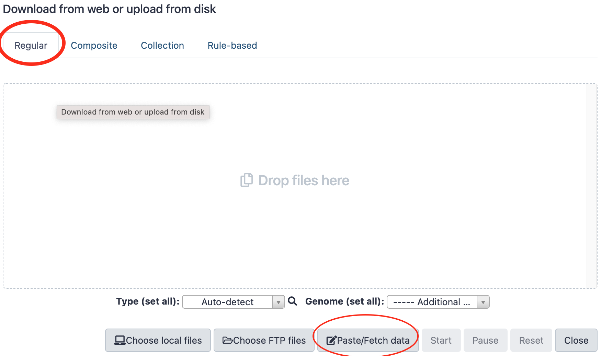
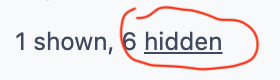

For the training, we need three types of datasets

- The reference sequences that will be used to align sequencing reads (full genome, miRNA, transposons, etc.)
- libraries of sequencing reads from small RNAs (for analysis of piRNAs)
- Librairies of sequencing reads from mRNA (for Gene differential expression analysis)

All these data have been deposited in 2 differents repositories. A first one is a so-called
S3 Amazon bucket. The second one is a
[Nextcloud server](https://usegalaxy.sorbonne-universite.fr/nextcloud) located at
Sorbonne-Université. You may get your input data from one or the other repositories.

### Get data "by URL"
We are going to focus on one method to upload data in galaxy, which is applicable when these
data _**are available through a URL**_ (Universal Resource Location).

??? info "The other methods to upload data in Galaxy are:"
    * transfering data from your local machine (the one that is running your web browser)
      to Galaxy
    * uploading data to your Galaxy FTP account and then transfering these data from your
    Galaxy FTP directory to one of your Galaxy histories. We are not going to use them in
    this training, and invite you to look at one of the "Galaxy tours" available
    in the menu `Help` :arrow_forward: `Interactive tours`

#### 1. Single URL

- Click the `Upload Data` button at the top-left corner of the Galaxy interface:

{: style="width:200px"}

- Stay with the regular tab and click the `Paste/Fetch data` button

{: style="width:600px"}

- Paste the following url in the open text field,
```
https://usegalaxy.sorbonne-universite.fr/nextcloud/index.php/s/B433xtdmdQqdFYd/download?path=%2F&files=PlacW.fasta
```
- Paste `PlacW.fasta` in the name text field (instead of `New File`)
- Finally, press the dark-blue `Start` button.

==-->== a dataset should appear soon in your current history and turn green when the upload is
complete.
    
#### 2. Multiple URLs :heavy_plus_sign: Programmatic file naming

Delete the uploaded dataset, we are going to re-upload it in batch.

- Click the `Upload Data` button at the top-left corner of the Galaxy interface.
- This time, Click the `Rule-based`tab !
- Leave **Upload data as** `Datasets` and **Load tabular data from** `Pasted Table`
- In the text field `Tabular source data to extract collection files and metadata from`,
paste the following Tabular source data:
```
https://usegalaxy.sorbonne-universite.fr/nextcloud/index.php/s/B433xtdmdQqdFYd/download?path=%2F&files=dmel-all-r6.18.gtf	dmel-all-r6.18.gtf
https://usegalaxy.sorbonne-universite.fr/nextcloud/index.php/s/B433xtdmdQqdFYd/download?path=%2F&files=dmel-all-miscRNA-r6.18.fasta	miscRNA
https://usegalaxy.sorbonne-universite.fr/nextcloud/index.php/s/B433xtdmdQqdFYd/download?path=%2F&files=PlacW.fasta	PlacW
https://usegalaxy.sorbonne-universite.fr/nextcloud/index.php/s/B433xtdmdQqdFYd/download?path=%2F&files=dmel-all-ncRNA-r6.18.fasta	ncRNA
https://usegalaxy.sorbonne-universite.fr/nextcloud/index.php/s/B433xtdmdQqdFYd/download?path=%2F&files=dmel-all-miRNA-r6.18.fasta	miRNA
https://usegalaxy.sorbonne-universite.fr/nextcloud/index.php/s/B433xtdmdQqdFYd/download?path=%2F&files=dmel-all-intron-r6.18.fasta	introns
https://usegalaxy.sorbonne-universite.fr/nextcloud/index.php/s/B433xtdmdQqdFYd/download?path=%2F&files=dmel-all-gene-r6.18.fasta	genes
https://usegalaxy.sorbonne-universite.fr/nextcloud/index.php/s/B433xtdmdQqdFYd/download?path=%2F&files=Dmel_piRNA_clusters.fasta	piRNA_clusters
https://usegalaxy.sorbonne-universite.fr/nextcloud/index.php/s/B433xtdmdQqdFYd/download?path=%2F&files=Dmel_all-transposon_merge.fasta	all-transposons
https://usegalaxy.sorbonne-universite.fr/nextcloud/index.php/s/B433xtdmdQqdFYd/download?path=%2F&files=dmel-all-chromosome-r6.18.fasta	dmel-all-chromosome-r6.18
```

??? info "To balance the load of the data servers, a half of the trainees may also use the S3 Amazon bucket"
    ```
    https://mydeepseqbucket.s3.amazonaws.com/References/PlacW.fasta	PlacW
    https://mydeepseqbucket.s3.amazonaws.com/References/dmel-all-ncRNA-r6.18.fasta	ncRNA
    https://mydeepseqbucket.s3.amazonaws.com/References/dmel-all-miscRNA-r6.18.fasta	miscRNA
    https://mydeepseqbucket.s3.amazonaws.com/References/dmel-all-miRNA-r6.18.fasta	miRNA
    https://mydeepseqbucket.s3.amazonaws.com/References/dmel-all-intron-r6.18.fasta	introns
    https://mydeepseqbucket.s3.amazonaws.com/References/dmel-all-gene-r6.18.fasta	genes
    https://mydeepseqbucket.s3.amazonaws.com/References/dmel-all-chromosome-r6.18.fasta	dmel-r6.18
    https://mydeepseqbucket.s3.amazonaws.com/References/Dmel_piRNA_clusters.fasta	piRNA_clusters
    https://mydeepseqbucket.s3.amazonaws.com/References/Dmel_all-transposon_merge.fasta	transposons
    https://mydeepseqbucket.s3.amazonaws.com/References/dmel-all-r6.18.gtf	dmel-all-r6.18.gtf
    ```
- Click the `Build` button
- In the `Build Rules ...` pannel that opened, click the { width="80"}
and choose `Add/Modify Column Definitions`
- Click a first time on `Add Definition` and Select `URL`. Leave the URL column to `A`
- Click a second time on `Add Definition`, select `Name` and choose the column `B` for `Name`
- Now, click the `Apply` button
- And to finish the job, click on the dark-blue button `Upload`
- After the upload is complete, rename the history "References"

<center>:tada:	:confetti_ball:	:balloon:</center>

#### 3. Multiple URLs :heavy_plus_sign: Programmatic file naming :heavy_plus_sign: dataset collection

For the rest of the data, we are going to organize them using an additional structure layer:
the **Galaxy Collection**.

A Galaxy Collection is just a container object which is convenient to treat multiple equivalent
datasets, such as a list of sequencing dataset, of text labels, of fasta sequences, etc.
For those of you who are a bit familiar with Python language, a Galaxy Collection is actually
just a dictionary, whose `keys` are the names of the datasets in the collection (in Galaxy
these names are referred to as `element identifiers`), and `values` are the paths to the
corresponding datasets. Well, a dictionary as I said :stuck_out_tongue_winking_eye:

There is a way to create a Collection from pre-existing datasets in a history. However,
here, we are going to create collections directly at the upload step.

##### A. small RNA sequencing datasets.

Before all, create a new history by clicking the **+** icon in the history header
{ width="300"} and immediately renaming the new history as
**"Small RNA sequence datasets"**.

We are going to import these datasets as a single collection:

- Click the `Upload Data` button at the top-left corner of the Galaxy interface.
- Click the `Rule-based`tab as we just did with the reference datasets
- This time however, select **Upload data as** `Collection(s)` and **Load tabular data from** `Pasted Table`
- In the text field `Tabular source data to extract collection files and metadata from`,
paste the following Tabular source data:

??? info "from the Nextcloud server"
    ```
    https://usegalaxy.sorbonne-universite.fr/nextcloud/index.php/s/LqKb3Qmy8m9RXtk/download?path=%2F&files=GRH-103_R1.fastq.gz	GRH-103
    https://usegalaxy.sorbonne-universite.fr/nextcloud/index.php/s/LqKb3Qmy8m9RXtk/download?path=%2F&files=GRH-104_R1.fastq.gz	GRH-104
    https://usegalaxy.sorbonne-universite.fr/nextcloud/index.php/s/LqKb3Qmy8m9RXtk/download?path=%2F&files=GRH-105_R1.fastq.gz	GRH-105
    https://usegalaxy.sorbonne-universite.fr/nextcloud/index.php/s/LqKb3Qmy8m9RXtk/download?path=%2F&files=GRH-106_R1.fastq.gz	GRH-106
    https://usegalaxy.sorbonne-universite.fr/nextcloud/index.php/s/LqKb3Qmy8m9RXtk/download?path=%2F&files=GRH-111_R1.fastq.gz	GRH-111
    https://usegalaxy.sorbonne-universite.fr/nextcloud/index.php/s/LqKb3Qmy8m9RXtk/download?path=%2F&files=GRH-112_R1.fastq.gz	GRH-112
    ```
Or
??? info "from the S3 Amazon bucket"
    ```
    https://mydeepseqbucket.s3.amazonaws.com/smRNAseq/GRH-103_R1.fastq.gz	GRH-103
    https://mydeepseqbucket.s3.amazonaws.com/smRNAseq/GRH-104_R1.fastq.gz	GRH-104
    https://mydeepseqbucket.s3.amazonaws.com/smRNAseq/GRH-105_R1.fastq.gz	GRH-105
    https://mydeepseqbucket.s3.amazonaws.com/smRNAseq/GRH-106_R1.fastq.gz	GRH-106
    https://mydeepseqbucket.s3.amazonaws.com/smRNAseq/GRH-111_R1.fastq.gz	GRH-111
    https://mydeepseqbucket.s3.amazonaws.com/smRNAseq/GRH-112_R1.fastq.gz	GRH-112
    ```
- Click the `Build` button
- In the `Build Rules ...` pannel that opened, click the { width="80"}
and choose `Add/Modify Column Definitions`
- Click a first time on `Add Definition` and Select `URL`. Leave the URL column to `A`
- Click a second time on `Add Definition`, select `List Identifier(s)` (note that it was
`Name` when we uploaded before as datasets) to upload as Collection and choose the column `B`
for the `List Identifier(s)`
- Now, click the `Apply` button
- Give a (simple) name to your collection (remember that the collection is just the container)
- And to finish the job, click on the dark-blue button `Upload`
<center>:tada:	:confetti_ball:	:balloon: :tada:	:confetti_ball:	:balloon:</center>

??? question "What do you see when you click on the dataset collection ?"
    You see the content of the collection, with datasets identified with names called
    `element_identifiers.
    
    Click on the `recycling` icon { width="20"} to come back to the
    normal history view.


??? question "what do you see if you click the `deleted` hyperlink at the top right corner { width="150"} ? "
    You see the actual dataset contained in the Collection. If you click on `unhide` for
    each of these datasets, you will actually see both the container and the contained
    datasets !

##### B. RNAseq datasets (for gene differential expression analysis)

For RNAseq datasets, collections are also very convenient. However, it is even better to
anticipate at the upload, the type of analysis that you are going to perform with the
datasets. Indeed, you are going to compare 3 "test" (mutant, treated, whatever...) datasets
with 3 control datasets.

Therefore, we are going to upload the RNAseq datasets as 2 collections: a collection `WT`
and a collection `SF`.

So let's go! 

- Click the `Upload Data` button at the top-left corner of the Galaxy interface.
- Click the `Rule-based`tab as we just did with the reference datasets
- Select **Upload data as** `Collection(s)` and **Load tabular data from** `Pasted Table`
- In the text field `Tabular source data to extract collection files and metadata from`,
paste the following Tabular source data:

??? info "from the Nextcloud server"
    ```
    https://usegalaxy.sorbonne-universite.fr/nextcloud/index.php/s/LqKb3Qmy8m9RXtk/download?path=%2F&files=WT1_R1.fastq.gz	WT1
    https://usegalaxy.sorbonne-universite.fr/nextcloud/index.php/s/LqKb3Qmy8m9RXtk/download?path=%2F&files=WT2_R1.fastq.gz	WT2
    https://usegalaxy.sorbonne-universite.fr/nextcloud/index.php/s/LqKb3Qmy8m9RXtk/download?path=%2F&files=WT3_R1.fastq.gz	WT3
    ```
Or
??? info "from the S3 Amazon bucket"
    ```
    https://mydeepseqbucket.s3.amazonaws.com/RNAseq/WT1_R1.fastq.gz	WT1
    https://mydeepseqbucket.s3.amazonaws.com/RNAseq/WT2_R1.fastq.gz	WT2
    https://mydeepseqbucket.s3.amazonaws.com/RNAseq/WT3_R1.fastq.gz	WT3

    ```
- Click the `Build` button
- In the `Build Rules ...` pannel that opened, click the { width="80"}
and choose `Add/Modify Column Definitions`
- Click a first time on `Add Definition` and Select `URL`. Leave the URL column to `A`
- Click a second time on `Add Definition`, select `List Identifier(s)` to upload as
Collection and choose the column `B` for the `List Identifier(s)`
- Click the `Apply` button
- Give the name `WT` to this collection (sounds reasonable...)
- And to finish the job, click on the dark-blue button `Upload`


**Repeat the same operation with:**

??? info "from the Nextcloud server"
    ```
    https://usegalaxy.sorbonne-universite.fr/nextcloud/index.php/s/LqKb3Qmy8m9RXtk/download?path=%2F&files=SF1_R1.fastq.gz	SF1
    https://usegalaxy.sorbonne-universite.fr/nextcloud/index.php/s/LqKb3Qmy8m9RXtk/download?path=%2F&files=SF2_R1.fastq.gz	SF2
    https://usegalaxy.sorbonne-universite.fr/nextcloud/index.php/s/LqKb3Qmy8m9RXtk/download?path=%2F&files=SF3_R1.fastq.gz	SF3
    ```
Or
??? info "from the S3 Amazon bucket"
    ```
    https://mydeepseqbucket.s3.amazonaws.com/RNAseq/SF1_R1.fastq.gz	SF1
    https://mydeepseqbucket.s3.amazonaws.com/RNAseq/SF2_R1.fastq.gz	SF2
    https://mydeepseqbucket.s3.amazonaws.com/RNAseq/SF3_R1.fastq.gz	SF3
    ```
**Except that you should choose the name `SF` for this last collection (sounds reasonable
too...)**


<center>:tada:	:confetti_ball:	:balloon: :tada:	:confetti_ball:	:balloon:
:tada:	:confetti_ball:	:balloon: :tada:	:confetti_ball:	:balloon:</center>


