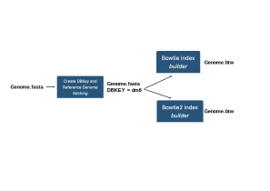

The last thing we can do for the incoming analyses is to prepare an index of your
drosophila genome, which will be available Galaxy-wide.

Each alignment program uses its own, specific index, to speed up the alignment tasks. Thus,
if you plan for instance to align reads using bowtie and bowtie2, you should prepare a bowtie
genome index and a bowtie2 genome index.

In Galaxy, in addition, these indexations are preceded by a "fetch and dbkey" task, whose
purpose is to implement the Galaxy database and inform it of the existence of this genome and
of possible derived indexes.

{ width="600" }

## :wrench: Prepare the drosophila fasta dataset

# 
:construction:

