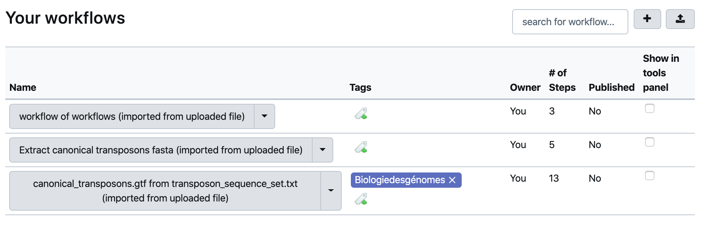
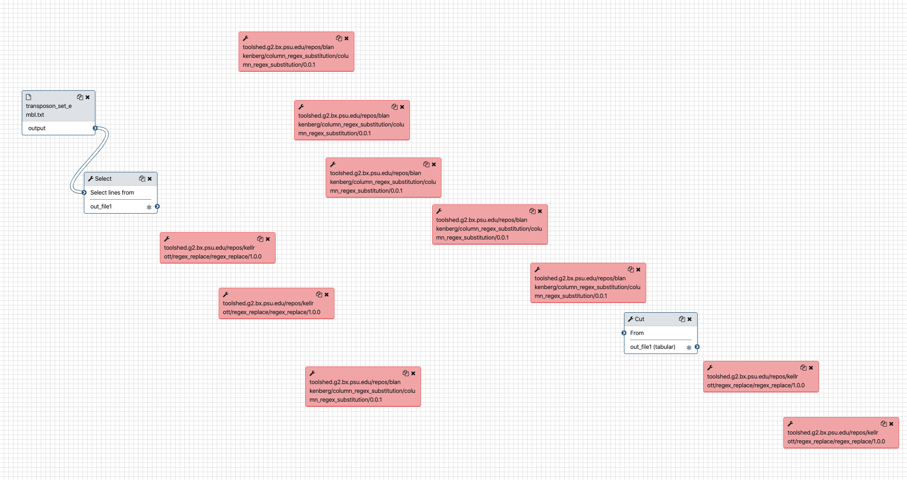
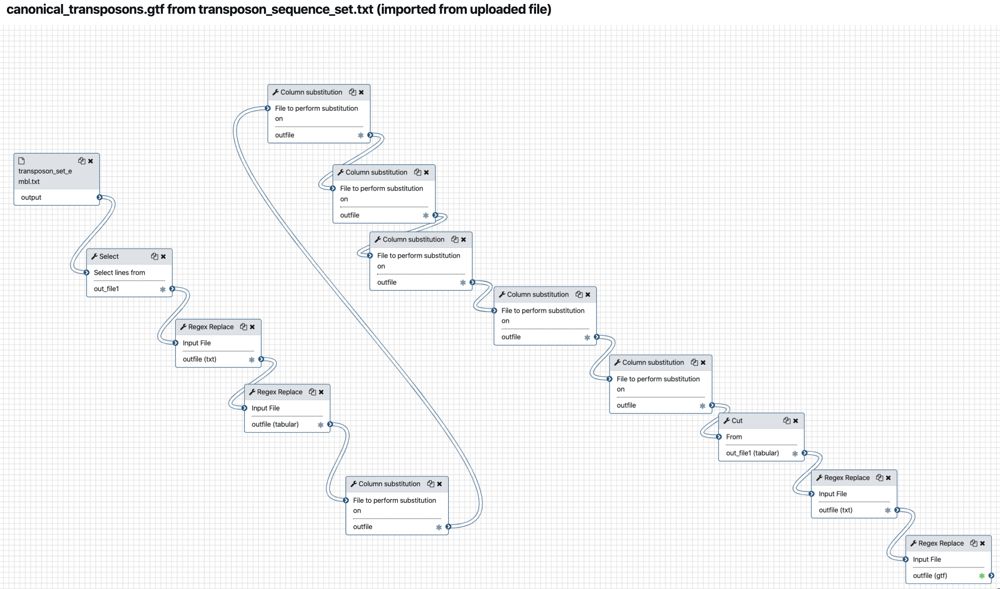

# Running a workflow in Galaxy
**In this use case, we are going to** 

- Upload 3 workflow description files in the Galaxy server instance
- Visualise these workflows and see that tools to execute the workflows are missing
- *since you are administrating the instance*, install the missing tools
- Eventually run the workflows on input data obtained from a remote public repository.

### 1. Upload workflow description file (.ga)

- Ensure you are connected to your Galaxy server as an admin (the email you have entered
in the galaxy.yml configuration file and the password to you've entered for this login when you
registered for the first time)
- Click the workflow menu
- Click the "Upload or import workflow" button at the top right
- In the `Galaxy workflow URL:` field, paste the url of the workflow file:
```
https://raw.githubusercontent.com/ARTbio/Run-Galaxy/master/workflows/Galaxy-Workflow-canonical_transposons.gtf_from_transposon_sequence_set.txt.ga
```
Note that this file is in the [Run-Galaxy](https://github.com/ARTbio/Run-Galaxy) repository where
a part of the material for this training is hosted

- Click on the `Import` button

- repeat the same operation with the second workflow
```
https://raw.githubusercontent.com/ARTbio/Run-Galaxy/master/workflows/Galaxy-Workflow-Extract_canonical_transposons_fasta.ga
```

- repeat the same operation with the third workflow
```
https://raw.githubusercontent.com/ARTbio/Run-Galaxy/master/workflows/Galaxy-Workflow-workflow_of_workflows.ga
```

!!! note
    Alternatively, you could upload the workflow files from you computer instead of uploading them by URL


- the `Workflow` menu is now a list of 3 workflows that should look like :



- Click the workflow `canonical_transposons.gtf from transposon_sequence_set.txt (imported from uploaded file)` and the `Edit` option
- Observe the warning window that should look like:

??? bug "Issues loading this workflow"
    Please review the following issues, possibly resulting from tool upgrades or changes.
      
      - Step 3: toolshed.g2.bx.psu.edu/repos/galaxyp/regex_find_replace/regex1/1.0.1
        - Tool is not installed
      - Step 4: toolshed.g2.bx.psu.edu/repos/galaxyp/regex_find_replace/regexColumn1/1.0.1
        - Tool is not installed
      - Step 5: toolshed.g2.bx.psu.edu/repos/galaxyp/regex_find_replace/regexColumn1/1.0.1
        - Tool is not installed
      - Step 6: toolshed.g2.bx.psu.edu/repos/galaxyp/regex_find_replace/regexColumn1/1.0.1
        - Tool is not installed
      - Step 7: toolshed.g2.bx.psu.edu/repos/galaxyp/regex_find_replace/regexColumn1/1.0.1
        - Tool is not installed
      - Step 9: toolshed.g2.bx.psu.edu/repos/galaxyp/regex_find_replace/regex1/1.0.1
        - Tool is not installed
  
When you read the warnings, you will see that the workflow was indeed successfully imported.
However, some tools are missing, namely:
```
toolshed.g2.bx.psu.edu/repos/galaxyp/regex_find_replace/regex1/1.0.1
toolshed.g2.bx.psu.edu/repos/galaxyp/regex_find_replace/regexColumn1/1.0.1
```
The other lines are redundant, because the workflow is using the same tools at different steps.

Click on the `Continue` button. You should now see missing tools in red and missing links
between various workflow steps. Note that some tools are indeed present because they are
installed by default in the provided Galaxy framework.
??? note "broken workflow"
    


- We are going to fix this. Click on the `Continue` button and then the upper "wheel" icon and select `Close`,
we will come back to the workflow editor when the missing tools are installed in the server.

### 2. Installing (missing) tools
The missing tools are reported in the [tools.yml](https://github.com/ARTbio/Run-Galaxy/blob/master/workflows/tools.yml)
file in yaml format in the Run-Galaxy repository, as well as just bellow.

!!! note "Details of missing tools"
    Thus, we have to install the following missing tool in our Galaxy instance:
    
    tools:
    ```yaml
    - name: regex_find_replace
      owner: galaxyp
      tool_panel_section_label: Analyse des genomes
      tool_shed_url: https://toolshed.g2.bx.psu.edu
    ```
  

- Click on the `Admin` top menu
- In the left bar click on `Manage tools`

Check that there is actually no installed tools !

- Now, click the `Install new tools` menu (again in the left bar)
- Press the `Galaxy Main Tool Shed` button
- In the search field, copy and paste
```
regex_find_replace
```
and press the ++enter++ key.
- Two tools will show up, one owned by `jjohnson` and the other owned by `galaxyp`.
    We want to install the latter one, click on it and select `install` button of the lattest
    revision (2, version 1.0.1)
- In the `Target Section:` menu, select `Text Manipulation`.
    Thus, the tool will appears in the section `Text Manipulation` of the Galaxy tools.
- Click `OK`
- After a few seconds, you will notice the `Cloning...` then soon `Installing dependencies`
  displayed by the install button.
- And rapidly enough, the `Install` button should turn to a red `Uninstall` button.
- You can now check the `Installed only` circle at the top, and look at the newly
  installed tool `regex_find_replace` in the list.
---
    
### 3. Check that the imported workflows now display correctly

If you click the `workflow` top menu, you should now be able to edit the imported workflows,
and see that everything is displaying correctly. For the workflow
`canonical_transposons.gtf from transposon_sequence_set.txt` :



We can go through the various steps of the workflows and figure out what they are doing.

This first workflow  performs a suite of find-and-replace text manipulations, starting
from input data that has been tagged `transposon_set_embl.txt` and producing a new text
dataset that is renamed `canonical_transposons.gtf`.

The second workflow uses the same input data file `transposon_set_embl.txt` to generate
a fasta file of canonical_transposon sequences

The third workflow is a workflow of the two previous workflows !

We will come back to all these steps after the workflows execution. However, we need to
retrieve the input data set before running the workflows on these data.

### 4. Retrieve the `transposon_set_embl.txt` dataset

- Create a new history and name it `transposon_set_embl.txt manipulation`
- import the dataset using the `Paste/Fetch data` mode of the upload manager (the small
bottom-top arrow icon at the top left of the Galaxy interface). Copy the URL
```
https://github.com/bergmanlab/transposons/raw/2018c2e848cec2aefc4a87187d5ed5927d04c9a4/current/transposon_sequence_set.embl.txt
```
in the open field and click the `Start` button.

- have a close look at the file

### 5. Run the workflow

- Click on the workflow menu
- Click on the first workflow and select the Run option
- Leave the `Send results to a new history` menu to the `No` option for the moment.
- Just Click the `Run workflow` button to run the workflow, and look at datasets in the
history turning from grey to yellow to green. Note: often you don't see the dataset in the
"yellow" state (running). You just need to refresh the history with the 2-curved-arrows
icon of the local history menu.
- repeat the same operation (from the input history) for the second workflow 
`Extract canonical transposons fasta (imported from uploaded file)`

#### Discussion on workflows and on workflow of workflows

### 6. Stop and destroy your `bare-galaxy` instance
Since we are now at the end of the first use case, we can destroy the VM instance.

- Go to you Google Cloud Platform management web page.
- Select your bare-galaxy VM
- roll-down the top menu with the 3 vertical dots, and select `Supprimer`

{width="300"} 


