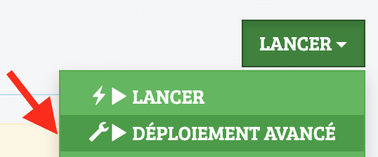
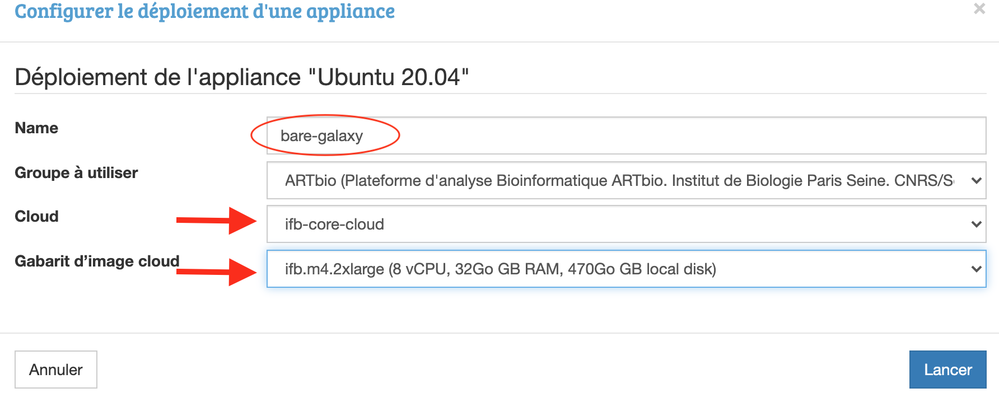
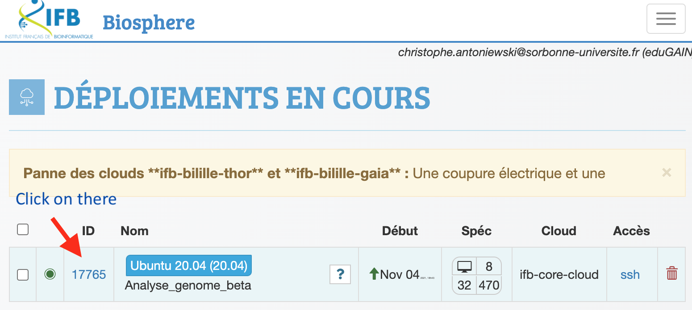
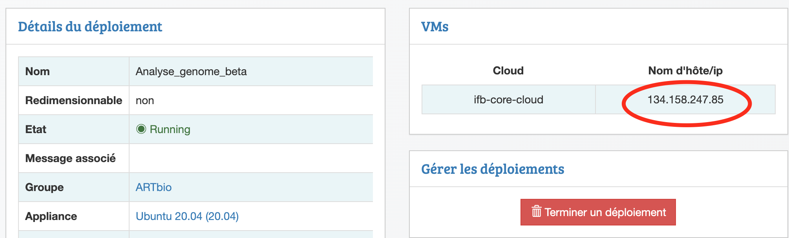
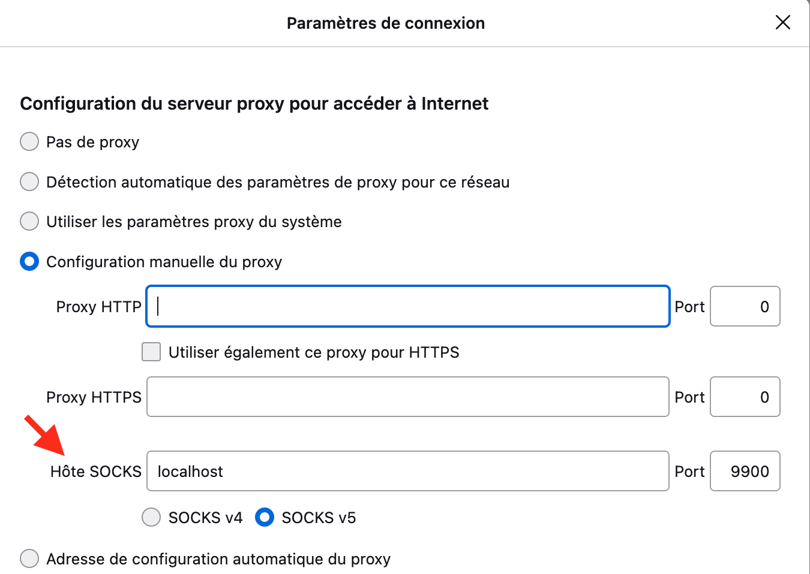

### 1. Spin off a virtual Machine `bare-galaxy` with the {: style="width:70px"} core-IFB cloud

- Connect to your the [biosphere](https://biosphere.france-bioinformatique.fr/), and click
  on **RAINBio** menu.

- Choose the {: style="width:200px"} virtual image.
- Choose "Déploiement Avancé" in the menu "Lancer"

{: style="width:200px"}

- Give a name to your VM, choose `IFB-core` as a cloud region, `ifb.m4.2xlarge
  (8 vcpu, 32Go GB RAM, 470Go GB local disk)` for the machine, and press `Lancer`.
  
  
 
- Follow the deployment of your VM in the `myVM` menu. In contrast to the Google Cloud platform,
  this may take more that 10 min.

### 2. SSH connect to the IFB VM using your terminal

- Be sure that your `private` key (`mykey`) is in your ~/.ssh/folder.
- The corresponding `public`key (`mykey.pub`) _should have been deposited/uploaded to biosphere_,
  otherwise, it cannot work.
- Type the following command
```
ssh -A ubuntu@134.158.247.168 # replace by the IP of your deployed VM
```
- If this command does not work (it happens...), type instead:
```
ssh -i ~/.ssh/mykey ubuntu@134.158.247.168 # ! mykey, NOT mykey.pub. And replace by your IP
```
- You should see a shell in your connected VM, which looks like:
??? info "Terminal"
    ```
    imac-chris:~ aligre$ ssh -A ubuntu@134.158.247.168
    The authenticity of host '134.158.247.168 (134.158.247.168)' can't be established.
    ECDSA key fingerprint is SHA256:WdN9NuYfDgj0DM0r78fH5rUkSwuQK3IIH+H4FmkGpOM.
    Are you sure you want to continue connecting (yes/no/[fingerprint])? yes
    Warning: Permanently added '134.158.247.168' (ECDSA) to the list of known hosts.
    Welcome to Ubuntu 20.04.3 LTS (GNU/Linux 5.4.0-88-generic x86_64)
    
     * Documentation:  https://help.ubuntu.com
     * Management:     https://landscape.canonical.com
     * Support:        https://ubuntu.com/advantage
    
      System information as of Mon Nov  8 18:29:33 UTC 2021
    
      System load:  0.07               Processes:                153
      Usage of /:   17.0% of 19.21GB   Users logged in:          0
      Memory usage: 3%                 IPv4 address for docker0: 172.17.0.1
      Swap usage:   0%                 IPv4 address for ens3:    10.158.16.9
    
    0 updates can be applied immediately.
    
    
    *** System restart required ***
    
    The programs included with the Ubuntu system are free software;
    the exact distribution terms for each program are described in the
    individual files in /usr/share/doc/*/copyright.
    
    Ubuntu comes with ABSOLUTELY NO WARRANTY, to the extent permitted by
    applicable law.
    ```
### 3. Installation of the Galaxy server

In this first approach "==bare-galaxy==", everything is made super simple:

- We are gonna become `root` unix user. This is easier because installation
of new programs as well as manipulations of network interfaces is generally permitted only
to users with administration rights.

- We are gonna check that all software needed to deploy galaxy are there (they are with
Ubuntu 20.04 !)

- Finally, we will run the automated deployment of Galaxy

So let's do this, step by step:

  1.
    
  ```
  sudo -i
  ```
  This command open a new "shell" where you are root. You can check this by typing `pwd` that
  should return `/root/`, meaning that you are now working in the directory of the `root` user.
  
  2.
  ```
  python3 --version && git --version && nano --version
  ```
  This command checks that the only 2 programs required for the deployment are already there
  
  3.
  ```
  git clone https://github.com/galaxyproject/galaxy.git -b release_21.05
  ```
  This command says to use `git` to `clone` the code repository located at
  `https://github.com/galaxyproject/galaxy.git`.
  
  In addition the `-b release_21.05` option specifies that only the version `release_21.05`
  will be cloned locally in your virtual machine. You may try to visualize the URL
  [https://github.com/galaxyproject/galaxy.git](https://github.com/galaxyproject/galaxy.git)
  in your web browser. You will, literally, see the code of Galaxy. It is Open Source, as
  you can notice.
  
  4.
  ```
  cd galaxy
  ```
  This command shift you in the `galaxy` directory that was created by git and the
  `git clone` command in 3.
  
  5.
  ```
  cp config/galaxy.yml.sample config/galaxy.yml
  ```
  This command makes a copie of the `galaxy.yml.sample` file to `galaxy.yml` - in the
  directory `config` that is in the `galaxy` directory.
  
  6.
  ```
  nano config/galaxy.yml
  ```
  Using this command, we are going to edit some important settings that are required to
  run our Galaxy fresh instance.
!!! question ""
    - Find the line
    ```
    http: 127.0.0.1:8080
    ```
    (you can use the editor command ++ctrl+w++, paste the previous line and press enter)
    
    and edit it to
    ```
    http: 0.0.0.0:80
    ```
    By doing this, we ensure that we will be able to reach the galaxy web server on our
    virtual machine using the usual web port `80`.

    - Find the line
    ```
    #admin_users: ''
    ```
    delete the `#` character and type your email address between the two single quotes.
    
    Any email address is ok (admin@galaxy.org for instance). It is just used here as
    an admin identifier.
    
    - save your changes by pressing the key combination ++ctrl+o++
    - quit nano by pressing the key combination ++ctrl+x++

??? tip "OPTIONAL but SAVING US 20 min of deployment !"
    Before starting the deployment of Galaxy, we are going to use a little trick to
    bypass the step of compilation of html and javascript codes which are used to
    render the Galaxy graphic interface.
    
    Indeed, modern web application use a lot of cached codes that speed up
    the user experience. However, this implies that this code cache is built during the
    deployment of the application.
    
    For Galaxy, building/caching the client codes for the web server takes about 20 min
    and this is increasing with newer galaxy versions.
    
    To save us these 20 min, we are going to remove the web client folders and replace them
    by already built client folders, prepared by your trainer...
    
    1. Remove the web client folders
    ```
    rm -rf ~/galaxy/client ~/galaxy/static
    ```
    2. Download the cached web client folders
    ```
    cd ~/galaxy && wget https://analyse-genomes.s3.eu-west-3.amazonaws.com/bare.client.tar.gz https://analyse-genomes.s3.eu-west-3.amazonaws.com/bare.static.tar.gz
    ```
    3. Uncompress the cached client folders
    ```
    cd ~/galaxy && tar -xvf bare.static.tar.gz && tar -xvf bare.client.tar.gz
    ```
    
    Last note: this tip is **optional**, if you run the next command without doing it,
    everything will go the same, but the `run.sh` script which we are goin to execute will
    detect that the galaxy web page are not built and it will do it. This takes about 10-15
    minutes...

!!! bug "One more thing specifically related to the IFB VMs"
    In IFB cloud, VM instances have a very small system volume, and we have installed
    the galaxy git repository on this volume.
    You can check this using the command
    ```
    df -h
    ```
    Since the deployment of Galaxy will increase the size of the galaxy folder, it is
    safer to move this folder on a larger volume that is mounted at /mnt
    To do so, just type:
    ```
    mv /root/galaxy /mnt/mydatalocal/ && cd /mnt/mydatalocal/galaxy
    ```

  7.
  Ready for deploying Galaxy ?
  
  
  Then type `sh run.sh` and press the `enter` key !
  
  You should see an abundant log scrolling down. Don't worry !

  - All Galaxy dependencies required for the Galaxy server instance are being downloaded and installed
  - The Galaxy computing environment is automatically set up
  - the Galaxy web server is installed and static pages are built (this step specifically takes more and more time)
  - The Galaxy database (sqlight) is automatically upgraded to its latest structure/model
  - The package manager Conda, which is heavily used by Galaxy to install its tools is installed.
  
  After 5-10 minutes, you should see the log stopping with:

```
Starting server in PID 3813.
serving on http://127.0.0.1:80
```
### 4. Connect to your living Galaxy instance

All virtual machines deployed in the IFB core are located in a subnetwork whose access is
limited to

- the port 22, for ssh connections
- the port 443, for https (web) connections. Accessing a web server running on a virtual
  instance through https (443) requires that each machine has declared its own SSL
  certificate and most preferably owns a unique domain name, in the form of `mymachine.ifb.fr`.
  Although there are turnarounds for generating self-signed SSL certificate for cloud instances,
  this implies manipulations which are beyond the scope on this training for beginners.

Unfortunately, the port 80 is blocked by the IFB firewall, precluding connection through
the "insecure" http port your web Galaxy server is listening to.


There is a least 2 ways for circumventing this limitation and "tunnelling" http requests
from your local browser through the open secured ssh port 22.

#### 1 - option 1. Running a SOCKS proxy on your VM

First of all, get the IP address of your VM from the [IFB biosphere interface](https://biosphere.france-bioinformatique.fr/cloud/deployment/)






Now, in a terminal :computer: session, type this command:
    
  ```bash
  ssh -A -D 9900 ubuntu@134.158.247.85  # replace the IP address with your IP which you will find in you IFB control board
  ```

??? bug "If you receive an error from the previous command, it is most likely the option `-A` which failed. Then, try the following command instead:"
    
    ```bash
    ssh -i .ssh/<your_ifb_private_ssh_key> -D 9900 ubuntu@134.158.247.85  # replace the IP address with your IP
    ```
    :warning: `<your_ifb_private_ssh_key>` is a file located in the ~/.ssh folder, which you
    should have generated at your IFB cloud registration
    
    :warning: this is *_not_* the corresponding public key which has the extension `.pub`
    (`your_ifb_private_ssh_key.pub`)
**It is important that you leave this terminal session alive.**

**THEN**

- open your system network settings
- go to your system proxy settings
- Check the box for SOCKS Proxy (v4 or v5)
- in the field for the Server Proxy SOCKS address, enter `localhost`
- in the field for the Server Proxy SOCKS port, enter `9900`

??? tip "you can also set your socks proxy settings directly in Firefox (but not in Chrome)"
    Go to `about:preferences#general` in Firefox and click "Parameters at the very bottom of the page":
    
    

**From this point**

You should be able to access directly to your cloud Galaxy server by typing 

`http://<IFB.IP.your.server>`


#### 1 - option 2. Tunnelling the unaccessible port 80 through an accessible ssh (22) port

Using this method, no need to set network parameters for your system or in your browser.

Type the following command in a terminal window, and leave it alive:

```
sudo ssh -A -N -L 80:<your.ifb.cloud.ip>:80 ubuntu@<your.ifb.cloud.ip> # replace <your.ifb.cloud.ip> by a real ip address
```
:warning: the asked password is the one for the sudo command, ie, your admin password for your **local** machine.

??? bug "OR, if the previous command returned an error"
    ```
    sudo ssh -i .ssh/<your_ifb_private_ssh_key> -N -L 80:<your.ifb.cloud.ip>:80 ubuntu@<your.ifb.cloud.ip> # replace <your.ifb.cloud.ip> by a real ip address
    
    ```
    :warning: the asked password in the one for the sudo command, ie, your admin password for
    your local machine.
    
    :warning: `<your_ifb_private_ssh_key>` is a file located in the ~/.ssh folder, which you
    should have generated at your IFB cloud registration, this is not the corresponding public
    key which has the extension `.pub` (`your_ifb_private_ssh_key.pub`)

**THEN**

Access your cloud Galaxy server by typing in your browser `http://localhost:80`

:warning: Note that this address is different from the one used when setting a SOCKS proxy.

----

#### 2. Register as an admin to your Galaxy server instance

  - In the new browser window, follow the menu `Authentification et enregistrement`
    --> `Enregistrement` and  **register** to your instance using the email address you
    put in the galaxy.yml at step 3.6
  - After login, you should see the admin tab in the top menu of the Galaxy interface.
    
    ==You are connected to Galaxy as an admin !==
