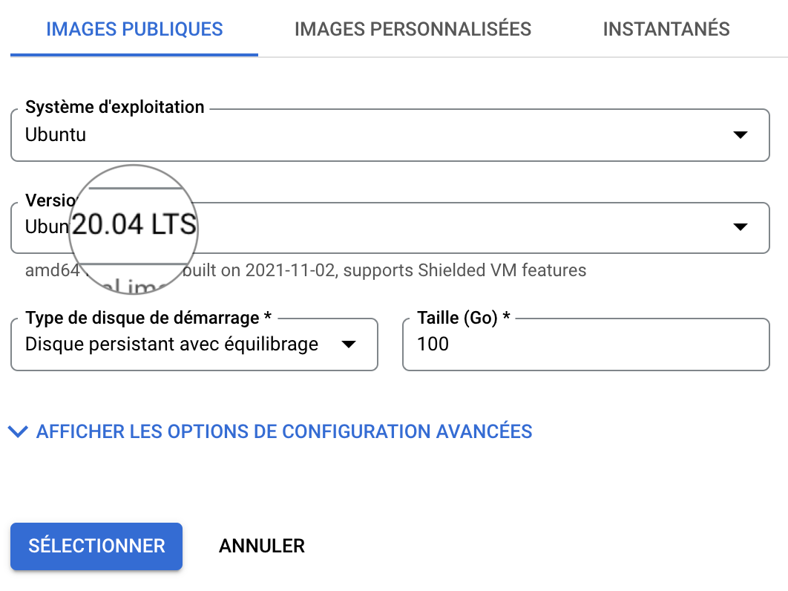

!!! info "Differences between Google Cloud Engine and IFB Cloud"
    The procedure to start a VM is not the same whether you are using Google Cloud Engine
    or the IFB Cloud.
    If you are working with the IFB Cloud, jump to the next section [Install a minimal
    standalone galaxy server in the IFB Cloud](bare-galaxy-IFB.md)


### 1. Spin off a virtual Machine `bare-galaxy` with {: style="width:30px"} Google Cloud Engine

??? tip "Tip"
    Start and stop of Google Virtual Machines is also described in [Annex 2](spin_off_VM.md)

- Connect to your Google Compute Instances
  [dashboard](https://console.cloud.google.com/compute/instances)

- Create a Virtual Machine Instance
 

!!! question "with the following settings"
    - Name: `bare-galaxy`
    - Region `europe-west6 (Zurich)` (or any region available with you Google coupon)
    - Zone: `europe-west6-a` (or `-b` or `-c`)
    - **Configuration de la machine**
        - `OPTIMISEE POUR LE CALCUL`
        - Série: `C2`
        - Type de machine: `c2-standard-8 (8 processeurs virtuels, 32 Go de mémoire)`
    - **Disque de démarrage (Modifier)**
        - `IMAGES PUBLIQUES`
        - Système d'exploitation: `Ubuntu`
        - Version*: `Ubuntu 20.04 LTS`
        - Type de disque de démarrage: `Disque persistant avec équilibrage`
        - Taille (Go): `100`
        - ==SELECTIONNER==
    - **Pare-feu**
        - Check `Autoriser le trafic HTTP`

This settings should look like:
    
{: style="width:450px"}
{: style="width:450px"}
{: style="width:450px"}

### 2. Connect to the VM using the ssh web console

!!! question "ssh connection"
    Roll down the `ssh` menu in the control pannel and select the first option
    `Ouvrir dans une fenêtre du navigateur`

    
    Here is your web ssh console to control your VM
    


### 3. Installation of the Galaxy server

In this first approach "==bare-galaxy==", everything is made super simple:

- We are gonna become `root` unix user. This is easier because installation
of new programs as well as manipulations of network interfaces is generally permitted only
to users with administration rights.

- We are gonna check that all software needed to deploy galaxy are there (they are with
Ubuntu 20.04 !)

- Finally, we will run the automated deployment of Galaxy

So let's do this, step by step:

  1.
    
  ```
  sudo -i
  ```
  This command open a new "shell" where you are root. You can check this by typing `pwd` that
  should return `/root/`, meaning that you are now working in the directory of the `root` user.
  
  2.
  ```
  python3 --version && git --version && nano --version
  ```
  This command checks that the only 2 programs required for the deployment are already there
  
  3.
  ```
  git clone https://github.com/galaxyproject/galaxy.git -b release_21.05
  ```
  This command says to use `git` to `clone` the code repository located at
  `https://github.com/galaxyproject/galaxy.git`.
  
  In addition the `-b release_21.05` option specifies that only the version `release_21.05`
  will be cloned locally in your virtual machine. You may try to visualize the URL
  [https://github.com/galaxyproject/galaxy.git](https://github.com/galaxyproject/galaxy.git)
  in your web browser. You will, literally, see the code of Galaxy. It is Open Source, as
  you can notice.
  
  4.
  ```
  cd galaxy
  ```
  This command shift you in the `galaxy` directory that was created by git and the
  `git clone` command in 3.
  
  5.
  ```
  cp config/galaxy.yml.sample config/galaxy.yml
  ```
  This command makes a copie of the `galaxy.yml.sample` file to `galaxy.yml` - in the
  directory `config` that is in the `galaxy` directory.
  
  6.
  ```
  nano config/galaxy.yml
  ```
  Using this command, we are going to edit some important settings that are required to
  run our Galaxy fresh instance.
!!! question ""
    - Find the line
    ```
    http: 127.0.0.1:8080
    ```
    (you can use the editor command ++ctrl+w++, paste the previous line and press enter)
    
    and edit it to
    ```
    http: 0.0.0.0:80
    ```
    By doing this, we ensure that we will be able to reach the galaxy web server on our
    virtual machine using the usual web port `80`.

    - Find the line
    ```
    #admin_users: ''
    ```
    delete the `#` character and type your email address between the two single quotes.
    
    Any email address is ok (admin@galaxy.org for instance). It is just used here as
    an admin identifier.
    
    - save your changes by pressing the key combination ++ctrl+o++
    - quit nano by pressing the key combination ++ctrl+x++

??? tip "OPTIONAL but SAVING US 20 min of deployment !"
    Before starting the deployment of Galaxy, we are going to use a little trick to
    bypass the step of compilation of html and javascript codes which are used to
    render the Galaxy graphic interface.
    
    Indeed, modern web application use a lot of cached codes that speed up
    the user experience. However, this implies that this code cache is built during the
    deployment of the application.
    
    For Galaxy, building/caching the client codes for the web server takes about 20 min
    and this is increasing with newer galaxy versions.
    
    To save us these 20 min, we are going to remove the web client folders and replace them
    by already built client folders, prepared by your trainer...
    
    1. Remove the web client folders
    ```
    rm -rf ~/galaxy/client ~/galaxy/static
    ```
    2. Download the cached web client folders
    ```
    cd ~/galaxy && wget https://mydeepseqbucket.s3.amazonaws.com/bare.client.tar.gz https://mydeepseqbucket.s3.amazonaws.com/bare.static.tar.gz
    ```
    3. Uncompress the cached client folders
    ```
    cd ~/galaxy && tar -xvf bare.static.tar.gz && tar -xvf bare.client.tar.gz
    ```
    
    Last note: this tip is **optional**, if you run the next command without doing it,
    everything will go the same, but the `run.sh` script which we are goin to execute will
    detect that the galaxy web page are not built and it will do it. This takes about 10-15
    minutes...

  7.
  Ready for deploying Galaxy ?
    
  Then type `sh run.sh` and press the `enter` key !
  
  You should see an abundant log scrolling down. Don't worry !

  - All Galaxy dependencies required for the Galaxy server instance are being downloaded and installed
  - The Galaxy computing environment is automatically set up
  - the Galaxy web server is installed and static pages are built (this step specifically takes more and more time)
  - The Galaxy database (sqlight) is automatically upgraded to its latest structure/model
  - The package manager Conda, which is heavily used by Galaxy to install its tools is installed.
  
  After 5-10 minutes, you should see the log stopping with:

```
Starting server in PID 3813.
serving on http://127.0.0.1:80
```
### 4. Connect to your living Galaxy instance

You should now be able to access to you Galaxy instance in a your web browser window.

  - Go back to your Google Cloud Engine control panel.
  - Find the `External IP address` / `Adresse IP externe` in the 7th column of the dashboard
  (to the left of the ssh menu that you used before).
  - Click on the hyperlink.
  - In the new browser window, follow the menu `Authentification et enregistrement`
    --> `Enregistrement` and  **register** to your instance using the email address you
    put in the galaxy.yml at step 3.6
  - After login, you should see the admin tab in the top menu of the Galaxy interface.
    
    ==You are connected to Galaxy as an admin !==
