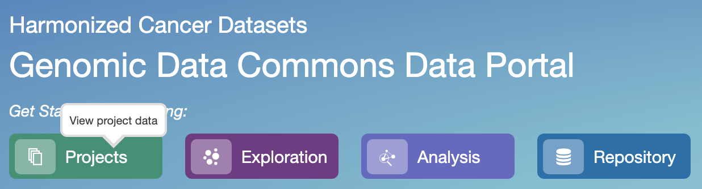
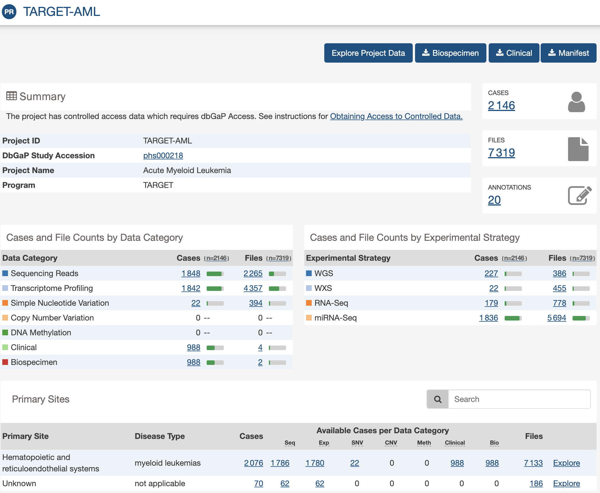
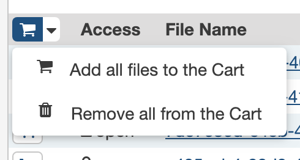

## Recovering datasets metadata from the GDC portal

In this first phase, we are going to select the datasets we want to download, and create a file containing dataset metadata
that will be required later for downloading the data.


1. Connect to the [GDC portal](https://portal.gdc.cancer.gov/)
2. Click the `Project` [button](https://portal.gdc.cancer.gov/projects)
  
    {: style="width:300px"}
    
    The project table then displays 64 projects at the date `February 19, 2020`
    
    You can restrict the project list using the selectors in the left hand vertical bar:
    
    Click the `TARGET`checkbox --> Only 9 projects are left in the table, including the
    [TARGET-AML](https://portal.gdc.cancer.gov/projects/TARGET-AML) one. Click on it !
    
    {: style="width:600px"}
    
3. File Selection
    
    In this use case, we are interested in RNAseq `files`. The GDC portal is a rich interface and
    there is several ways, all valuable, to reach the same selection level.
    Here is a way:
    
    - In the section `Cases and File Counts by Experimental Strategy` click the link in the
    column `Files` and the row `RNA-Seq` that is [778](https://portal.gdc.cancer.gov/repository?facetTab=files&filters=%7B%22op%22%3A%22and%22%2C%22content%22%3A%5B%7B%22op%22%3A%22in%22%2C%22content%22%3A%7B%22field%22%3A%22cases.project.project_id%22%2C%22value%22%3A%5B%22TARGET-AML%22%5D%7D%7D%2C%7B%22op%22%3A%22in%22%2C%22content%22%3A%7B%22field%22%3A%22files.experimental_strategy%22%2C%22value%22%3A%5B%22RNA-Seq%22%5D%7D%7D%5D%7D&searchTableTab=files)
    at the date of `February 19, 2020`
    - In the file list that is displayed, you can now see that some files are accessible
    (`open`), whereas others are not (`controlled`)
    - Click the checkbox `open` at the bottom of the left selectors bar.
    - Further restrict the file list by checking the checkbox `HTSeq - FPKM`
    - You should have now ~187 files selected, out of which 20 are displayed
    - Click on the **upper** cart icon, the one that contains a menu arrow
    
    {: style="width:200px"}
    
    - --> Add all files to the Cart
    - A green window will prompt that 187 files have been added to the cart and the main top
    menu should display this:
    
    {: style="width:400px"}
    
4. File metadata recovery
    - Click on the Cart icon in the main upper menu
    - Click on the `Sample Sheet`icon
    
    {: style="width:600px"}
    
    - This will trigger the download of a file whose name is in the form of
    `gdc_sample_sheet.yyyy-mm-dd.tsv` and the content looks like:
    ```
    File ID	File Name	Data Category	Data Type	Project ID	Case ID	Sample ID	Sample Type
    0d3ddab0-4c6e-4f96-88dc-3c9813d9c292	2a3814fb-e9b1-404c-95da-db348ecfa14a.FPKM.txt.gz	Transcriptome Profiling	Gene Expression Quantification	TARGET-AML	TARGET-20-PAEFGT	TARGET-20-PAEFGT-03A	Primary Blood Derived Cancer - Peripheral Blood
    cc802aa8-e299-40c3-9539-a854ef950ff6	6f475a4d-53ea-4110-b80f-d519289d41f9.FPKM.txt.gz	Transcriptome Profiling	Gene Expression Quantification	TARGET-AML	TARGET-20-PASMHY	TARGET-20-PASMHY-03A	Primary Blood Derived Cancer - Peripheral Blood
    85310996-75c9-4b5b-a16e-406cde0a3373	7d07636d-e4cb-4642-83ee-c04b21d15227.FPKM.txt.gz	Transcriptome Profiling	Gene Expression Quantification	TARGET-AML	TARGET-20-PASWAJ	TARGET-20-PASWAJ-04A	Recurrent Blood Derived Cancer - Bone Marrow
    0dc459fe-ac56-42af-9c99-3fe3e14bc156	a405cab4-28d0-4cf3-b3c0-2007539002f3.FPKM.txt.gz	Transcriptome Profiling	Gene Expression Quantification	TARGET-AML	TARGET-20-PAMVKZ	TARGET-20-PAMVKZ-09A	Primary Blood Derived Cancer - Bone Marrow
    e8a0e021-96cd-4ced-b881-da6b31351ac3	a9fd9d1c-348f-41a9-9da2-a72981ef1ae5.FPKM.txt.gz	Transcriptome Profiling	Gene Expression Quantification	TARGET-AML	TARGET-20-PANFMG	TARGET-20-PANFMG-09A	Primary Blood Derived Cancer - Bone Marrow
    5b28c25d-8775-403d-b286-dc88fa3a2d17	bd29f662-4f53-43ce-ad0f-ebcb62546109.FPKM.txt.gz	Transcriptome Profiling	Gene Expression Quantification	TARGET-AML	TARGET-20-PAMYGX	TARGET-20-PAMYGX-09A	Primary Blood Derived Cancer - Bone Marrow
    23735039-36e9-4029-bb57-e2ccab9598ed	f49764c5-6b18-435a-90de-64f114a4ce89.FPKM.txt.gz	Transcriptome Profiling	Gene Expression Quantification	TARGET-AML	TARGET-20-PASVVS	TARGET-20-PASVVS-04A	Recurrent Blood Derived Cancer - Bone Marrow
    30a6e42d-81de-4837-abb4-84a3687f60de	2f601196-beaf-4a1e-91ee-72ef1de17f98.FPKM.txt.gz	Transcriptome Profiling	Gene Expression Quantification	TARGET-AML	TARGET-20-PANHYK	TARGET-20-PANHYK-09A	Primary Blood Derived Cancer - Bone Marrow
    6694923c-6ac6-4ba8-bddc-b35f438924b9	50b79e4d-0e67-4d79-914f-924e0ea920d9.FPKM.txt.gz	Transcriptome Profiling	Gene Expression Quantification	TARGET-AML	TARGET-20-PAPWYK	TARGET-20-PAPWYK-09A	Primary Blood Derived Cancer - Bone Marrow
    a0f31602-503b-4964-b68c-1ef996536a74	b5514b40-5b8b-4faf-a202-49438c386032.FPKM.txt.gz	Transcriptome Profiling	Gene Expression Quantification	TARGET-AML	TARGET-20-PARGVC	TARGET-20-PARGVC-03A	Primary Blood Derived Cancer - Peripheral Blood
    ```
    Here we are ! In the next section, we will manipulate this metadata file, in order
    to use it for batch downloading of the data files
    

    

