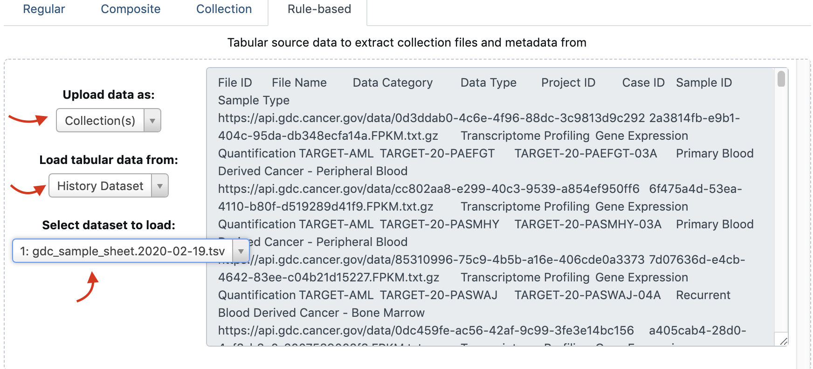

Now that we have formed the appropriate metadata file, we are going to use it to import the GDC data in a GALAXY
User Account.
Therefore, you should own a Galaxy account in a Galaxy server, for instance

- [https://usegalaxy.org/](https://usegalaxy.org/)
- [https://usegalaxy.eu/](https://usegalaxy.eu/)
- [https://mississippi.snv.jussieu.fr/](https://mississippi.snv.jussieu.fr/)

### Import the metadata file in a Galaxy History

1. Create a new Galaxy history by clicking on the `+` of the top right menu
    
    {: style="width:300px"}
    
2. Rename you history "TARGET Expression datasets"
    
    {: style="width:300px"}
    
3. Open the upload panel by clicking on the upload icon
    
    {: style="width:300px"}
    
4. Select the `Choose local file` tab and your edited gdc_sample_sheet.2020-02-19.tsv
(see previous section)
    
5. Click on `Start` and close the panel. the edited metadata file should now be in your
`TARGET Expression datasets` history.

### Import the expression datasets specified in the metadata file

1. Click again on the upload icon
2. This time, select the Paste/Fetch data tab
    
    {: style="width:600px"}
    
3. Click on the `Rule-based` tab
    
    {: style="width:500px"}
    
4. Select **Upload data as:** `Collection(s)`, **Load tabular data from**: `History Dataset`,
**Select dataset to load**: `gdc_sample_sheet.2020-02-19.tsv`
    
    {: style="width:600px"}
    
    You should see the content of the metadata file appearing.
    
5. Click on the `Build`button
    
6. On the left hand side off the panel, there is a "Rules" section, and a link to click on
    
    {: style="width:300px"}
    
7. Then, click a **first time** on `Add Definition` and select `URL`
    
    {: style="width:200px"}
    
    You should now see that the column A will be recognized as providing the URLs of the datasets
    to download.
    
    {: style="width:600px"}
    
8. Click a **second time** on `Add Definition` and select `List Identifier(s)`. Further
select the `B` column.
    
9. Finish the Rules settings by clicking on `Apply`
    
    Now, there is on task remaining: we have to indicate to Galaxy that the first line of
    the metadata file is the column headers and should not be considered as containing information.
    
10. Click on the `Filter` button,
    
    {: style="width:300px"}
    
    select `Matching a Supplied Value`, from column `A` (should be already selected), paste
    ```
    File ID
    ```
    in the empty field, and finally check the `Invert filter` checkbox.
    
    Here is our filter: we do not want to consider lines that contain the string `File ID` in
    column A.
    
    {: style="width:300px"}
    
- Click on `Apply` button
    
- Finally, give a Name to the future collection of downloaded files, in the field `Name`.
For instance
    ```
    TARGET_AML_FPKMs
    ```
    
    and click the `Upload` button.
    
    You should see the following upload banner
    
    {: style="width:800px"}
    
    Now, you just need to wait, the upload of the ~200 files, 1.6 GB each, is expected to take
    less than 5 min.
    
- After completion of the upload, take a look to you dataset collection:
    
    {: style="width:300px"}
    
    {: style="width:300px"}
