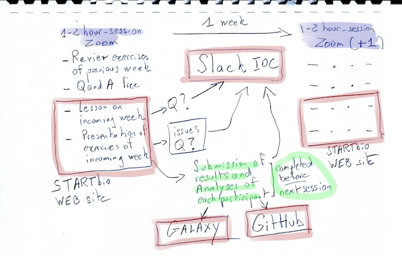
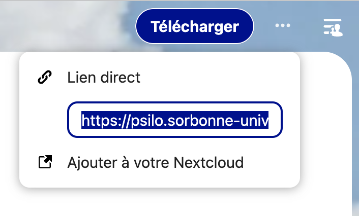
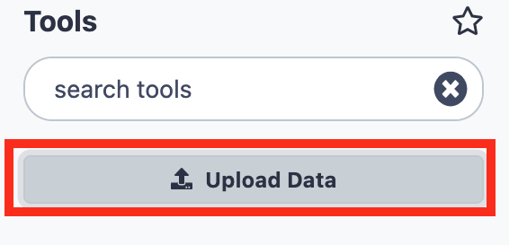
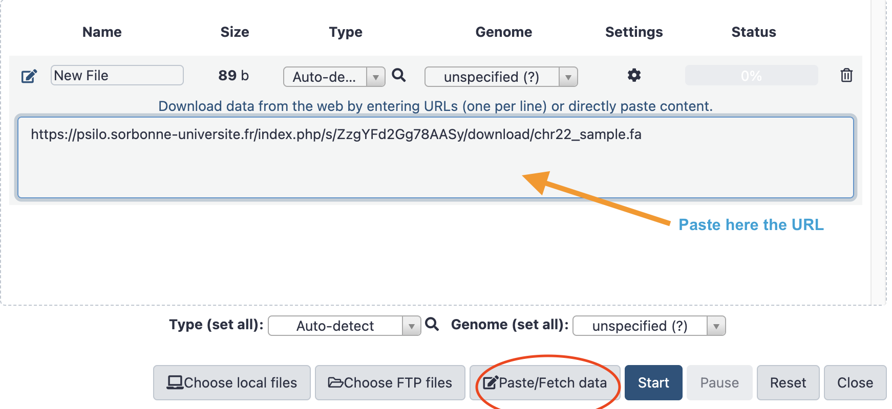

**3-hours Zoom video-conference**

## Introduction of the Companions and Instructors (10 min)
## Presentation of the IOC general workflow (Scheme) (15 min)

## Presentation of the IOC tools (2 hours)
### Zoom
We currently use the Zoom software for our video-conferences.
They will be recorded and available off line in the psilo data server (see below)

Please, follow these guides lines for Zoom usage

1. Use a local, desktop Zoom application instead of the online web application. You can
   download Zoom [here](https://zoom.us/fr/download){:target="_blank"}
- Test your Zoom application once if you never used it. We will be happy to arrange a quick
  Zoom session a few days before the IOC if you feel that there may be an issue.
- Be sure that your internet connection is reasonably fast to allow __the use of your camera__.
  We much value visual interactions !
- Arrange a quiet local place for your Zoom weekly session. People talking around you are
  disturbing you as well as the other conference participants. If you cannot arrange to be
  alone in your office, please warn you colleagues well ahead the session that you will
  need peace.
- **Use a headset with a built-in microphone**. It's not a gimmick! There are now cheap
  headsets for video-conference that works well. Test your headset with your computer
  and Zoom well ahead the first IOC session.
- Prefer a Desktop (generally more powerful) to a Laptop computer.
- Use the largest screen you have (another reason not using a laptop). If you have two
  screens, even better, but then test zoom with your dual screen setup. We may have to
  leave open several windows and applications during the Zoom session. 
- Be on time at the session !
- You are welcome to use the chat panel of Zoom to exchange links, code issues etc, but
  Slack (see below) is likely better suited to this (especially because the Zoom chat is
  lost when the application is shutdown. Therefore, be sure to have you Slack board available
  during the Zoom sessions.

There are many other interesting functionalities with Zoom, which will be covered in the 
presentation.

### Trello

One of our favorite tools is Trello.
You will be invited to access to the [trello board](https://trello.com/b/NtaNjZ6f){:target="_blank"}
of the IOC. Not a lot to say about Trello. It is just a great tool to capture information,
collaborate, and organize projects.

We hope that you will still use Trello for your own projects and purposes when the IOC is
finished !

### STARTbio
Our [STARTbio web site](https://artbio.github.io/startbio/) is the hub where we connect
all the training materials for IOCs.
To access rapidly to your bulk-RNAseq-analysis IOC, use this
[URL shortcut](https://artbio.github.io/startbio/bulk_RNAseq-IOC/IOC_RNAseq_program/)

Here, you'll find all weekly lessons, exercises, instructions, etc...

**Importantly**, you, yes, you, are welcome to propose modifications or fixes to the STARTbio
IOC web pages !
Assuming that during this IOC you will become familiar with the use of GitHub, all you
have to do is click on the pencil icon {width="25"}
at the top of each page and propose your modifications in a branch of our GitHub startbio
repository.

### Slack
Slack is a workspace to exchange messages or files, follow conversations, communicate
about issues and ideas.

If you haven't already done so, you will first need to open a
[Slack account](https://slack.com/get-started#/createnew){:target="_blank"} by providing
a username and password (you can also use authentication through Google or Apple).

If you have already a Slack account, you can connect to this account using this
[URL](https://slack.com/signin#/signin){:target="_blank"}.

!!! warning "Attention !"
    If you have multiple login emails for your Slack account, it can become confusing if
    some of your workspaces are identified with one email and others with another email.
    
    This might happen, for example, if you were invited to a Slack workspace with a
    different email than the one you initially used to create your first Slack workspace.

!!! tip "Get Slack app on your local computer"
    We really strongly recommend that you use a desktop version of the slack application
    on your computer(s).
    
    Once installed, this desktop Slack application will connect to
    your Slack account(s) and import locally your workspace, including the workspace
    dedicated to this IOC
    
    [Apple Desktop Slack](https://apps.apple.com/us/app/slack-for-desktop/id803453959?mt=12){:target="_blank"}
    | [Windows Desktop Slack](https://slack.com/intl/fr-fr/downloads/windows){:target="_blank"}

Last but not least, Slack is not an option for this IOC !

We will be extremely reluctant to communicate by email with you about this IOC.

Indeed, emails capture information very poorly, because very often the subject headings
are poorly chosen (or not chosen at all...), conversations by email deal with heterogeneous
subjects, the recipients of a series of messages vary over time, and other joyful things -
the imagination of Internet users is limitless (and exhausting)....

Instead, use your [IOC Slack](https://iocbulkrnaseq.slack.com)

### GitHub
Git is a powerful versionning system.
The software was implemented in web environments to create even more powerful system of
continuous development and continuous integration.

This is the case of [GitHub](https://github.com){:target="_blank"} which we have chosen in ARTbio.
[GitLab](https://about.gitlab.com/) is another option, which will not use here.

Good news ! there is a GitHub repository just for your IOC
[**here**](https://github.com/ARTbio/ARTbio_064_IOC_Bulk-RNAseq/tree/main){:target="_blank"}.
This repository is private. Therefore, to access it, you will need to create a personal
GitHub account, and to communicate your GitHub identifier to be invited to contribute to
(and benefit from) the repository.

We are not going to use the repository intensively
[ARTbio_064_IOC_Bulk-RNAseq](https://github.com/ARTbio/ARTbio_064_IOC_Bulk-RNAseq/tree/main){:target="_blank"}.
However, we will try to take advantage of it to introduce you to the notions
of FAIR (Findability, Accessibility, interoperability and reproducibility) and familiarize
you with the continuous integration and transparency of bioinformatics analyses.

!!! info "Disclosure"
    The learning curve of git and github is not steep for a biologist... which
    unfortunately means that you will have to make a substantial effort before
    understanding the benefit of GitHub and being able to manipulate it without
    discomfort. But if you make the necessary effort, rest assured that you won't regret
    it.
    
    For a very good introductory journal to Git and GitHub, although a bit old, see this
    [article](https://journals.plos.org/ploscompbiol/article?id=10.1371/journal.pcbi.1004668)
    
    GitHub is also very good at teaching how to use it... You can go from
    [there](https://docs.github.com/en/get-started/quickstart)!

### PSILO storage (15 min)

[PSILO](https://psilo.sorbonne-universite.fr/){:target="_blank"} is file storage server with a NextCloud web interface.
If you are affiliated to Sorbonne-Université (and have a corresponding email address), you
may have already an account on PSILO.
In any case, as an IOC participant, whatever your affiliation. We will configure for you
a PSILO account with the email of your choice and we will send you your credentials to
access to this account.

The NextCloud interface is rather easy and intuitive, and NextCloud documentation is extensive
and easy to find with a web search engine.

We will use PSILO to store large files, such as input datasets or important analysis results.
Importantly, we will show you how to quickly transfer files from PSILO to your Galaxy account,
your local computer, GitHub, etc...

We may also use our ARTbio PSILO account to share files with you !

You get it: stop exchanging research datasets (including excel tables) using your email client :smile:

### Galaxy (65 min)

Galaxy is a web service which provides a very powerful analysis environment.

Galaxy is particularly well suited to bulk RNAseq analysis because virtually all the
bioinformatics tools necessary to perform it are available in its environment, have been
proven and are continuously improved by a very large community of analysts and developers.

But the main reasons why we use Galaxy at ARTbio is that Galaxy helps immensely in making
your analysis:

- REPRODUCIBLE (by others, but believe us, by you too :smile:)
- TRANSPARENT. Galaxy captures the smallest details of an analysis, allows you to build
complete workflows, from input datasets to the most conclusive datasets of your analyses,
including all the steps and tools you will have used. Finally, by having correctly
constructed a Galaxy workflow, writing the “Materials and Methods” section of a manuscript
is child’s play!
- ACCESSIBLE. Everything is done in the Galaxy framework to allow you to exchange your
information with others and explicitly report any problems or bugs encountered. Generally,
biologists are not very good at correctly describing problems and concerns encountered when
analyzing with a computer. Galaxy helps tremendously in this important area. It also makes
it possible to carry out an analysis in real collaboration.

Each IOC participant will have a Galaxy account on the
[artbio.snv.jussieu.fr](https://artbio.snv.jussieu.fr) server. We will give you the login
and password for your account, probably on Slack and perhaps on Trello.

So we will immediately take advantage of an invaluable resource of the Galaxy community,
the [Galaxy Training Network](https://training.galaxyproject.org/training-material/){:target="_blank"}
(GTN), in order to take together a short introductory tour of the Galaxy environment.

#### A short introduction to Galaxy

Enough talking!

You are going to follow the tutorial
[A short introduction to Galaxy](https://training.galaxyproject.org/training-material/topics/introduction/tutorials/galaxy-intro-short/tutorial.html){:target="_blank"}
using your Galaxy account on the server [artbio.snv.jussieu.fr](https://artbio.snv.jussieu.fr).

Open this training link in a new tab in your browser, and keep it next to your Galaxy
window !

{: style="width:120px"}

??? bug "Possible confusion about the `sharing story with yourself` step!"
    The above tutorial says `Try and create a link for your history and share it
    with…yourself!`.
    
    It is indeed impossible to share an history with yourself _if you do it using your
    login email_. What is actually possible is to generate a share link for your story,
    and open this link in a new window in your browser.
    
    However, please note in this case that what you will see is not exactly what another
    user will see: that other user will have the option to import the shared story into
    their own account, for e.g. to re-run a tool on another data set.
-----
#### Import data from Psilo to Galaxy

{: style="width:75px"} **Do it yourself !**

- [x] Upload a file from your local computer: either a png, jpeg, or tiff image, or a pdf
  file, or a tsv text file, or a small sequence file (fasta, fastq...)
- [x] Share your file on psilo, by clicking the sharing icon, then clinking the
  :heavy_plus_sign: icon in the left handside pop-up menu.
- [x] Copy and Paste the share link in a new browser window
- [x] At the top right corner of the new window, there are three dots, just to the right
  of the `Télécharger` button. Click on these three dots, and copy the direct link as shown
  on this small screenshot.
  
  {: style="width:300px"}

- [x] Paste this link in a safe place (an open note, and open text file, whatever).
  As We are writing this doc, we are using this
  [DIRECT test link](https://psilo.sorbonne-universite.fr/index.php/s/ZzgYFd2Gg78AASy/download/chr22_sample.fa)
  that should still work today.
- [x] Go to *your* Galaxy account
- [x] Create a new history and name it `PSILO file transfer`
- [x] Click on the `Upload Data` button
  
  {: style="width:300px"}
  
- [x] Click on the `Paste/Fetch Data` button and copy your PSILO direct link in the central
  field as shown on this small screenshot.
  
  {: style="width:600px"}
  
- [x] Click on the Start button and then on the close button.
- [x] Your file transfer from PSILO to you Galaxy history should be soon completed !
- [x] Check it out, by clicking on the `eye` icon.

??? bug "It did not work for you ?"
    This is most probably because you did not copy the *direct* psilo link but, instead,
    the indirect link that display an intermediate "download file" window.

#### Thank you for your attention and see you nextweek :clap: :clap: :clap:

----
