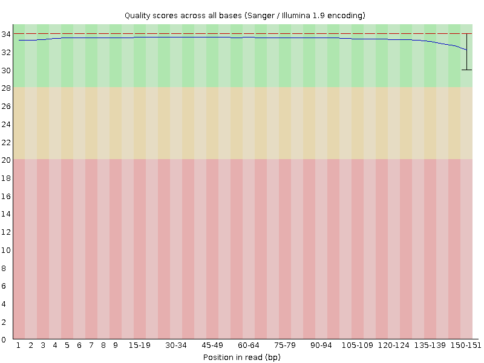
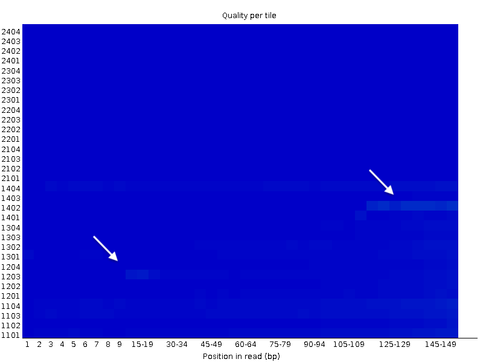
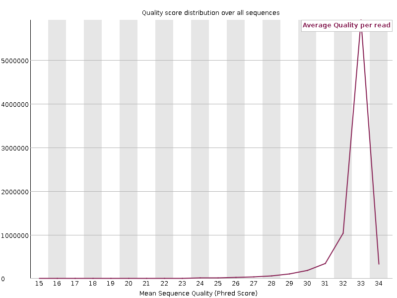
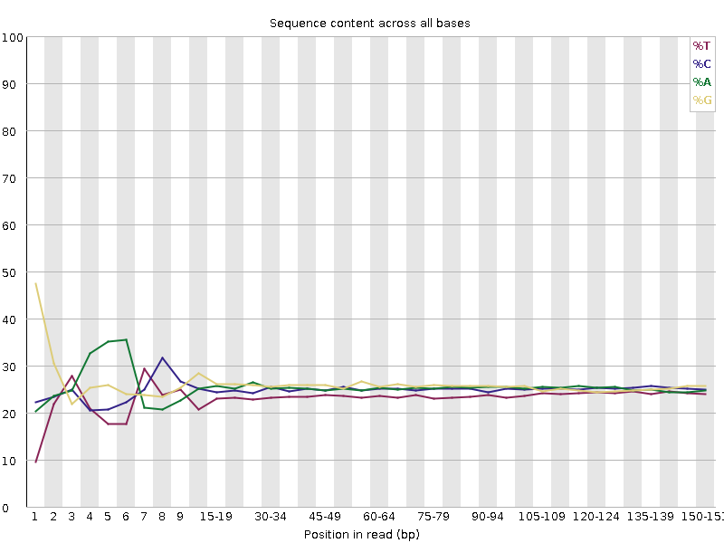
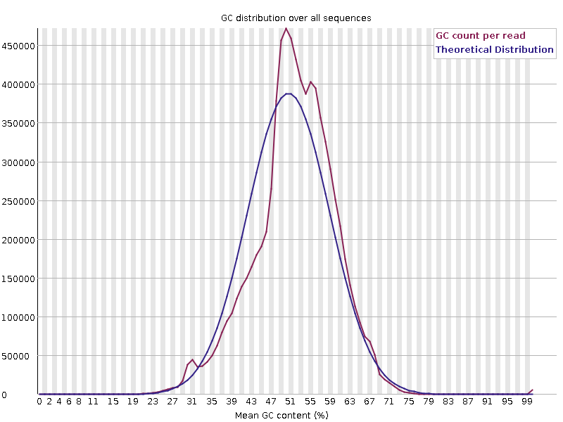
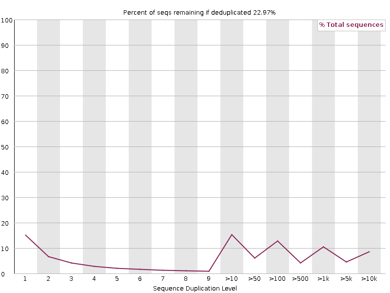
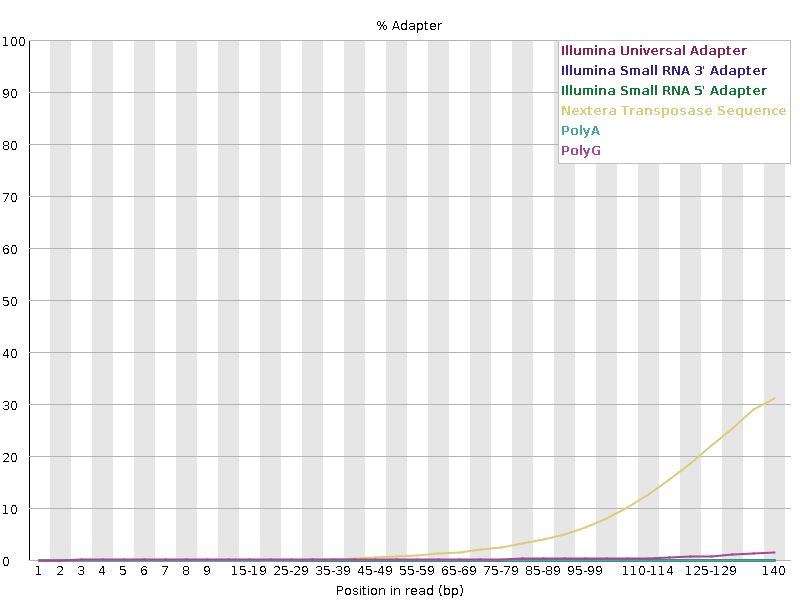

## Fastq files and Fastq quality

Next generation sequencing report sequences in the FASTQ format.

In this FASQTQ format, both the sequence letter and quality score are each encoded with a
single ASCII character for brevity and for alignment between a reported nucleotide and
the quality of its calling.

### FASTQ format
A FASTQ file has four line-separated fields per sequence:

- Line 1 begins with a '@' character and is followed by a sequence identifier and an optional description (like a FASTA title line).
- Line 2 is the raw sequence letters.
- Line 3 begins with a '+' character and is optionally followed by the same sequence identifier (and any description) again.
- Line 4 encodes the quality values for the sequence in Field 2, and must contain the same number of symbols as letters in the sequence.

!!! info "A FASTQ file containing a single sequence might look like this:"
    ```
    @A00680:51:HF2TKDRXX:2:2133:6596:12289/1
    AGAGTAAGTCTTTGTATTTTATGCTACTGTACCTCTGGGATTAATTGCTC
    +
    BFCHBBEGAHDDDHABCDDDBCHFDCFDHABGEDGDHGGCCDBECEHFDG
                  123
    ```
    
    | Q letter | Q score | Prob(Err) |
    | -------- | ------- | --------- |
    | A (Pos 1)| 32      | 0.00063   |
    | B (Pos 2)| 33      | 0.0005    |
    | C (Pos 3)| 34      | 0.00039   |

The quality score (or Q-score) expresses an error probability. In particular, it serves as
a convenient and compact way to communicate very small error probabilities.

Given an assertion, A, the quality score, Q(A), expresses the probability that A is not true,
P(~A), according to the relationship:

`Q(A) =-10 log10(P(~A))`

The relationship between the quality score and error probability is demonstrated with the
following table:

| Quality score, Q(A) | Error probability, P(~A) |
| ------------------- | ------------------------ |
| 10                  | 0.1                      |
| 20                  | 0.01                     |
| 30                  | 0.001                    |

### Quality Score Encoding
In FASTQ files, quality scores are encoded into a compact form, which uses only 1 byte per
quality value. In this encoding, the quality score is represented as the character with an
ASCII code equal to its value + 33 (offset of +33). The following table demonstrates the
relationship between the encoding character, its ASCII code, and the quality score represented.

??? info "relationship between the encoding character, its ASCII code, and the quality score represented"

    | Symbol | ASCII Code | Q-Score |
    | ------ | ---------- | ------- |
    | !      | 33         | 0       |
    | "      | 34         | 1       |
    | #      | 35         | 2       |
    | $      | 36         | 3       |
    | %      | 37         | 4       |
    | &      | 38         | 5       |
    | '      | 39         | 6       |
    | (      | 40         | 7       |
    | )      | 41         | 8       |
    | \*     | 42         | 9       |
    | +      | 43         | 10      |
    | ,      | 44         | 11      |
    | \-     | 45         | 12      |
    | .      | 46         | 13      |
    | /      | 47         | 14      |
    | 0      | 48         | 15      |
    | 1      | 49         | 16      |
    | 2      | 50         | 17      |
    | 3      | 51         | 18      |
    | 4      | 52         | 19      |
    | 5      | 53         | 20      |
    | 6      | 54         | 21      |
    | 7      | 55         | 22      |
    | 8      | 56         | 23      |
    | 9      | 57         | 24      |
    | :      | 58         | 25      |
    | ;      | 59         | 26      |
    | <      | 60         | 27      |
    | \=     | 61         | 28      |
    | \>     | 62         | 29      |
    | ?      | 63         | 30      |
    | @      | 64         | 31      |
    | A      | 65         | 32      |
    | B      | 66         | 33      |
    | C      | 67         | 34      |
    | D      | 68         | 35      |
    | E      | 69         | 36      |
    | F      | 70         | 37      |
    | G      | 71         | 38      |
    | H      | 72         | 39      |
    | I      | 73         | 40      |

### Assessing quality with FastQC

The [FastQC](http://www.bioinformatics.babraham.ac.uk/projects/fastqc/) tool provides a
simple way to examine quality metrics for raw sequence data coming from high throughput
sequencing platforms. It provides a modular set of analyses which you can use to give a
quick impression of whether your data has any problems of which you should be aware before
doing any further analysis.

The main functions of FastQC are:

- [x] Import of data from BAM, SAM or FastQ files (any variant)
- [x] Providing a quick overview to tell you in which areas there may be problems
- [x] Summary graphs and tables to quickly assess your data
- [x] Export of results to an HTML based permanent report

### Quick discussion of quality metrics assessed by FastQC

For several online discussions about Fastq quality metrics, see

- [hbctraining.github.io](https://hbctraining.github.io/Intro-to-rnaseq-hpc-salmon-flipped/lessons/07_qc_fastqc_assessment.html){:target="_blank"}
- [ancient but still interesing discussion from the BIOINFO-CORE teal (2010)](http://bioinfo-core.org/index.php/9th_Discussion-28_October_2010){:target="_blank"}

??? info "Basic Statistics... are basic statitics"
    | Measure                           | Value                   |
    | --------------------------------- | ----------------------- |
    | Filename                          | GCB_Mg_S12_forward.gz   |
    | File type                         | Conventional base calls |
    | Encoding                          | Sanger / Illumina 1.9   |
    | Total Sequences                   | 7998924                 |
    | Total Bases                       | 1.2 Gbp                 |
    | Sequences flagged as poor quality | 0                       |
    | Sequence length                   | 151                     |
    | %GC                               | 48                      |

??? info "Per base sequence quality"
    is expected to be at minimum of ~30 (.001 probability of wrong base calling)
    
    {width="800"}
    
??? info "Per tile sequence quality"
    is the representation of the mean Quality in function of the position on the
    Affymetrix chip. Non homogeneous quality suggest issues during the sequencing
    procedure, of low quality chip.
    
    {width="800"}
    
??? info "Per sequence quality scores"
    Shows the distribution of the quality of all sequences. Generally a high pic of
    sequences with high quality is observed, whereas a long tail of small fractions of
    total number of sequences have low quality.
    
    {width="800"}
    
??? info ":warning: Per base sequence content"
    Shows the % of each of the four nucleotides in function of their position in the read.
    Divergent fraction, often at the beginning of the reads may be due to one or several
    combined factors:
    
    - Illumina devices used to use the 5 first sequencing cycles to calibrate their
      fluorescence detector. Adjustment of the sensitivity of the four wave length chanels
      during the first cycles may cause divergent Nucleotides contents. This factor is
      likely minor with the recent Illumina devices.
    - If a small number of nucleotides belongs to an adapter or sequence primer, A strong
      bias in nucleotide contents is expected.
    - Nowadays, preparation of library using a transposase to generate short fragments
      (tagmentation) has become a popular procedure. This transposase does not cut completly
      randomly the DNA. Even a slight bias in tagmentation sites may be responsible for
      divergent fractions of nucleotides at the beginning of the reads.
    
    {width="800"}
    
    
??? info "Per sequence GC content"
    The distribution of the GC content of sequencing read is in general remarkably stable
    for a given organism.
    Divergence observed from the theoritical distribution may indicate an overrepresentation
    of a few sequences such as ribosomal RNAs or tRNAs (as is the case in the exemple below).
    
    Contamination of samples by another
    organism coming either from the experiment or from the experiment of another researcher
    may also be the cause of divergence from the theoritical distribution.
    
    {width="800"}
    
??? info "Per base N content"
    is expected to be low, otherwise there must have been issues during the base calling
    by the illumina device.
    
??? info "Sequence Length Distribution"
    is generally an unimodal curve with a pic at the lenght of the reads provided by the
    platform.
    
??? info ":warning: Sequence Duplication Levels"
    is an important metrics since some analysts are advising to remove PCR duplicates from
    sequencing datasets before perfoming read counting. Althought we must keep in mind that
    identical molecules (same sequence and same length) may still be biological duplicates
    (Think about tRNAs or miRNAs for instance), the advice seems holding for mRNAs.
    
    If you plan to remove "PCR duplicates", this plot allows you to anticipate how usable
    reads will be available for RNA profiling after de-duplications.
    
    High duplication levels may be due to the presence of highly expressed RNAs as mentionned
    above, or to over PCR-amplification of the library.
    
    {width="800"}
    
??? info "Overrepresented sequences"
    Are indicative of the presence of contaminating adapters, rRNA, tRNA, etc.
    
??? info "Adapter Content"
    Provide the detection of know adapter sequences, generally (but not always) next to
    the ends of reads.
    
    {width="800"}
    

## Read filtering
It is tempting to **filter** the data to get “good reads” and **discard** "bad reads"
including: 

- Reads with low quality alignments
- Reads suspected to be PCR duplicates

:warning: **HOWEVER**

  ==Discarding reads is a radical decision because it changes the counts==

- [ ] Why low quality reads should be skipped if they were aligned ?
      
      In the case of RNA profiling, we definitely do not advise to remove reads with low
      quality, *unless* this low quality impacts significantly the number of read effectively
      aligned to the reference genome. Generally, low quality reads are not randomly distributed,
      but, for instance, associated with genes with high GC content. In this case, removing
      low quality reads may skew your counts in favor of AT rich transcripts.
      

- [ ] When we remove PCR duplicates (exact same sequence and exact same location), we are
      never 100% sure that we are removing real PCR duplicates, unless a specific bar coding
      system was used (which is done in single-cell RNAseq protocols).
      
      Of course, over amplification of libraries must be corrected by removing duplicated
      sequences. But this can only be done after careful examination of the metrics to
      support this diagnosis.
      
      On another line, ultra deep sequencing of a small genome (or its RNAs) will inevitably cause
      the apparition of duplicated sequences. We can view this trend as a "saturation process",
      well known of geneticist. It may be difficult to deconvolve this expected trend
      from bias due to over amplification of libraries.


