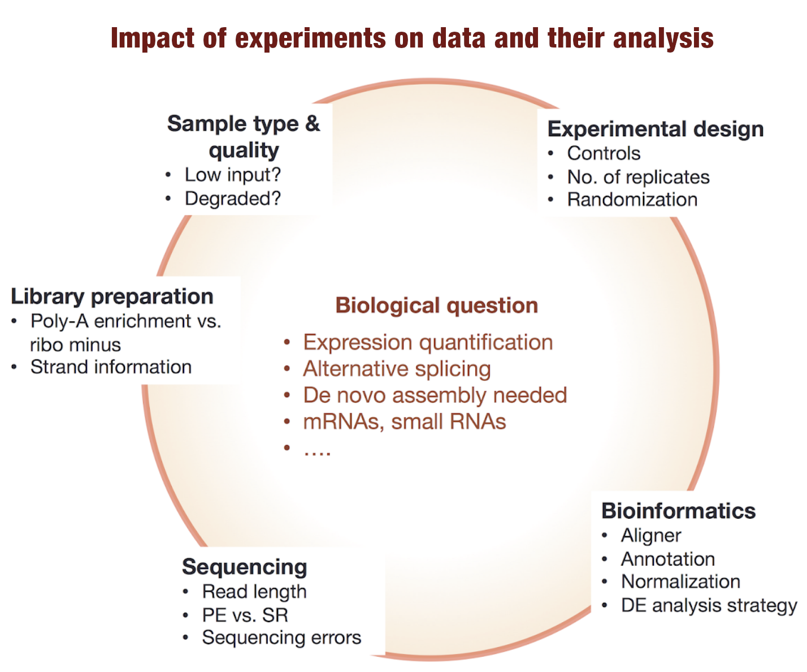

## A last word for this overview

It is important to master all the experimental procedures involved before the analysis
because they will impact the data and therefore orient (or disorient) the analysis.

