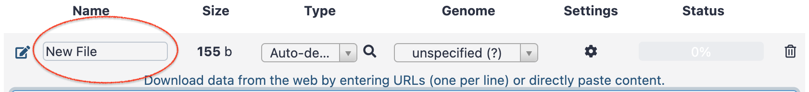
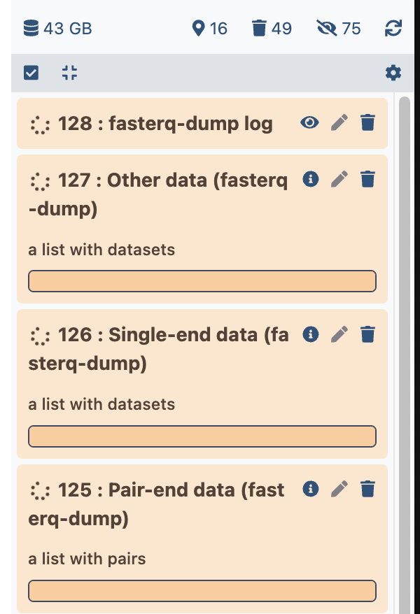

# Upload of PRJNA630433 data in 

----
For this use case, we need three types of datasets:

- [x] The fastq files, which are stored at the EBI SRA in a specific compressed format, the
small read archive (sra) format.
- [x] The appropriate GTF annotation file corresponding to the Mus musculus genome version
GRCm38 (which is strictly synonymous of mm10)
- [x] The genome GRCm38 in a fasta format. Indeed it is not necessary to fetch this genome
because Galaxy servers can store genomes and make it available server-wide to all its users.
Thus, your ARTbio Galaxy server already provides you with the reference genome GRCm38.

We will take benefit from these requirements to review below the various ways of uploading
data in your Galaxy account.

:warning: Importantly, it will also be an opportunity to practice a little on an important
aspect of bioinformatics analyses: the skills needed to access reliable genomic datasets
by visiting and mastering reliable public databases/repositories. Here, for the moment,
we will focus on two sources: the [Ensembl website](https://www.ensembl.org/index.html) and
the EMBL's European Bioinformatics Institute ([EBI](https://www.ebi.ac.uk/)) Small Read
Archive ([SRA](https://www.ebi.ac.uk/ena/browser/home))

## Upload data from your local computer

The first way to get input data in your Galaxy account is to transfer them from your
==local computer== to ==Galaxy==.

Note that whereas this mode may be convenient if you have _already_ the data on your computer,
it is pretty inefficient: it implies 2 transfers of data, first from the data
source to your computer, secondly from your computer to Galaxy. When it comes to large files,
as it is the case here with the fastq file collection of PRJNA630433, it matters a lot !

Therefore, we will illustrate the upload from computer with the case of the GTF file which
has a "reasonable" size.

###  Get a mus musculus GTF file from Ensembl

1. First Go to the [Ensembl portal page](https://www.ensembl.org/index.html)
2. We are going to work with the mus musculus genome. Thus, click the Mouse button on the
page, which is linked to this [URL](https://www.ensembl.org/Mus_musculus/Info/Index)
3. As of the date this doc is written, the current version of the mus musculus genome
assembly is GRCm39 (GCA_000001635.9). However, you will see in this current landing page
a menu to select older assembly version, including the previous one GRCm38 (Ensembl release
102) which is already selected in the menu `Other reference assemblies`: just click on the
`Go` button !
4. The color of the page background will change to brown (archive area) and you will see
in the top-right panel, a link to [Download](ftp://ftp.ensembl.org/pub/release-102/gtf/mus_musculus/)
`GTF or GFF3 files for genes, cDNAs, ncRNA, proteins`.

    - if you click directly this link you may have a pop up alert warning you that an helper
    application for ftp download will take in charge the next (downloading) step. This may be
    Filezilla, or Cyberduck or any application which you have on your computer and that is
    recognized as being able to take in charge `ftp://` links.
    <br>
    If it works for you,
    go for it ! In this helper application, you will see the content
    of an archive directory. Select the GTF file `Mus_musculus.GRCm38.102.chr.gtf.gz` (be
    carreful because file names are very similar...), and ask your ftp application to
    download it on your computer.
    - However, it is well possible that you do not have (yet) a helper ftp application, or
    that the communication between your navigator and this helper ftp application does not
    work properly. In this case you are in a kind of dead end... <br> No worries, there is
    a simple turn around !
    <br>
    Instead of clicking the link [Download](ftp://ftp.ensembl.org/pub/release-102/gtf/mus_musculus/)
    `GTF or GFF3 files for genes, cDNAs, ncRNA, proteins`, only _copy_ it (using the
    right-click button of your mouse).
    <br>
    Then, copy the link in a new browser window/tab and _edit it_, from
    `ftp://ftp.ensembl.org/pub/release-102/gtf/mus_musculus/` to 
    `https://ftp.ensembl.org/pub/release-102/gtf/mus_musculus/` (did you see the subtle
    difference ? :smile:) and press the ++enter++ key to navigate to this edited URL.
    <br>
    Here, you should see the content list of the directory `Index of
    /pub/release-102/gtf/mus_musculus` which looks like:
    ```
    Name	Last modified	Size	Description
    Parent Directory	 	-	 
    CHECKSUMS	2020-10-28 13:45	225	 
    Mus_musculus.GRCm38.102.abinitio.gtf.gz	2020-10-27 00:25	3.2M
    Mus_musculus.GRCm38.102.chr.gtf.gz	2020-10-27 00:08	32M <----
    [Mus_musculus.GRCm38.102.chr_patch_hapl_scaff.gtf.gz	2020-10-27 00:11	32M
    Mus_musculus.GRCm38.102.gtf.gz	2020-10-27 00:08	32M
    README	2020-10-27 00:12	9.2K
    ```
    <br>
    Now, you have just to click the right GTF file:
    [Mus_musculus.GRCm38.102.chr.gtf.gz](https://ftp.ensembl.org/pub/release-102/gtf/mus_musculus/Mus_musculus.GRCm38.102.chr.gtf.gz)

Last recommendation: it is not necessary to uncompress the `Mus_musculus.GRCm38.102.chr.gtf.gz`.
Leave it as is on your computer.

###  Upload the GTF file to your Galaxy account.

1. Navigate to your Galaxy account
2. Create a new history (the :heavy_plus_sign: button at the top right corner)and name it
`PRJNA630433 input data`
3. Click the `upload data` icon  at the top of the left bar.
4. Select `Choose local files`
5. Select your local `Mus_musculus.GRCm38.102.chr.gtf.gz` file in the menu
6. Press "Start", then "Close" buttons.

This is it. Your download should start in the history menu and the dataset will turn green
when is is complete.
----
## Upload data by URL to Galaxy
??? question "By the way, do you know what URL means ?"
    A URL (Uniform Resource Locator) is a unique identifier used to locate a resource on
    the Internet. It is also referred to as a web address.

[](images/tool_small.png)

Indeed, we can directly transfert the Drosophila_melanogaster.BDGP6.95.gtf.gz
from its primary location in the Ensembl database server to your Galaxy History. This is
one transfer less !

1. Copy the URL of the GTF Mus_musculus.GRCm38.102.chr.gtf.gz
   Note that this can be either the
   [FTP URL](ftp://ftp.ensembl.org/pub/release-102/gtf/mus_musculus/Mus_musculus.GRCm38.102.chr.gtf.gz)
   or the
   [HTTPS URL](https://ftp.ensembl.org/pub/release-102/gtf/mus_musculus/Mus_musculus.GRCm38.102.chr.gtf.gz)
    
2. Paste it in the `Paste/Fetch data` tab of the Galaxy  upload interface.
3. Press the `start` button, then the `close` button.

It really is better, isn't it? :satisfied:

However, this does not exempt you from providing
Galaxy with the correct URL! This is why we took our time to explain how to access the
appropriate GTF file on the Ensembl website.
----


## Upload data using multiple URLs

We have also to upload 12 fastq files which are deposited in the EBI SRA.

### Retrieve information from the EBI SRA.

Let's first have a look to the [EBI SRA](https://www.ebi.ac.uk/ena/browser/home) database
of NGS sequence read files.

If you enter
```
PRJNA630433
```
In the accession search box of the SRA homepage, you will land
[here](https://www.ebi.ac.uk/ena/browser/view/PRJNA630433), where a table displayed at
the bottom, which contains information about all samples of the study. Note that by defaults,
only the first 10 samples are shown. If you want to see, in our case, the 2 remaining samples,
you have either to click the `next` arrow button, or change the number of items displayed by
page.

If you click the `download report - TSV` link, you will download the table with the fields
as displayed on the page. However, looking carefully at the table, you'll see that the displayed
fields are not all what we need. Some fields are not useful (for instance Study Accession,
Sample Accession, Experiment Accession, Tax Id, Scientific Name), whereas a field is
notoriously missing: the one that describe to which replicate of DC, MPO or OC cells
correspond the sequencing runs.

No worry, you can customize the fields displayed in the table by clicking the link `Show
Column Selection`.

Here, uncheck all boxes and recheck only `run_accession`, `sample_title` and `fastq_ftp`.

Then click the `download report - TSV` link and retrieve the useful information as
a tsv (tabulation separated values) file, which looks like below:

```
run_accession	fastq_ftp	sample_accession	sample_title
SRR11688222	ftp.sra.ebi.ac.uk/vol1/fastq/SRR116/022/SRR11688222/SRR11688222.fastq.gz	SAMN14836341	Mo rep2
SRR11688221	ftp.sra.ebi.ac.uk/vol1/fastq/SRR116/021/SRR11688221/SRR11688221.fastq.gz	SAMN14836342	Dc rep2
SRR11688228	ftp.sra.ebi.ac.uk/vol1/fastq/SRR116/028/SRR11688228/SRR11688228.fastq.gz	SAMN14836335	Dc rep4
SRR11688227	ftp.sra.ebi.ac.uk/vol1/fastq/SRR116/027/SRR11688227/SRR11688227.fastq.gz	SAMN14836336	Mo rep4
SRR11688218	ftp.sra.ebi.ac.uk/vol1/fastq/SRR116/018/SRR11688218/SRR11688218.fastq.gz	SAMN14836345	Dc rep1
SRR11688219	ftp.sra.ebi.ac.uk/vol1/fastq/SRR116/019/SRR11688219/SRR11688219.fastq.gz	SAMN14836344	Mo rep1
SRR11688220	ftp.sra.ebi.ac.uk/vol1/fastq/SRR116/020/SRR11688220/SRR11688220.fastq.gz	SAMN14836343	Oc rep1
SRR11688223	ftp.sra.ebi.ac.uk/vol1/fastq/SRR116/023/SRR11688223/SRR11688223.fastq.gz	SAMN14836340	Oc rep2
SRR11688224	ftp.sra.ebi.ac.uk/vol1/fastq/SRR116/024/SRR11688224/SRR11688224.fastq.gz	SAMN14836339	Dc rep3
SRR11688225	ftp.sra.ebi.ac.uk/vol1/fastq/SRR116/025/SRR11688225/SRR11688225.fastq.gz	SAMN14836338	Mo rep3
SRR11688226	ftp.sra.ebi.ac.uk/vol1/fastq/SRR116/026/SRR11688226/SRR11688226.fastq.gz	SAMN14836337	Oc rep3
SRR11688229	ftp.sra.ebi.ac.uk/vol1/fastq/SRR116/029/SRR11688229/SRR11688229.fastq.gz	SAMN14836334	Oc rep4
```
If you open your tsv file (change the filename from `filereport_read_run_PRJNA630433_tsv.txt`
to `filereport_read_run_PRJNA630433.tsv`) with your spreadsheet software, it is also easy
to generate three additional tables, which will be useful to you later.

The first one is a single list of fastq.gz URLs (:warning: you have to had `https://` at
the beginning of each line):

!!! info "Table 1"
    ```
    https://ftp.sra.ebi.ac.uk/vol1/fastq/SRR116/022/SRR11688222/SRR11688222.fastq.gz
    https://ftp.sra.ebi.ac.uk/vol1/fastq/SRR116/021/SRR11688221/SRR11688221.fastq.gz
    https://ftp.sra.ebi.ac.uk/vol1/fastq/SRR116/028/SRR11688228/SRR11688228.fastq.gz
    https://ftp.sra.ebi.ac.uk/vol1/fastq/SRR116/027/SRR11688227/SRR11688227.fastq.gz
    https://ftp.sra.ebi.ac.uk/vol1/fastq/SRR116/018/SRR11688218/SRR11688218.fastq.gz
    https://ftp.sra.ebi.ac.uk/vol1/fastq/SRR116/019/SRR11688219/SRR11688219.fastq.gz
    https://ftp.sra.ebi.ac.uk/vol1/fastq/SRR116/020/SRR11688220/SRR11688220.fastq.gz
    https://ftp.sra.ebi.ac.uk/vol1/fastq/SRR116/023/SRR11688223/SRR11688223.fastq.gz
    https://ftp.sra.ebi.ac.uk/vol1/fastq/SRR116/024/SRR11688224/SRR11688224.fastq.gz
    https://ftp.sra.ebi.ac.uk/vol1/fastq/SRR116/025/SRR11688225/SRR11688225.fastq.gz
    https://ftp.sra.ebi.ac.uk/vol1/fastq/SRR116/026/SRR11688226/SRR11688226.fastq.gz
    https://ftp.sra.ebi.ac.uk/vol1/fastq/SRR116/029/SRR11688229/SRR11688229.fastq.gz
    ```

The second one is a single list of the run_accession IDs

!!! info "Table 2"
    ```
    SRR11688222
    SRR11688221
    SRR11688228
    SRR11688227
    SRR11688218
    SRR11688219
    SRR11688220
    SRR11688223
    SRR11688224
    SRR11688225
    SRR11688226
    SRR11688229
    ```

The third one is a run_accession / sample_title match table:
<a name="table3"></a>
!!! info "Table 3"
    ```
    run_accession	sample_title
    SRR11688222	Mo rep2
    SRR11688221	Dc rep2
    SRR11688228	Dc rep4
    SRR11688227	Mo rep4
    SRR11688218	Dc rep1
    SRR11688219	Mo rep1
    SRR11688220	Oc rep1
    SRR11688223	Oc rep2
    SRR11688224	Dc rep3
    SRR11688225	Mo rep3
    SRR11688226	Oc rep3
    SRR11688229	Oc rep4
    ```

### Use the URL list for a batch upload in Galaxy

1. Copy the content of the above Table 1
2. Paste it as is in the `Paste/Fetch data` tab of the Galaxy 
   upload interface.
3. Press the `start` button, then the `close` button.

You will see soon 12 datasets popping up in the right history bar. The datasets will turn
green when their upload (from the SRA site) is finished.


##  Upload SRA datasets using a Galaxy tool

A third way to upload the fastq samples is to use the Galaxy tool
`Faster Download and Extract Reads in FASTQ format from NCBI SRA`

Note that the NCBI and EBI Small Read Archives are mostly synchronised. Therefore, this
tool will retrieve the fastq datasets of our use case without problem.

1. Copy the content of the above Table 2 and paste it in the `Paste/Fetch data` tab of the
   Galaxy  upload interface.
   <br>
   --> Change the content of the `Name` box from "New File" to "SRR list"
   <br>
   
   <br>
   --> Click the `Start` then the `Close` buttons.
   <br>
   --> You will rapidly see a new dataset in the history right bar, whose name is "SRR list"
   and content is what you have pasted in the upload interface.
   <br>
   Thus, the upload interface of Galaxy can also be used to upload pieces
   of text, in addition to files ! Remember this functionality because it is very useful. 
2. Click on the tool `Faster Download and Extract Reads in FASTQ format from NCBI SRA`
   (you can select it rapidly by typing `Faster Download` in the tool search bar)
3. In the **select input type** menu of the tool, select `List of SRA accession, one per
   line`
4. In the **sra accession list** menu, select the newly created dataset whose name should
   be `SRR list`
5. Click the `Execute` button !

Several datasets will show up in the history right bar, similarly to this (except the
datasets numbers):

{: style="width:300px"}

the dataset lists (three first datasets), will remain empty until the upload is finished.
In contrast, the `fasterq-dump log` dataset will show progressively blocks of logs similar
to:
```
spots read      : 28,473,868
reads read      : 28,473,868
reads written   : 28,473,868
```

When the upload is completed, all 4 datasets will turn green. The you can verify that only
one dataset list is containing the list of SRR datasets: `Single-end data (fasterq-dump)`,
whereas the other lists remained empty.

You can now, and only now, delete the empty datasets and the useless log dataset.

To finish with this tool, you probably noticed that it is much slower in fetching the SRR
fastq files than the standard Galaxy upload interface. The name of the tool is not totally
appropriate :smile:. However, if someone gives you directly the list of the SRR identifier,
the tool allows you to retrieve them with a minimum manipulations and without even interacting
with the EBI SRA interface.

## Galaxy data libraries: the ultimate "upload" procedure !

You might rightly point out that there is no point in asking multiple users to upload the
same datasets.

It’s actually a waste of time, energy, and storage space!

To address this issue of effort duplication, Galaxy offers data libraries, where datasets
can be stored and available to multiple users.

In preparing this IOC, we uploaded the SRRs of this use case into a data library named
`IOC_bulk_RNAseq`.

To access this data library and import the SRR fastq files in your histories:

  
  
  1. Click the menu `Données partagées` (`Shared data`) and select the submenu
  `Bibliothèque de Données` (`Data libraries`).
  
  2. Navigate to the data library `IOC_bulk_RNAseq`
  
  3. Navigate to the folder `IOC_bulk_RNAseq / PRJNA630433 / FASTQ files`
  
  3. Select all datasets
  
  4. Click the `To History` button and select `as a Collection`
  
  5. In the pop up window, leave **Collection type** as `List` and select your input history
  in the menu **Select history**. Note that if instead, you type the name of a new history,
  an history will be created and fastq datasets will be transfered in this new history.
  in a new history with this name.
  
  - Click on the `Continue` button
  
  - In the field `Name`, just type a name for you collection such as `PRJNA630433 FASTQ
  collection`, and click `Create collection`
  
  6. Here we are ! Click the House icon in the very top Galaxy menu (main menu). You should
  see the new collection of fastq datasets in the history you have selected for its creation.

**Super fast isn't it :smile: ?**

----
