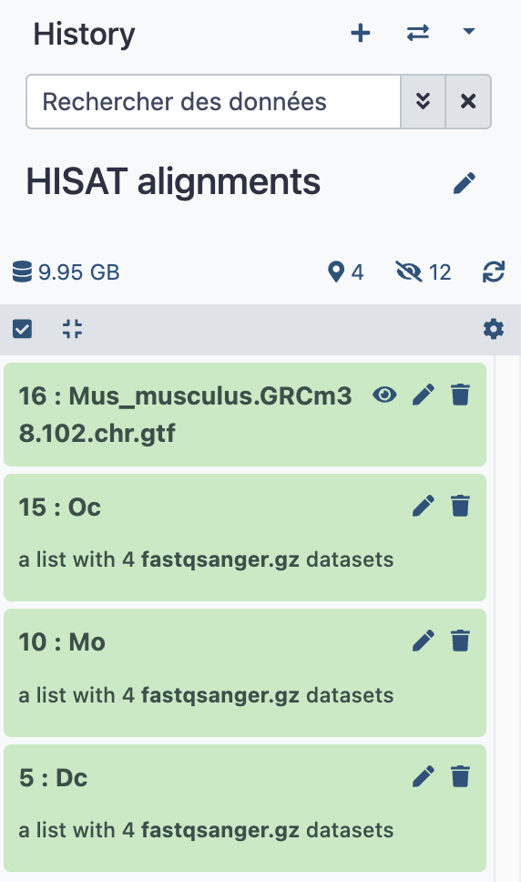
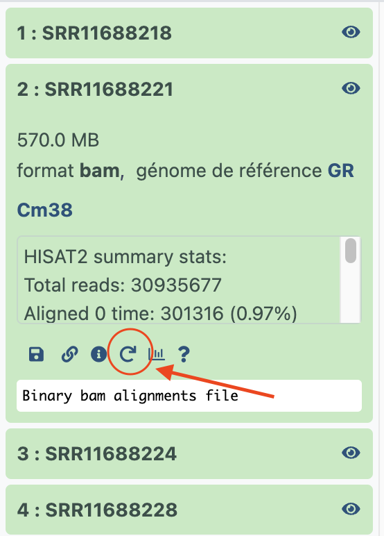

# HISAT2 

Now that we clearly know the strandness of our libraries in the `PRJNA630433` project, we
can perform their read alignments.

Before all, it is important to remember the structure of the data as mentioned in the
introduction to the use case PRJNA630433.

For the sake of simplicity, we report here again the table 3 from the section
[data upload](../11_uploads#table3):
??? info "Table 3"
    ```
    run_accession	sample_title
    SRR11688222	Mo rep2
    SRR11688221	Dc rep2
    SRR11688228	Dc rep4
    SRR11688227	Mo rep4
    SRR11688218	Dc rep1
    SRR11688219	Mo rep1
    SRR11688220	Oc rep1
    SRR11688223	Oc rep2
    SRR11688224	Dc rep3
    SRR11688225	Mo rep3
    SRR11688226	Oc rep3
    SRR11688229	Oc rep4
    ```
Let us reorder the table as follows:
    ```
    run_accession	sample_title
    SRR11688218	Dc rep1
    SRR11688221	Dc rep2
    SRR11688224	Dc rep3
    SRR11688228	Dc rep4
    SRR11688219	Mo rep1
    SRR11688222	Mo rep2
    SRR11688225	Mo rep3
    SRR11688227	Mo rep4
    SRR11688220	Oc rep1
    SRR11688223	Oc rep2
    SRR11688226	Oc rep3
    SRR11688229	Oc rep4
    ```

From this data structure, we see that it will be more convenient to treat the data as
three collections of replicates (1, 2, 3 and 4): collections `Dc`, `Mo` and `Oc`,
respectively.

Let's do this directly without even creating a new history "HISAT2 mapping" before (we
will do it on the fly)

- [x] Go to the data library `Libraries / IOC_bulk_RNAseq / PRJNA630433 / FASTQ files` (
  You know how to do this from the previous [section](../16_strandness))
- [x] Check first the datasets SRR11688**218**, SRR11688**221**, SRR11688**224** and
  SRR11688**228**
- [x] click the `Export to History` tab and, this time, select ==`as a Collection`==
- [x] on the next pop up panel, **type the name of a new history**: `HISAT alignments` and
  press the `Continue` button
- [x] In the next panel **Create a collection from a list of datasets**, you could reorder the
  replicates but there is little sense doing this: replicates are replicates, and unless
  specific design of the experiment, the number associated to a replicate is generally
  meaningless.
  
  Anyway you can order the samples alphabetically using the corresponding icon in the panel.
  
  Most importantly, give the collection a name ! In this case, we took all Dc replicates,
  thus it is logical to name it ==`Dc`==.
  
  Finally, press the button `Create Collection`
- [x] Now, if you click the house/home icon of the main Galaxy menu, you will access
  to the newly created history `HISAT alignments` and its first collection that contains
  the 4 fastqsanger.gz datasets SRR11688**218**, SRR11688**221**, SRR11688**224** and
  SRR11688**228**

Next, let's proceed with the second collection:
- [x] Return to the data library `Libraries / IOC_bulk_RNAseq / PRJNA630433 / FASTQ files`
- [x] Check now the datasets SRR11688**219**, SRR11688**222**, SRR11688**225** and
  SRR11688**227**
- [x] click the `Export to History` tab and select again ==`as a Collection`==
- [x] on the next pop up panel, **do not** type the name of a new history but instead,
  select the previously created history `HISAT alignments`, and press the `Continue` button
- [x] Give the collection the name ==`Mo`== and press `Create Collection`

Proceed the same way with the third collection and the remaining datasets
- [x] SRR11688**220**, SRR11688**223**, SRR11688**226** and SRR11688**229**
- [x] Give the collection the name ==`Oc`==

You can now navigate to the history `HISAT alignments` and verify that it is containing
3 collections of 4 fastqsanger.gz datasets each.

- [x] Go a last time to the data library `Libraries / IOC_bulk_RNAseq / Mouse reference
  files`
- [x] Check the GTF file `Mus_musculus.GRCm38.102.chr.gtf` and export it to the history
  `HISAT alignments` as a dataset. We also will need the GTF annotation file for the next
  step.

We are ready to perform HISAT2 alignments of this three dataset collections !
Your history should look like this:

<center>{width="250"}</center>

## {width="30" align="absbottom"} HISAT2 alignments of the three collections Dc, Mo and Oc.

!!! info "{width="25" align="absbottom"} HISAT2 settings"
    - Source for the reference genome
        
        --> Use a built-in genome
    - Select a reference genome
        
        --> GRCm38
    - Is this a single or paired library
        
        --> single
    - FASTA/Q file
        
        --> Click first the collection icon {width="75" align="absbottom"},
        and select `5: DC`
    - Specify strand information
        
        --> Reverse (R) (we know this from the previous analysis with infer experiment !)
    - Summary Options
        
        --> Output alignment summary in a more machine-friendly style. **Yes**
        
        --> Print alignment summary to a file. **Yes** (for MultiQC)
    - Leave `Advanced Options` as is
    - Press `Execute` !
    
    The tool will run during several minutes, generating two new dataset collections, whose
    name is self-explanatory. However, take benefit of this run time, to rename these
    collections with more meaningful names.
    
    Thus, click first on the running collection (yellow) `HISAT2 on collection 5: aligned
    reads (BAM)`, click the pencil icon of the collection content, type `Dc HISAT2
    alignments (BAM)` and click the `Save` button.
    
    Rename in the same way the collection `HISAT2 on collection 5: Mapping summary` to
    `Dc Mapping summary`
    
    :warning: Don't be lazzy, although a bit borring, these renaming operations are essential
    to the readibility of your histories.


### Re-run a tool !

We still have two dataset collections to align with HISAT2. Since we will use the exact
same HISAT2 settings, with the exception of the input collection, we are going to use
a powerful feature of Galaxy: the possibilité to re-run a tool.

Let's do it first for the alignment of the `Mo` dataset collection:

- [x] first, click on the previous output collection which you have renamed `Dc HISAT2
  alignments (BAM)` (note that you could follow the same procedure using the *other* Output
  collection `Dc Mapping summary`).
- [x] You should now see the content of the collection, ie, the 4 bam datasets with labels
  SRR11688**218**, SRR11688**221**, SRR11688**224** and SRR11688**228**.
- [x] Click on any of the 4 datasets, which will result in the deployment of the dataset
  within the collection view.
  
  <center>{width="250"}</center>

- [x] Now you can click on the re-run icon as indicated above. This will bring up the HISAT2
  form, with the same settings used to generate the dataset.
- [x] Here, the only important thing is to change the input dataset. In this specific case,
  click on the collection icon ({width="75" align="absbottom"})
  and select the collection ==`10: Mo`==
- [x] You can now `Execute` HISAT2 on this collection and, as we did before, rename the two
  new output collections `Mo HISAT2 alignments (BAM)` and `Mo Mapping summary`, respectively.
  
As you can expect now, it remains to repeat the exact same operation sequence to align the
Remaining input collection ==`15: Oc`==

## {width="30" align="absbottom"} Mapping statistics with MultiQC tool


