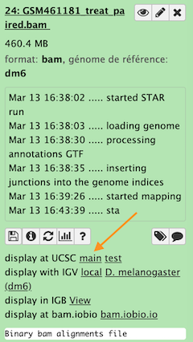
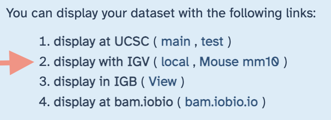

# Inspection of the mapping results

Visual inspection of the read alignments in genome browser may be helpful to

- ensure that there is a coverage sufficients for incoming statistics analyses
- re-check the strandness of the library (or check if you did not use the `infer experiment`
  tool)
- check contamination by DNA reads (which match intronic sequences)
- produce figures focusing on specific genes you are interested in
- or just because seeing read alignments in a genome is fun and interesting

Bam files are generally the preferred proxies for visualization in genomes browser.
However, it is also possible to convert bam files in bigwig format if you are only interested
in read coverage, and get this files displayed in genome browsers. Likewise, depending of
the genome browser, you may use various file format such as wig, bed, bedgraph, etc.

There are many ways to visualize reads in genome browsers, here we only introduce practically
2 procedures.

The first one is using the remote UCSC genome browser.

The second one is using the local IGV genome browser.

You will see that each procedure has pro and cons.

----
## {width="35" align="absbottom"} UCSC genome browser

The advantage of this genome browser is that it is maintained in a very powerful server
which already has numerous annotation tracks for you. In addition, visualisation in UCSC
browser is well integrated in Galaxy and transfer of bam information to the remote genome
browser is transparent for the Galaxy user. The downside is that your bam
alignment must have been produced with UCSC reference genomes, whose chromosomes are, for
examples prefixed with "chr", or have different haplotype or contig identifiers from the
Genome Resources Consortium (GRC). In some circumstances, you may also find that the UCSC
browser is slower than a local genome browser.

As you probably noticed, in our analysis case, we have used the reference GRCm38. The main
difference is that the corresponding UCSC mouse genome is mm10 in which chromosomes are
prefixed with "chr" (chr1, chr2, chrM, etc.), whereas our GRCm38 reference is not prefixed
(1, 2, MT, etc).

In theory it is possible to recode chromosome names in a bam file, but this implies
a rather complicated procedure (unpacking the bam in sam, using regex-find-replace tools,
repack in bam...)

In practical it is faster (and more reliable) to just realign the reads with a UCSC-compliant
mm10 reference !

We are going to do this

- using the `HISAT alignments` history --> navigate to this history
- on the subset of fastqsanger.gz datasets `Dc`

### {width="30" align="absbottom"} HISAT2 alignments of the Dc fastq.gz datasets.

!!! info "{width="25" align="absbottom"} HISAT2 settings for realignment of the Dc collection"
    - Source for the reference genome
        
        --> Use a built-in genome
    - Select a reference genome
        
        --> ==This time select **mm10**==
    - Is this a single or paired library
        
        --> single
    - FASTA/Q file
        
        --> Click first the collection icon {width="75" align="absbottom"},
        and select `5: DC`
    - Specify strand information
        
        --> Reverse (R) (we know this now...)
    - Summary Options
        
        --> Output alignment summary in a more machine-friendly style. ==**No**==
        
        --> Print alignment summary to a file. ==**No**== (here we don't need these summaries)
    - Leave `Advanced Options` as is
    - Press `Execute` !
    
    The tool will run during several minutes, generating this time only one dataset collection,
    which contains the mm10 BAM alignments. As usual take benefit of this run time to rename
    the collection "Dc BAM alignments to mm10".

 To be changed

Zoom to chr4:540,000-560,000 (Chromosome 4 between 540 kb to 560 kb)

## IGV  

To use IGV with galaxy you need to have this tool on your computer. (If not you can download IGV from [their main site](http://software.broadinstitute.org/software/igv/).)

1. Open locally IGV
2. click the IGV local ling as indicated by the red arrow.

Zoom to chr4:540,000-560,000 (Chromosome 4 between 540 kb to 560 kb)

----

