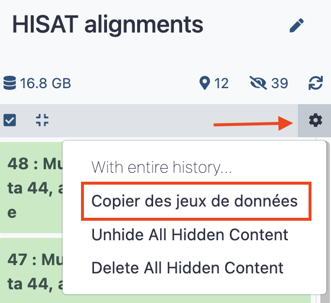
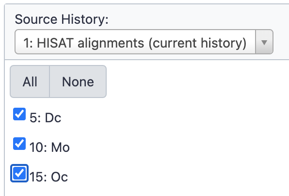
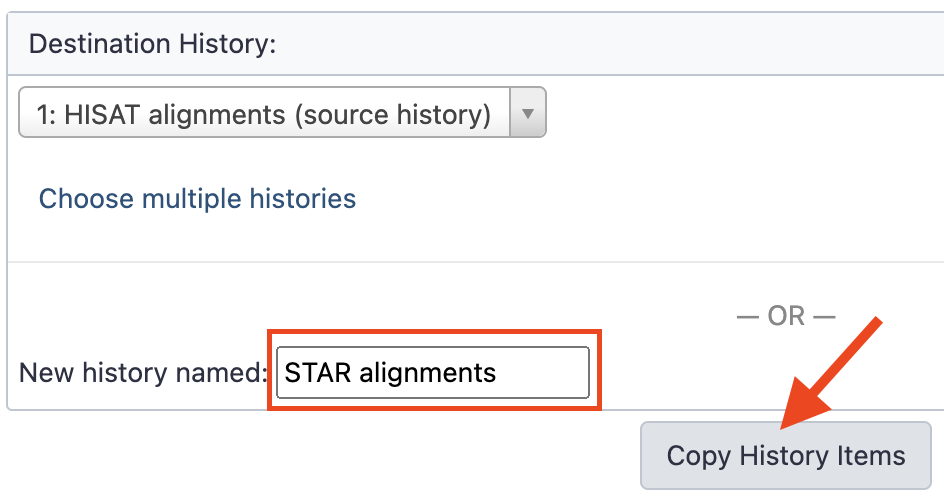
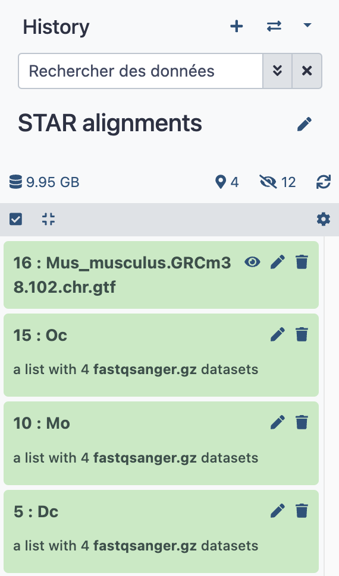

# STAR alignments

Let's test another aligner, STAR, in another new history. It will later be possible to
compare the performance between STAR and HISAT2.

Before anything, let's use some nice features of Galaxy to manipulate quickly datasets
and histories.

- [x] Go, or stay, to the history `HISAT alignments`
- [x] Click the upper right wheel icon at the top of the history stack and select `Copy
  datasets` or `Copier des jeux de données` if your interface is french.
  
{width="250"}

- [x] In the pop up panel, select the three dataset collection that we already built in the
  history. In the right part of the panel (`Destination History`), fill the empty field
  `New history named` with `STAR Alignments`, as shown bellow, and last, click the `Copy
  History Items` button.
  
  {width="250"} {width="350"}

- [x] Navigate directly to the newly created history by clicking the link ==3 datasets copied
  to 1 history: STAR alignments.==
- [x] You could also have copied the GTF file which will also required for STAR alignment, button
  for practicing purposes, let's get this file from the data library. We assume that you
  now know how to do this !
- [x] This makes our new history `STAR alignments` looking as follows:
  
  
{width="250"}

----

## {width="30" align="absbottom"}RNA STAR tool

!!! info "{width="25" align="absbottom"} RNA STAR settings"
    - Single-end or paired-end reads
        
        --> Single-end
    - RNA-Seq FASTQ/FASTA file
        
        --> select the collection icon and then the collection `5: Dc`
    - Custom or built-in reference genome
        
        --> Use a built-in index
    - Reference genome with or without an annotation
        
        --> use genome reference without builtin gene-model but provide a gtf
    - Select reference genome
        
        --> GRCm38_w/o_GTF
    - Gene model (gff3,gtf) file for splice junctions
        
        --> Mus_musculus.GRCm38.102.chr.gtf
    - In `Output filter criteria`, **Exclude the following records from the BAM output**
        
        --> check Select all
    - Leave any other setting as is and Press `Execute` !
    
    The tool will run during several minutes, generating four new dataset collections, whose
    name is self-explanatory. Take benefit of the run time, to rename at least 3 of these
    collections with more meaningful names:
    
    - `RNA STAR on collection 5: log` --> `Dc STAR log`
    - `RNA STAR on collection 5: mapped.bam` --> `Dc RNA STAR mapped.bam`
    - `RNA STAR on collection 5: reads per gene` --> `Dc nbre of reads per gene (STAR)`
    
    :warning: Reminder: we understand it is a bit borring to rename datasets but these
    renaming operations are essential to the readibility of your histories.

### Re-run the RNA STAR tool as you learned before with HISAT for the collections:
- [x] `10: Mo`
- [x] `15: Oc`
- [x] :warning: ... And do not forget to rename your collections accordingly :smile:

!!! info "About RNA STAR splice junctions.bed collection"
    These datasets are useful if you seek to find new splicing events and describe them.
    
    Since here, we are performing annotation-guided RNAseq analysis, these collections of
    datasets are not useful and you can trash them !

## {width="30" align="absbottom"} Mapping statistics with MultiQC tool

!!! info "{width="25" align="absbottom"} MultiQC settings"
    - 1: Results
    - Which tool was used generate logs?
        
        --> STAR
    - Click "Insert STAR output"
    - Type of STAR output?
        
        --> Log
    - STAR log output
        
        --> Click first the collection icon {width="75" align="absbottom"}
        
        --> Select the 3 collections `Dc`, `Mo` and `Oc RNA STAR log`, holding down the
        ++command++ key
    - Leave the other settings as is
    - Press `Execute` !

When MultiQC has run, look at the aggregated mapping statistics by clicking the eye icon
of the dataset `MultiQC on data 46, data 44, and others: Webpage`
---
