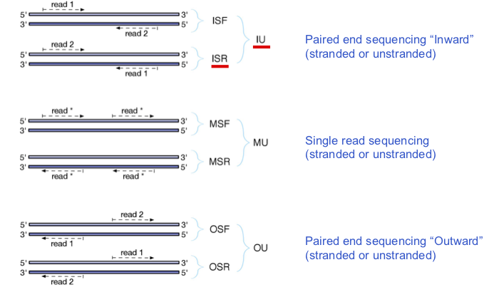

# Counting strategy 

## Count the number of reads per annotated gene
To compare the expression of single genes between different conditions
(e.g. with or without *Pasilla* depletion), an essential first step is to quantify
the number of reads per gene.

From the image above, we can compute:

### Number of reads per exons

|Gene   |Exon   |Number of reads |
|-------|-------|----------------|
|gene1  |exon1  |        3       |
|gene1  |exon2  |        2       |
|gene2  |exon1  |        3       |
|gene2  |exon2  |        4       |
|gene2  |exon3  |        3       |

- The gene1 has 4 reads, not 5 (gene1 - exon1 + gene1 - exon2) because of the splicing of the last read.
- The gene2 has 6 reads (3 spliced reads)

## Counting tools
Two main tools could be used for that: HTSeq-count
([Anders et al, Bioinformatics, 2015](https://academic.oup.com/bioinformatics/article/31/2/166/2366196))
or featureCounts ([Liao et al, Bioinformatics, 2014](https://academic.oup.com/bioinformatics/article/31/2/166/2366196)).
FeatureCounts is considerably faster and requires far less computational resources,
so we will use it here.

In principle, the counting of reads overlapping with genomic features is a fairly
simple task. But there are some details that need to be given to featureCounts:
for example the strandness.

