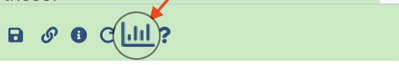

# Manipulation of edgeR data for visualisation and comparisons

As we did for DESeq2 we will extract the most differentially expressed genes in the various
conditions, and then visualize them using an heatmap of the normalized counts for each
sample.

## Extract the most differentially expressed genes (PRJNA630433 / edgeR)

Basically, we navigate in the edgeR history of the PRJNA630433 use-case and we repeat a
edgeR run, asking in addition for a file containing the normalised counts, these are in
**log2 counts per million (logCPM)**.

Note the difference with DESeq2 which instead return **rLog-Normalized counts**. Both
transformation give very similar results except for low counts that show more dispersion
with the logCPM approach (see an interesting comparison
[here](https://idepsite.wordpress.com/pre-process/){:target="_blank"})

??? info "{width="25" align="absbottom"} `edgeR` settings"
    - Count Files or Matrix?
        
        --> Separate Count Files
    - 1: Factor/Name
        
        --> Tissue
    - 1: Factor/1: Group
        
        Note that there will be three Groups (ie factor levels) in this analysis: Dc, Mo and Oc.
        
        --> Oc
        
    - Counts file(s)
        
        --> select the data collection icon, then `15: Oc FeatureCounts counts`
    - 2: Factor/2: Group
        
        --> Mo
        
    - Counts file(s)
        
        --> select the data collection icon, then `10: Mo FeatureCounts counts`
    - 3: Factor level (you must click on :heavy_plus_sign: `Insert Group`)
        
        --> Dc
        
    - Counts file(s)
        
        --> select the data collection icon, then `5: Mo FeatureCounts counts`
    - Use Gene Annotations?
        
        --> `No`
     - Formula for linear model
       
       --> Leave empty
    - Input contrasts manually or through a file
        
        --> `manually`
    - 1: Constrast
        
        --> `Mo-Dc`
    - 2: Constrast (click :heavy_plus_sign: `Insert Contrast`)
        
        --> `Oc-Dc`
    - 3: Constrast (click :heavy_plus_sign: `Insert Contrast`)
        
        --> `Oc-Mo`
    - Filter Low Counts
        
        --> No, leave folded
    - Output options
        
        --> `Yes` to `Output Normalised Counts Table?`
    - Advanced options
        
        --> Put `P-Value Adjusted Threshold` to 0.1 (to be consistent with DESeq settings)
        
        --> Leave other advanced options unchanged
    - `Run Tool`

:warning: This time, the normalized counts are returned as a supplementary dataset in the
collection `edgeR on data ... and others: Tables`.

Indeed this is an issue to have a this collection with heterogenous datasets (3 DE tables + 
1 normalized count tables, with different number of columns) since in the next step we are
going to apply a filter to these data.

We thus will fix this issue immediately in three steps (a bit a Galaxy practice...)

- [x] Use the tool ` Extract element identifiers of a list collection` and run it on the
collection `edgeR on data ... and others: Tables`. (Be careful to select the last
collection) This will return a single dataset with the names of the collections elements.
- [x] Deploy this dataset and click at its bottom to the visualisation icon
    
    {width="300"}
    
    In the central panel that opens up, click the `Editor, Manually edit text`, remove the
    last line ("edgeR_normcounts"), check that you have **4** line remaining (3 lines plus
    one empty) and click the light blue button `export` (:warning: this button is not easy
    to see depending on your screen settings).

- [x] Now use the tool `Filter collection`, select the collection `edgeR on data ... and
  others: Tables` as input collection, `Remove if identifiers are ABSENT from the file`, and
  the manually edited dataset `Extract element identifiers on ..., and others (modified)`.
- [x] This will return 2 collections. Rename immediately the "(filtered)" collection as
  `edgeR DE tables` and the (discarded) collection as `Log2CPM edgeR_normcounts`. :warning:
  Note that this latter is a **collection** but with a single element...

Beside, `edgeR_normcounts.tsv` also show up as a html link in the dataset `edgeR on
data 4, data 3, and others: Report`, that download directly to your local computer if you
click it.

:warning: Keep the 1-element collection `Log2CPM edgeR_normcounts` for latter, we will use
it for the clustered heatmap.

## Generate top lists of EdgeR DE genes

### Select genes with |log2FC > 2| and p-adj < 0.01 with {width="30" align="absbottom"}`Filter data on any column using simple expressions`

!!! info "{width="25" align="absbottom"} `Filter data on any column...` settings"
    - Filter
        
        --> edgeR DE tables (:warning: this is a collection)
    - With following condition
        
        --> `abs(c2) > 2 and c6 < 0.01` :warning: this expression is different from the one
        used for DESeq2 tables because the column structure is different.
    - Number of header lines to skip
        
        --> `1` (these tables have an added header !)
    - Click the `Run Tool` button

:warning: Rename the "filter on..." collection to `edgeR Top gene lists`

### Compute a boolean value by row

This is to determine whether genes in the lists are up or down-regulated

!!! info "{width="25" align="absbottom"} `Compute on rows` settings"
    - Input file
        
        --> `edgeR Top gene lists` (:warning: collection !)
    - Input has a header line with column names?
        
        --> `Yes`
    - 1: Expressions
    - Add expression
        
        --> `c2 > 0` :warning: this expression is different from the one used for DESeq2
        tables
    - Mode of the operation
        
        --> `Append`
    - The new column name
        
        --> `Regulation`
    - Avoid scientific notation in any newly computed columns
        
        --> `No`
    - Click the `Run Tool` button

:warning: Look at the effect of evaluating the expression `c2 > 0` in the new column
`expression` in the output datasets.

### Transform `True` and `False` values to `up` and `down`, respectively

!!! info "{width="25" align="absbottom"} `Column Regex Find And Replace` settings"
    - Select cells from
        
        --> `Compute on collection 40 (or so)`
    - using column
        
        --> `7`
    - Check
        
        --> click the button :heavy_plus_sign:`Insert Check`
    - Find Regex
        
        --> `False`
    - Replacement
        
        --> `down`
    - Check
        
        --> click another time the button :heavy_plus_sign:`Insert Check`
    - Find Regex
        
        --> `True`
    - Replacement
        
        --> `up`
    - Click the `Run Tool` button

:warning: rename the collection `Column Regex Find And Replace on collection 44` with
`top gene lists - oriented`

### Split the lists in `up` and `down` regulated lists

This will be performed through 2 successive runs of the
{width="25" align="absbottom"} tool `Select lines that match an
expression`

!!! info "{width="25" align="absbottom"} `Select lines that match an expression` settings"
    - Select lines from
        
        --> `top gene lists - oriented`
    - that
        
        --> `matching`
    - the pattern
        
        --> `\tup` (a tabulation immediately followed by the string *up*)
    - Keep header line
        
        --> `Yes`
    - Click the `Run Tool` button

:warning: Immediately rename the collection `Select on collection...` to `edgeR top up-regulated
gene lists`

Redo exactly the same operation with a single change in the setting of the
{width="25" align="absbottom"} tool `Select lines that match an
expression`

??? info "{width="25" align="absbottom"} `Select lines that match an expression` settings"
    - Select lines from
        
        --> `top gene lists - oriented`
    - that
        
        --> `matching`
    - the pattern
        
        --> `\tdown` (a tabulation immediately followed by the string *down*)
    - Keep header line
        
        --> `Yes`
    - Click the `Run Tool` button

:warning: Rename the collection `Select on collection...` to `edgeR top down-regulated
gene lists`

:warning: keep the last three generated collections for later comparison with DESeq2 and
limma tools

## Plotting an heatmap of the most significantly de-regulated genes

For this, we are going to collect and gather all significantly de-regulated genes in any of the
3 conditions, and to intersect (join operation) this list with the rLog normalized count
table precedently generated.

### Use {width="25" align="absbottom"}`Advanced cut` to select the list of deregulated genes in all three comparisons

!!! info "{width="25" align="absbottom"} `advanced cut` settings"
    - File to cut
        
        --> `edgeR Top gene lists` (this is a collection)
    - Operation
        
        --> `Keep`
    - Delimited by
        
        --> `Tab`
    - Cut by
        
        --> `fields`
    - List of Fields
        
        --> `Column 1`
    - First line is a header line
    - Click the `Run Tool` button

:warning: Rename this collection of single column datasets `edgeR top genes names`
### Next we concatenate the three datasets of the previous collection in a single dataset

We do that using the {width="25" align="absbottom"}
`Concatenate multiple datasets tail-to-head while specifying how` tool

!!! info "{width="25" align="absbottom"} `Concatenate multiple datasets tail-to-head while specifying how` settings"
    - What type of data do you wish to concatenate?
        
        --> `Single datasets`
    - Concatenate Datasets
        
        --> :warning: Click on the collection icon and select `edgeR top genes names`
    - Include dataset names?
        
        --> `No`
    - Number of lines to skip at the beginning of each concatenation:
        
        --> `1`
    - Click the `Run Tool` button

:warning: Rename the return single dataset as `edgeR Pooled top genes`

### Next we extract *Uniques* gene names from the `Pooled top genes` dataset

You probably agree that the same gene may be deregulated in the three pair-wise comparisons
which we have performed with DESeq2.

Thus we need to eliminate the redundancy, using the tool
{width="25" align="absbottom"}`Unique
occurrences of each record`.

!!! info "{width="25" align="absbottom"} `Unique occurrences of each record` settings"
    - File to scan for unique values
        
        --> `edgeR Pooled top genes`
    - Ignore differences in case when comparing
        
        --> `No`
    - Column only contains numeric values
        
        --> `No`
    - Advanced Options
        
        --> Leave as `Hide Advanced Options`
    - Click the `Run Tool` button

### Add a header the list of unique gene names associated we significant DE in any of the comparisons

We do this with the tools `Add Header`

!!! info "{width="25" align="absbottom"} `Add Header` settings"
    - List of Column headers (comma delimited, e.g. C1,C2,...)
        
        --> `edgeR_All_DE_genes`
    - Data File (tab-delimted)
        
        --> `Unique on data 7x...`
    - Click the `Run Tool` button

:warning: Rename the generated dataset `edgeR_All_DE_genes`

### Intersection (join operation) between the list of unique gene name associated with DE and the rLog-Normalized counts file.

This is the moment when we are going to use the single-element `Log2CPM edgeR_normcounts`
collection and intersect it (join operation) with the list of DE genes in all three condition.

To do this, we are going to use the tool
{width="25" align="absbottom"}`Join two files`

!!! info "{width="25" align="absbottom"} `Join two files` settings"
    - 1st file
        
        --> click on the collection icon and select `log2CPM edgeR_normcounts`
    - Column to use from 1st file
        
        --> `1`
    - 2nd File
        
        --> `edgeR_All_DE_genes`
    - Column to use from 2nd file
        
        --> `1`
    - Output lines appearing in
        
        --> `Both 1st and 2nd files`
    - First line is a header line
        
        --> `Yes`
    - Ignore case
        
        --> `No`
    - Value to put in unpaired (empty) fields
        
        --> `NA`
    - Click the `Run Tool` button

:warning: Rename the single-element output collection `edgeR Log2CPM Normalized counts of DE genes`

### Plot a heatmap of the Log2CPM Normalized counts of edgeR DE genes in all three conditions

We do this using the {width="25" align="absbottom"}`Plot
heatmap with high number of rows` tool

!!! info "{width="25" align="absbottom"} `Plot heatmap with high number of rows` settings"
    - Input should have column headers - these will be the columns that are plotted
        
        --> Click the collection icon and select `edgeR Log2CPM Normalized counts of DE genes`
    - Data transformation
        
        --> `Plot the data as it is`
    - Enable data clustering
        
        --> `Yes`
        
    - Clustering columns and rows
        
        --> `Cluster rows and not columns`
    - Distance method
        
        --> `Euclidean`
        
    - Clustering method
        
        --> `Complete`
    - Labeling columns and rows
        
        --> `Label columns and not rows`
        
    - Coloring groups
        
        --> `Blue to white to red`
    - Data scaling
        
        --> `Scale my data by row`
    - tweak plot height
        
        --> `35`
    - tweak row label size
        
        --> `1`
    - tweak line height
        
        --> `24`
    - `Run Tool`
