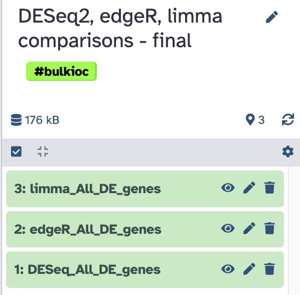
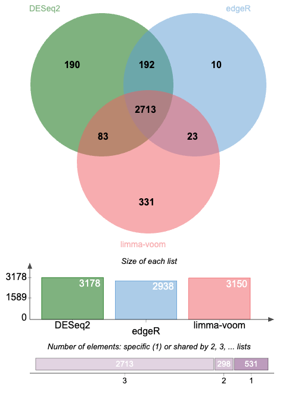

We are now going to make a quick comparison of the three Differential Expression analysis
packages, DESeq2, edgeR, and limma, using some results generated in the histories
"PRJNA630433 DESeq2 analysis", "PRJNA630433 edgeR analysis" and "PRJNA630433 limma
analysis".

## Collect datasets

Thus, create a new history `DESeq2, edgeR, limma comparisons`, and from this history,
import (menu `copy datasets`) the required datasets.

- [x] in the history `PRJNA630433 DESeq2 analysis`, copy the dataset
  - `DESeq_All_DE_genes` (This should be the second to last file of the history). It is a
    simple list of gene names with a single header)
- [x] in the history `PRJNA630433 edgeR analysis`, get the dataset
  - `edgeR_All_DE_genes` (Also probably the second to last file of the history).
- [x] in the history `PRJNA630433 limma analysis`, get the dataset
  - `limma_All_DE_genes`

:warning: You can stay in the current "PRJNA630433 edgeR analysis" and "PRJNA630433 limma
analysis" history to execute these 3 copies. Just change the `Source History` of the copy
dashboard, and be sure that, each time, the `Destination History` is `DESeq2, edgeR, limma
comparisons`

Your starting history should look like this:

{width="300"}

## Venn diagram

The three datasets contain a list of significantly deregulated (up and down) genes in
either of the three comparisons (Mo vs Dc, Oc vs Dc, Oc vs Mo), as returned by DESeq2,
edgeR or Limma-voom, respectively.

Note that, although there is no quantitative information anymore in these lists, we can
look at their overlaps using a Venn diagram approach.

We are going to perform this analysis using the Galaxy tool `Venn diagram [JVenn]`

!!! info "{width="25" align="absbottom"} `Venn diagram [JVenn]` settings"
    - **1: List to compare**
    - Enter your list
        
        --> `Input file containing your list`
    - Select your file
        
        --> `DESeq_All_DE_genes`
        
    - Does file contain header?
        
        --> `Yes`
    - Column number on which apply the comparison
        
        --> `c1`
        
    - Enter the name of this list
        
        --> `DESeq2`
        
    - **2: List to compare**
    - Enter your list
        
        --> `Input file containing your list`
    - Select your file
        
        --> `edgeR_All_DE_genes`
        
    - Does file contain header?
        
        --> `Yes`
    - Column number on which apply the comparison
        
        --> `c1`
        
    - Enter the name of this list
        
        --> `edgeR`
        
    - **3: List to compare** (after clicking :heavy_plus_sign:**`Insert List to compare`**)
    - Enter your list
        
        --> `Input file containing your list`
    - Select your file
        
        --> `limma_All_DE_genes`
        
    - Does file contain header?
        
        --> `Yes`
    - Column number on which apply the comparison
        
        --> `c1`
        
    - Enter the name of this list
        
        --> `limma-voom`
        
    - Run tool

The venn diagram return by the tool should look like this:

{width="500"}

## Discussion

DESeq2 appears as a less stringent "Caller" than edgeR: overall only a few genes (10 + 23)
are called by edgeR but not by DESeq2. This is expected because normalisation and statistical
tests (exact Fisher's test) are similar between DESeq2 and edgeR. However DESeq perfoms an
original step of variance shrinking and the authors of DESeq2 claim that this data transformation
allows to call confidently more DE genes without increasing the False Detection Rate (type
I error). Taking only the DE genes common to both DESeq2 and edgeR would allow to further
improve the false detection rate, at the expanse of increased False Negative rate (type II
error)

Limma appears a bit "transversal" to DESeq2 and edgeR: beside a core of common gene (2713),
Limma calls 83 genes also called by DESeq2 and 23 genes also called by edgeR, respectively.

Strikingly however, limma calls a substantial number of genes which are not called either
by DESeq2 or edgeR. This is likely due to the radically different approach of Limma-Zoom,
in part inherited from methods to analyse continuous microarray variables (which modele
gene expression variables as Gaussians).

Note that although Limma is likely less adapted to analysis of discrete read counts, it
performs relatively well in light of the fact that only ~10 % of DE genes called by limma
are not called by DESeq2 or edgeR !
---